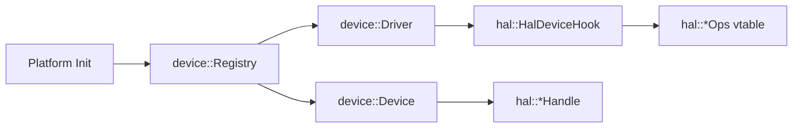

# Charm HAL Design (Draft)

## Goals
- Chip-agnostic interfaces; platform impl lives in targets/examples.
- Small, composable, IDE-friendly; zero dynamic alloc path preserved.
- Contracts first: document blocking/async semantics, ownership, timing.

## Scope (MVP interface set)
- core: time (tick_ms), irq (disable/enable), clock (freq query), delay/sleep.
- io: gpio (in/out, irq edge), uart (tx/rx, irq/dma optional), timer (oneshot/periodic), spi, i2c.
- optional later: flash, entropy, pwm, adc, watchdog.

## Shape
- Module: port.kernel keeps KernelCaps for scheduler (time/irq/wakeup/swi).
- Module: charm-hal.gpio etc. Each module defines:
  - lightweight handle (struct Handle { platform ptr/id })
  - cfg struct (constexpr defaults)
  - ops as free functions or static member of Impl
  - concept checks for Impl
- Capability detection: constexpr bool has_<feature>(Impl) via requires.
- No global macros in interface; selection via CMake/manifest choosing platform impl files.

## Platform binding
- For each target: targets/<vendor>/<board>/hal_<periph>.cpp implements the concepts.
- Provide template file Modules/port/port.kernel.template.cpp as quick start; similar templates for gpio/uart.

## Unified API routing (VSF-aligned)
- A single hal::<periph> API should target multiple backends:
  - hardware IP (SPI/UART/I2C)
  - bitbang GPIO
  - USB bridge or remote SPI
- The handle owns a driver vtable (ops) so all backends share one API.
- Upper layers stay backend-agnostic; only binding chooses the backend.

## IP core drivers (VSF-aligned)
- Split into two layers:
  - core: register model + state machine (no clocks/pins/irq routing)
  - port: clock/reset/irq/pinmux glue
- Port ops should be minimal and explicit; core owns logic.
 
## Build selection
- CMake cache variables choose target; a manifest lists sources to compile for that target.
- Upper layers link only the interfaces they use (per-module granularity), enabling dead-strip.

## Compatibility layers
- POSIX/Arduino live in charm-shim, depend on charm-hal + charm-os (or charm-rt facade), not the other way around.

## RT facade
- charm-rt: optional thread API mapping to EDA/ThreadTask; stacks configurable; keeps zero-alloc path available when disabled.

## Documentation
- For each periph: table of required/optional behaviors (blocking/async, timeout units, ISR context rules).
- Example usage snippets per module; platform notes (e.g., STM32 requires clock enable before gpio_cfg).
- Ops binding templates: `Modules/io/hal/hal_ops_template_guide.md`.
- Registry wiring example: `Modules/io/hal/hal_device_examples.cppm`.

## Phasing
- Phase A (current): port.kernel + minimal time/irq for PC/STM32.
- Phase B: add gpio/uart/timer, publish concepts and template impl.
- Phase C: spi/i2c/flash + shim time/sleep; start RT facade design.
- Phase D: entropy/pwm/adc/watchdog + richer shim (POSIX subset).

## HAL + Device Registry (Wiring)



### Example (SPI)

```cpp
device::Registry<8, 8> reg{};

hal::HalDeviceHook spi_hook{};
spi_hook.ctx = &spi_backend_state;
spi_hook.probe = &spi_probe;
spi_hook.init = &spi_init;

auto desc = hal::make_hal_desc("spi");
auto drv = hal::make_hal_driver(&spi_hook, desc, "spi.hw", 10);

reg.add_device(desc, &spi_hook);
reg.add_driver(drv);
reg.init_all();
```

> The registry drives probe/init/suspend/resume; HAL handles only backend logic.
