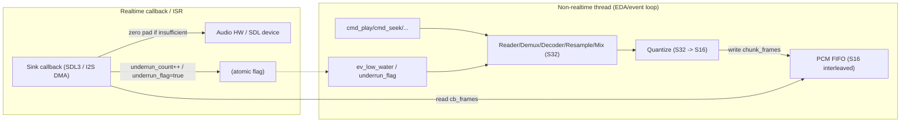
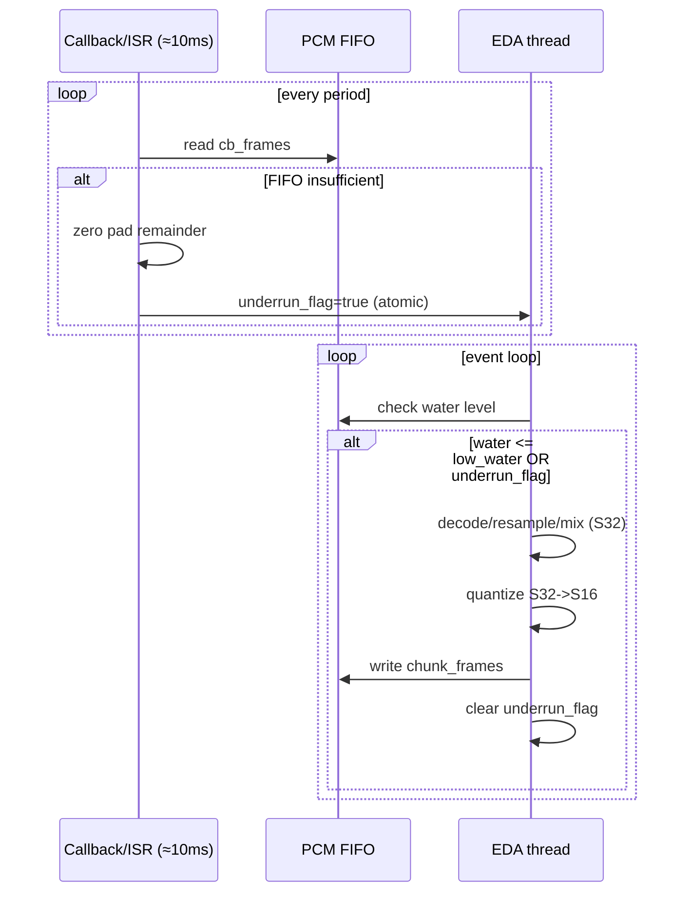

# Audio 设计草案（L1/L2/L3）

> 目标：**PC/MCU 同构行为** + **实时路径最短**。  
> 约束：**pipeline 内部使用 S32**，**FIFO 存 S16**，量化点固定在写入 FIFO 之前。

> v1 可落地设计：`docs/audio/audio_design_v1.md`

---

## L1 接口签名（稳定 API）

### 1) 基础类型

```cpp
template<class T>
using Result = util::Result<T>;
// 错误码直接使用 util::Errc。

enum class SampleType : uint8_t { s16, s24_in_32, s32, f32 };

struct AudioFormat {
  uint32_t rate = 48000;
  uint16_t channels = 2;
  SampleType sample_type = SampleType::s16;
  bool interleaved = true;

  uint16_t bytes_per_sample() const;
  uint16_t frame_size() const;      // channels * bytes_per_sample (interleaved)
};
```

### 2) IDataSource：顺序读 + 随机读

```cpp
struct IDataSource {
  virtual ~IDataSource() = default;

  virtual Result<size_t> read(std::span<std::byte> out) = 0;
  virtual Result<int64_t> seek(int64_t offset, int whence) = 0;  // SEEK_SET/CUR/END
  virtual Result<int64_t> tell() = 0;
  virtual Result<int64_t> size() = 0;

  // 可选：并行预读/索引查表
  virtual Result<size_t> read_at(int64_t offset, std::span<std::byte> out) {
    return std::unexpected(Errc::not_supported);
  }
};
```

### 3) PCM FIFO：SPSC + span 友好

```cpp
struct PcmFifoView {
  std::span<std::byte> a;
  std::span<std::byte> b; // wrap-around 段
};

struct IPcmFifo {
  virtual ~IPcmFifo() = default;

  virtual size_t capacity_bytes() const = 0;
  virtual size_t size_bytes() const = 0;
  virtual size_t free_bytes() const = 0;

  virtual PcmFifoView writable_view() = 0;
  virtual void commit_write(size_t bytes) = 0;

  virtual PcmFifoView readable_view() = 0;
  virtual void commit_read(size_t bytes) = 0;

  virtual void clear() = 0;
};
```

### 4) IAudioSink：纯 pull（回调驱动）

```cpp
using FillCallback = size_t(*)(std::span<std::byte> dst, void* user) noexcept;

约束（必须遵守）：
- 返回值 `filled_bytes` 必须满足 `0 <= filled_bytes <= dst.size()`
- `filled_bytes % frame_size == 0`
- `dst.size()` 由 sink 保证是 `frame_size` 的整数倍
- 若 FIFO 数据不足，只读取“最后一个完整 frame”，其余交给补零

struct SinkConfig {
  AudioFormat fmt;
  uint32_t preferred_period_frames = rate / 100; // 建议：约 10ms，实际以设备支持为准
};

struct IAudioSink {
  virtual ~IAudioSink() = default;

  virtual Result<void> open(const SinkConfig& cfg) = 0;
  virtual Result<void> start() = 0;
  virtual Result<void> stop() = 0;
  virtual void close() = 0;

  virtual void set_fill_callback(FillCallback cb, void* user) = 0;

  virtual AudioFormat format() const = 0;
  virtual uint32_t actual_period_frames() const = 0;
  virtual double output_latency_seconds() const = 0;
};
```

### 5) IDecoder：压缩 -> PCM（源格式）

```cpp
struct StreamInfo {
  AudioFormat fmt;
  int64_t duration_frames = -1;
};

struct IDecoder {
  virtual ~IDecoder() = default;

  virtual Result<StreamInfo> open(IDataSource& src) = 0;
  virtual Result<void> seek_frame(int64_t frame_index) = 0;
  virtual Result<size_t> decode_frames(std::span<std::byte> pcm_out) = 0;
  virtual Result<void> close() = 0;
};
```

---

## L2 管线与时序（water level / underrun）

### 1) 统一换算链（ms ↔ frames ↔ bytes）

唯一换算链条：

```
frames = rate * ms / 1000
bytes  = frames * frame_size
frame_size = channels * bytes_per_sample (interleaved)
```

建议：所有阈值都以 **毫秒** 配置，运行时根据 `AudioFormat` 转为 bytes。

示例（48k / 2ch / s16）：

```
bytes_per_sample = 2
frame_size = 4
1ms = 48 frames = 192 bytes
```

### 2) 水位阈值建议

默认值（推荐）：
- `low_water_ms`：40ms
- `high_water_ms`：120~150ms

可调范围：
- `low_water_ms`：30~80ms
- `high_water_ms`：100~300ms

转换：

```cpp
low_water_bytes  = ms_to_bytes(low_water_ms, fmt);
high_water_bytes = ms_to_bytes(high_water_ms, fmt);
```

### 3) 量化点固定在 FIFO 之前

pipeline 内部：S32  
FIFO 存储：S16

处理链路（示例）：

```
Reader -> (Demux) -> Decoder -> (Resample/Mix/DSP in S32)
        -> Quantize(S32->S16) -> PCM FIFO -> Sink
```

量化建议：
- S32->S16：饱和裁剪 + 右移（或带噪量化，后续可选）
- 量化完成后再写 FIFO，确保实时路径只 memcpy

### 4) SPSC underrun 原子策略

**实时路径（回调/ISR）** 只做：读 FIFO、补零、计数与置位。

建议使用：
- `std::atomic<uint32_t> underrun_count;`
- `std::atomic<uint8_t> underrun_flag;`  // 0/1

**写端（回调/ISR）**：

```cpp
if (filled < need) {
  underrun_count.fetch_add(1, std::memory_order_relaxed);
  underrun_flag.store(1, std::memory_order_relaxed);
}
```

**读端（事件线程）**：

```cpp
if (underrun_flag.exchange(0, std::memory_order_acq_rel) != 0) {
  // 触发 Buffering / 统计 / UI 事件
}
```

> SPSC 场景下无需重型内存序；`exchange` 用 `acq_rel` 可确保事件线程看见最新计数。

### 5) SDL3/I2S 同构回调伪代码（20 行）

> **共性**：只读 FIFO + 不足补零 + 标记 underrun。

```cpp
size_t audio_fill(std::span<std::byte> dst, void* user) noexcept {
  auto* fifo = static_cast<IPcmFifo*>(user);
  size_t need = dst.size();
  size_t filled = 0;

  while (filled < need) {
    auto v = fifo->readable_view();
    if (v.a.empty() && v.b.empty()) break;

    auto copy_one = [&](std::span<std::byte> src) {
      size_t n = std::min(src.size(), need - filled);
      std::memcpy(dst.data() + filled, src.data(), n);
      fifo->commit_read(n);
      filled += n;
    };

    if (!v.a.empty()) copy_one(v.a);
    else if (!v.b.empty()) copy_one(v.b);
  }

  if (filled < need) {
    std::memset(dst.data() + filled, 0, need - filled);
    underrun_count.fetch_add(1, std::memory_order_relaxed);
    underrun_flag.store(1, std::memory_order_relaxed);
  }
  return filled; // 仅返回实际从 FIFO 读取的字节数
}
```

---

## L2.6 DSP Graph 骨架合同（Pull 语义 + 固定块）

### 1) 外部语义：Pull 驱动

系统唯一入口保持：

```
device.pull(period_frames)
```

Graph 对外只承诺：

```
graph.pull(frames)
```

> 设备时钟域驱动，避免 producer runaway，天然支持 zero-copy。

### 2) 内部执行：固定块 + topo 顺序

Graph 内部使用固定 block 处理（Push 执行），避免递归：

```
graph_block_frames = min(period_frames, 128)
```

建议：
- `graph_block_frames` 优先取 2 的幂（64/128），便于 SIMD / resampler。  
- 若 `period_frames` 小于 128，则保持 `period_frames`，避免额外拆分。
- 若 `graph_block_frames < period_frames`，必须保持 **2 的幂**（64/128/256）。

执行模型：

```
while (queue < frames) {
  run_graph_block(graph_block_frames); // topo order
}
```

> Pull 语义 + Push 执行，保证 MCU 友好与 DSP 友好。

### 2.1) 输出写入策略（v1/v1.5 预留）

v1 使用 **BufferWriter**（写入临时 S16 输出缓冲）：

```
Graph → BufferWriter → s16_out_ → PCM FIFO
```

v1.5 预留 **FifoWriter**（直接量化写入 FIFO span）：

```
Graph → FifoWriter → PCM FIFO
```

要求：Graph API 不绑定 FIFO 布局，输出方式由 Writer 适配，避免污染 DSP contract。

### 2.2) Writer 适配接口（草图）

```cpp
struct FrameWriter {
  // 返回可写 span（S16 interleaved），按 frames 申请
  // 若返回空，表示当前不可写（例如 FIFO 满）
  std::span<std::int16_t> writable(std::uint32_t frames) noexcept;
  void commit(std::uint32_t frames) noexcept;
};

// v1: BufferWriter → s16_out_
// v1.5: FifoWriter  → PCM FIFO span(A/B)
```

约束：
- Writer 不暴露 FIFO A/B 细节给 Graph  
- Graph 仍只处理 S32，量化写入由 Writer 统一完成  
- Writer 必须保证 frame 对齐与有界时间

### 3) FrameSpan（v1 最小形态）

```cpp
struct FrameSpan {
  std::int32_t* data;   // interleaved S32
  std::uint32_t frames;
  std::uint16_t channels;
  std::uint16_t stride; // sample stride, v1 默认 = channels
};
```

约定：
- DMA/I2S buffer 使用 **interleaved LRLR**。  
- `stride` 默认等于 `channels`，如需 planar/对齐，使用节点内部 scratch。

### 4) Node 接口（去 virtual）

v1 采用 type-erased 函数表，避免虚函数：

```cpp
struct NodeApi {
  void (*pull)(void* ctx, FrameSpan out) noexcept;
  void (*reset)(void* ctx, std::uint16_t channels) noexcept;
};

struct NodeRef {
  void* ctx;
  const NodeApi* api;
};
```

### 5) 节点约束（强规则）

- 节点必须 deterministic：同样输入 → 同样输出  
- 节点不得分配内存（no malloc/new），只允许栈或预分配  
- 节点不得阻塞、不得锁等待、不得进行 IO  
- 节点必须在有界时间内完成  
- 节点默认假定 `frames == graph_block_frames`  
- 支持 in-place（输入输出可重叠）
- 节点不得改变 frame count（输入帧数必须等于输出帧数）  
  变速/重采样属于专用节点，不得混入普通 DSP 节点

### 5.1) In-place 约束（v1）

v1 采用 **in-place 线性 pipeline**：

```
buffer → node1 → node2 → node3
```

若节点不支持 in-place，**必须在节点内部使用 scratch 并写回**，  
不得把 ping-pong 传导到 Graph 层。  
Node 可使用内部 scratch memory，但 **Graph 逻辑仍然是 in-place**。

---

## L2.7 PCMFrameQueue（时钟域桥接）

### 1) 角色定位

PCMFrameQueue 不是“普通 buffer”，而是 **clock domain bridge**：

```
IO/Compute domain (Decoder burst)
          ↓
     PCMFrameQueue
          ↓
Realtime/Device domain (fixed block)
```

它负责把 **burst 解码** 与 **固定 block DSP** 解耦。

### 2) 数据结构

- **frame-aligned ringbuffer**  
- **contiguous storage + head/tail**  
- **A/B 双 span 视图**（零拷贝）

访问形态：

```
read/write -> span A + span B
```

### 3) 核心契约（必须满足）

1) **frame 对齐**  
   存储单位为 frame，禁止半个 frame 读写。

2) **固定容量**  
   `reset()` 时一次性分配，运行期 **不允许动态扩容**。

3) **零拷贝视图**  
   所有读写都通过 span A/B 暴露连续内存。

### 4) 容量建议

推荐：

```
capacity_frames >= 2 * period_frames
```

更稳的下限：

```
capacity_frames >= 4 * graph_block_frames
```

用于吸收 decoder burst（如 MP3 1152 frames）。

### 5) 并发语义（v1 / v2）

v1：单线程 data-plane 内部使用。  
v2：可升级为 **SPSC ringbuffer**（head/tail 原子 + acq/rel）。

### 5.1) 双队列并发模型（必须区分）

```
PCMFrameQueue  → compute-domain transport（单线程，无原子）
PCM FIFO       → realtime-domain transport（SPSC atomic）
```

PCMFrameQueue 只服务 Decoder/DSP，不与 ISR 并发。  
PCM FIFO 负责 task ↔ ISR 的实时交互。

### 6) 数据格式约束

v1 仅承载 **S32 interleaved PCM**，用于：

```
Decoder → PCMFrameQueue → DSP Graph
```

未来如需 DSD/float，可引入 **AudioFrameQueue** 或在队列上层加 format tag，  
但 v1 不扩展格式，避免污染实时域契约。

**PCMFrameQueue 是实时域 PCM 传输组件，而不是通用音频帧队列。**  
原则：**不要过早泛化实时数据通道。**

---

## L2.8 Realtime ISR 约束与水位策略

### 1) ISR 约束（必须遵守）

DMA ISR **不得**：
- 运行 DSP Graph / Decoder  
- 进行存储 IO  
- 分配内存（malloc/new）  

DMA ISR **只允许**：
- 从 PCM FIFO 读取  
- 拷贝到 DMA buffer  
- 不足补零  
- 计数/标志位更新

### 2) 生产/消费模型

```
ISR（消费） ← PCM FIFO ← Audio Task（生产）
```

PCMFrameQueue 仍在 data-plane 内部使用，不与 ISR 并发。  

### 3) 水位策略（推荐）

```
capacity_frames >= 2 * period_frames
low_water  < high_water
```

Audio Task 逻辑：

```
if queue < high_water:
  run_graph_block(...)
```

目的：Graph 批量运行，提升 cache locality，降低调度开销。

---

## L2.9 输出格式策略（v1/v2）

### v1：S16 输出（稳定优先）

当前默认链路：

```
DSP(S32) → quantize → S16 FIFO → I2S/SDL
```

理由：
- v1 优先稳态与兼容性  
- FIFO/带宽/缓存成本更可控  
- sink/I2S 配置成本更低  

### v2：S32 输出（高动态范围）

目标链路：

```
DSP(S32) → S32 FIFO → I2S 32bit
```

适用：ES9039Q2M 等支持 32bit I2S 的场景。  

落地前置条件：
- PCM FIFO 支持 32bit 样本  
- sink/I2S 支持 `SampleType::s32`  
- Writer/量化路径可切换  

---

## L2.10 PCM FIFO 与 Sink 的格式协商

### 1) 协商原则

- **输出格式由 Sink 能力决定**，Graph 不做格式协商  
- Data-plane 负责 **量化/格式转换**，保证 FIFO 与 Sink 匹配  
- v1 仅支持 `S16 interleaved`，v2 才引入 `S32`

### 2) v1 协商流程（S16 固定）

```
InputFmt → (Decode/Resample/EQ) → S32 DSP
S32 → quantize → S16 FIFO
Sink.open(S16)
```

### 3) v2 协商流程（S16/S32 可切换）

```
Sink.capabilities() → choose SampleType
DSP outputs S32

if SampleType == s16:
    quantize → S16 FIFO
else if SampleType == s32:
    direct → S32 FIFO
```

### 4) 量化点归属

**量化只允许发生在 realtime 输出边界**（FIFO 写入前）。  
禁止在 Graph 节点内部做量化，以免污染 DSP contract。

### 5) 失败策略

- Sink 不支持请求格式 → 回退至 S16  
- FIFO 不支持请求格式 → 回退至 S16  

---

## L3 Player 状态机

### 状态

- `Idle`
- `Opening`
- `Buffering`
- `Playing`
- `Paused`
- `Stopping`
- `Error`

### 命令（进入 EDA 队列，统一序列化）

- `cmd_play(url/path)`
- `cmd_pause()`
- `cmd_resume()`
- `cmd_seek(ms or frame)`
- `cmd_stop()`
- `cmd_close()`

### 事件（pipeline 产生）

- `ev_low_water`
- `ev_underrun`
- `ev_end_of_stream`
- `ev_error(Err)`
- `ev_format_changed(StreamInfo)`（可选）

### 转移（Buffering ↔ Playing 可逆）

- `Idle` + `cmd_play` -> `Opening`
- `Opening` 成功 -> `Buffering`
- `Buffering` 达到高水位 -> `Playing`
- `Playing` + `ev_low_water/ev_underrun` -> `Buffering`
- `Playing` + `cmd_pause` -> `Paused`
- `Paused` + `cmd_resume` -> `Buffering` -> `Playing`
- 任意非 `Idle` + `cmd_stop` -> `Stopping` -> `Idle`
- 任意 + `ev_error` -> `Error`（可 `cmd_stop` 回到 `Idle`）

### 推荐策略

- `Paused` 时可选择：sink 继续输出补零，或 sink 暂停输出  
  （PC/MCU 行为保持一致即可）
- `Buffering` 一律先填到 `high_water` 再启动 sink，避免连续 underrun

### 并发安全顺序（seek/stop/close）

- `stop()`：先让 sink 停止回调（pause/stop），确保不会再调用 FillCallback  
  然后事件线程清空 FIFO / 关闭 decoder，最后 `close()` 释放资源
- `seek()`：事件线程执行 `sink.pause -> clear FIFO -> decoder.seek -> prefill -> sink.resume`
- 回调线程只做 FIFO 读与计数，不触发状态转换；状态切换由事件线程处理

---

## L2-扩展：时序图 / 水位图 / 推荐参数（基于实测 baseline）

### 1) FIFO 时序与事件流（简图）

```
             (非实时线程 / EDA事件)
  cmd_play ───────────┐
                       v
                +-------------+
                | Reader/Dec  |  decode S32
                +-------------+
                       |
                       v  (S32 -> S16 quantize point)
                +-------------+
                | Quantize    |
                +-------------+
                       |
                       v  write (chunk_frames)
                +-------------+        (实时回调/ISR)
                |  PCM FIFO   | <-------------------------+
                |  S16 inter  |                           |
                +-------------+                           |
                       ^                                  |
                       |                                  |
              ev_low_water / underrun_flag                |
                       |                                  |
                       +---------- sink callback fills ----+
                                (read + zero pad)
```

### 1.1 FIFO 时序与事件流（Mermaid）



**文本流程**
1) Sink callback 每 `period_ms≈10ms` 拉取 `cb_frames` 帧（= `cb_bytes = cb_frames * frame_size`）。  
2) callback 只做：`fifo.read -> 不足补零 -> underrun_count/flag`。  
3) EDA 线程检查 `water_ms <= low_water_ms` 时补给（decode + quantize + fifo write）。  
4) 每次补给写入 `chunk_frames`，形成锯齿水位波。  

### 2) 水位策略图（锯齿 + low/high）

```
water(ms)
  ^
  |            /\      /\      /\
  |           /  \    /  \    /  \
H |----------/----\--/----\--/----\-----  high_water_ms
  |         /      \/      \/      \
  |        /
L |-------/--------------------------------  low_water_ms
  |
  +-------------------------------------------------> t
      refill         refill         refill
```

### 2.1 水位策略（Mermaid）



**实测 baseline（FLAC@44.1kHz）**
- `cb_frames≈441`（period≈10ms）
- `underrun=0`
- `water range≈40..200ms`（启动峰值≈200ms，稳态≈40..140ms）

### 3) 推荐参数表

**A) 稳定优先（默认）**
- `low_water_ms = 40ms`（≈ 4 * period）
- `high_water_ms = 150ms`（启动预填目标 / Buffering→Playing 阈值）
- `chunk_frames = 4410`（≈ 100ms @44.1k）

稳定档 baseline（含预填）：
- 启动预填峰值：`water_peak≈200ms`
- 稳态水位范围：`water_range≈40..140ms`

**B) 延迟优先（当前实测接近）**
- `low_water_ms = 30~40ms`
- `high_water_ms = 100~120ms`
- `chunk_frames = 2048`（≈ 46ms @44.1k）

> 结论：B 档已验证可用；若需要更稳的 Buffering/Playing 语义，建议收敛到 A 档。

### 4) 自动推导（便于移植）

```
period_ms = 1000 * cb_frames / sample_rate
bytes_per_ms = sample_rate * frame_size / 1000
water_ms = water_bytes / bytes_per_ms
```

阈值推荐：
- `low_water_ms = k_low * period_ms`（k_low≈4）
- `high_water_ms = k_high * period_ms`（k_high≈12~15）
- `chunk_frames = k_chunk * cb_frames`（k_chunk≈4~10）

---

## L2-附录：FIFO 容量建议（ms）

> FIFO 容量不是实际延迟；实际延迟主要由 `water_level`（尤其 high_water）决定。

| Profile                 | low_water_ms | high_water_ms | chunk_ms (≈) | FIFO capacity (ms) | 适用场景 |
| ----------------------- | -----------: | ------------: | -----------: | -----------------: | -------- |
| Low-latency             |           40 |           120 |       ~40–50 |            **200** | PC 交互、快速响应、underrun 已稳定为 0 |
| Stable-default          |           40 |           150 |      ~100    |            **300** | 默认工程配置、IO/调度偶发抖动更抗 |
| Extra-stable (optional) |        50–80 |           200 |         ~100 |            **500** | 极端 IO 抖动、网络/大缓存需求（非首选） |

推导规则（便于移植）：
- `fifo_capacity_ms >= high_water_ms + 2 * chunk_ms + safety_ms`
- `safety_ms` 推荐 20–50ms（PC）/ 30–80ms（MCU）

---

## L4 后端实现结构（PC / STM32）

> 目标：**SDL3 callback == I2S DMA ISR**，完全同构的 FillCallback 路径。

### 1) PC 端结构（SDL3）

目录建议：

```
audio/
  sink/
    sdl3/
      sdl3_sink.hpp
      sdl3_sink.cpp
  platform/
    pc/
      pc_audio_backend.cpp
```

SDL3 Sink 模板：

```cpp
class Sdl3AudioSink final : public IAudioSink {
public:
  Result<void> open(const SinkConfig&) override;
  Result<void> start() override;
  Result<void> stop() override;
  void close() override;

  void set_fill_callback(FillCallback, void*) override;

  AudioFormat format() const override;
  uint32_t actual_period_frames() const override;
  double output_latency_seconds() const override;

private:
  static void sdl_audio_callback(void* userdata, Uint8* stream, int len);

  FillCallback fill_cb_{};
  void* fill_user_{};

  SDL_AudioDeviceID dev_{};
  SDL_AudioSpec spec_{};

  std::atomic<uint8_t> underrun_flag_{0};
  std::atomic<uint64_t> underrun_count_{0};
};
```

核心回调（同构于 MCU ISR）：

```cpp
void Sdl3AudioSink::sdl_audio_callback(void* userdata, Uint8* stream, int len) {
  auto* self = static_cast<Sdl3AudioSink*>(userdata);
  std::span<std::byte> dst{
      reinterpret_cast<std::byte*>(stream),
      static_cast<size_t>(len)};

  size_t written = 0;
  if (self->fill_cb_) {
    written = self->fill_cb_(dst, self->fill_user_);
  }

  if (written < dst.size()) {
    std::memset(dst.data() + written, 0, dst.size() - written);
    self->underrun_flag_.store(1, std::memory_order_relaxed);
    self->underrun_count_.fetch_add(1, std::memory_order_relaxed);
  }
}
```

关键约束：
- 不分配、不锁、不解码、不切状态
- 只读 FIFO、必要时补零、打 underrun 计数

### 2) STM32 端结构（I2S DMA 双缓冲）

同构模板：

```cpp
void I2S_DMA_HalfComplete_Callback() {
  fill_half(0);
}

void I2S_DMA_Complete_Callback() {
  fill_half(1);
}

void fill_half(int index) {
  auto* dst = &dma_buffer[index * half_size_bytes];
  std::span<std::byte> span{reinterpret_cast<std::byte*>(dst), half_size_bytes};

  size_t written = 0;
  if (fill_cb_) {
    written = fill_cb_(span, fill_user_);
  }

  if (written < span.size()) {
    std::memset(span.data() + written, 0, span.size() - written);
    underrun_flag_.store(1, std::memory_order_relaxed);
    underrun_count_++;
  }
}
```

要点：
- SDL3 callback == DMA half/full ISR
- FillCallback / FIFO / underrun 策略完全一致
- 量化已在 pipeline 完成，ISR 只做 memcpy + 补零

---

## L4-STM32：落地版参数模板（I2S DMA 双缓冲）

### 1) 同构映射关系

- SDL3：每次 callback 拉 `cb_frames`
- STM32：每次 DMA half/full complete 回调拉 `half_buffer_frames`

约束：
- `half_buffer_frames == period_frames`
- `dma_frames_total = 2 * half_buffer_frames`
- ISR 只做：`FillCallback(span) -> 不足补零 -> underrun 计数/flag`

### 2) period / half-buffer 推导（默认 10ms）

给定 `period_ms`（推荐 10ms）：

```
raw_frames = rate * period_ms / 1000
half_buffer_frames = align_up(raw_frames, align_frames)
```

对齐建议：
- `align_frames = 4`（保守且硬件友好；也可用 8/16）

备注：
- PC/SDL3 实测的 `cb_frames` 由设备/SDL 决定（可能为 441）。
- STM32 侧建议对齐到 `align_frames`（如 4）得到 `half_frames=444`。
- 两者不要求数值完全相等，只要 **period_ms 近似一致**，并按倍数推导水位即可保持同构行为。

例：44.1kHz
- `raw=441`，`align=4` -> `444`（period≈10.07ms）

### 3) DMA buffer 时长与大小

```
dma_frames_total = 2 * half_buffer_frames
dma_ms_total = 1000 * dma_frames_total / rate
dma_bytes_total = dma_frames_total * frame_size
```

例：44.1kHz / 2ch / S16 / half=444
- `frame_size=4 bytes`
- `dma_frames_total=888`
- `dma_bytes_total=3552 bytes`

### 4) FIFO 水位阈值（沿用 L2 倍数）

推荐默认（稳定优先）：
- `low_water_ms = 4 * period_ms`
- `high_water_ms = 12~15 * period_ms`
- `chunk_frames = 4~10 * half_buffer_frames`

换算：
```
bytes_per_ms = rate * frame_size / 1000
low_water_bytes = low_water_ms * bytes_per_ms
high_water_bytes = high_water_ms * bytes_per_ms
```

### 5) I2S DMA 同构回调模板

```cpp
using FillCallback = size_t(*)(std::span<std::byte> dst, void* user) noexcept;

struct I2sDmaSink {
  void set_fill_callback(FillCallback cb, void* user) noexcept {
    fill_cb_ = cb;
    fill_user_ = user;
  }

  std::span<std::byte> dma_buffer;   // 双缓冲
  size_t half_bytes = 0;

  std::atomic<bool> underrun_flag{false};
  std::atomic<uint64_t> underrun_count{0};

  void on_half_complete() noexcept { fill_half(0); }
  void on_full_complete() noexcept { fill_half(1); }

private:
  void fill_half(int index) noexcept {
    auto* base = dma_buffer.data() + (static_cast<size_t>(index) * half_bytes);
    std::span<std::byte> dst{base, half_bytes};

    size_t written = 0;
    if (fill_cb_) {
      written = fill_cb_(dst, fill_user_);
    }

    if (written < dst.size()) {
      std::memset(dst.data() + written, 0, dst.size() - written);
      underrun_flag.store(true, std::memory_order_relaxed);
      underrun_count.fetch_add(1, std::memory_order_relaxed);
    }
  }

  FillCallback fill_cb_{};
  void* fill_user_{};
};
```

约束：
- `fill_cb_` 只能从 FIFO 读 S16；不得阻塞/分配/加锁
- underrun_flag 由事件线程消费（`exchange(false)`）

---

## 44.1k / 48k 默认参数表（period=10ms, align=4, S16×2ch）

定义：
- `half_frames = align(rate * period_ms / 1000)`，`dma_frames = 2 * half_frames`
- `dma_bytes = dma_frames * frame_size`，`frame_size = channels * 2 = 4 bytes`
- 水位阈值：`low = 4*period`，`high = 12*period`（低延迟）或 `15*period`（稳定）
- chunk：`chunk_frames = 4*half`（低延迟）或 `8*half`（稳定）

### 基础（DMA & period）

| Sample rate | half_frames (≈10ms) | period_ms (actual) | dma_frames | dma_bytes |
| ----------: | ------------------: | -----------------: | ---------: | --------: |
|       44100 |                 444 |             10.068 |        888 |      3552 |
|       48000 |                 480 |             10.000 |        960 |      3840 |

### 低延迟优先（推荐用于 PC 验证/交互）

| Sample rate | low_water_ms | high_water_ms | low_water_frames | high_water_frames | chunk_frames |
| ----------: | -----------: | ------------: | ---------------: | ----------------: | -----------: |
|       44100 |           40 |           120 |             1764 |              5292 | 1776 (4×444) |
|       48000 |           40 |           120 |             1920 |              5760 | 1920 (4×480) |

### 稳定优先（推荐默认工程配置）

| Sample rate | low_water_ms | high_water_ms | low_water_frames | high_water_frames | chunk_frames |
| ----------: | -----------: | ------------: | ---------------: | ----------------: | -----------: |
|       44100 |           40 |           150 |             1764 |              6615 | 3552 (8×444) |
|       48000 |           40 |           150 |             1920 |              7200 | 3840 (8×480) |

### 备注

- `low_water_ms=40ms` 用于覆盖调度抖动；系统繁忙可提升到 50–80ms。
- `high_water_ms` 不宜过大，否则 Buffering->Playing 语义会变弱。
- `chunk_frames` 越大波动越大但 refill 次数更少；越小延迟更低但 refill 更频繁。
- FIFO 容量建议至少 `>= high_water + 2*chunk`（以 frames 或 ms 维度计算），避免 refill 溢出。

---

## 回归/基准（Profiles + 示例输出）

### 1) Low-latency 示例（可复现行为）

推荐参数：
- `low=25~30ms`
- `high=110~120ms`（用于启动预填/语义阈值）
- `chunk≈40ms`（≈ 4×period）
- `fifo=200ms`

示例命令：

```bash
sdl3-wav-demo --profile lowlat --stress 5 --seconds 6 sample.flac
```

预期特征：
- water 更低（如 20..70ms 区间）
- refill 更频繁
- 延迟更低，抗抖动能力略弱于 stable

### 2) 回归样本格式（字段顺序固定）

> Regression sample（stable, stress=5ms, 6s, 44.1kHz FLAC）

```text
[audio] profile=stable stress_ms=5 seconds=6 file=sample.flac
[audio] fmt=44100Hz 2ch s16 period=10ms cb_frames=441 low/high/chunk=40/150/100ms
[audio] expect: underrun=0, water_steady≈40..140ms
t=1.0s rate=44100 cb_frames=441 cb_dt(ms)=9.56/10.01/21.20 water(ms)=0..200 underrun=0 refill=11 refill_ms=0.19/0.27/0.33
```

> Regression sample（lowlat, stress=5ms, 6s, 44.1kHz FLAC）

```text
[audio] profile=lowlat stress_ms=5 seconds=6 file=sample.flac
[audio] fmt=44100Hz 2ch s16 period=10ms cb_frames=441 low/high/chunk=40/120/40ms
[audio] expect: underrun=0, water_steady≈40..80ms
t=1.0s rate=44100 cb_frames=441 cb_dt(ms)=9.96/9.90/10.06 water(ms)=0..120 underrun=0 refill=27 refill_ms=0.04/0.14/0.92
```

> Regression sample（lowlat, fixed-rate=48k, stress=5ms, 6s, 44.1kHz FLAC）

```text
[audio] profile=lowlat fixed_rate=48000 stress_ms=5 seconds=6 file=sample.flac
[audio] fmt=44100Hz->48000Hz 2ch s16 period=10ms cb_frames=480 low/high/chunk=40/120/40ms
[audio] expect: underrun=0, water_steady≈40..80ms
t=1.0s rate=48000 cb_frames=480 cb_dt(ms)=9.34/9.90/10.63 water(ms)=0..120 underrun=0 refill=27 refill_ms=0.07/0.14/0.27
```

> Regression sample（stable, force-mono=1, follow-input, 6s, 44.1kHz FLAC）

```text
[audio] input_rate=44100 output_rate=44100 in_ch=2 out_ch=1 profile=stable
[audio] expect: underrun=0, cb_frames≈441, force-mono=1
t=1.0s rate=44100 cb_frames=441 cb_dt(ms)=9.47/10.01/21.11 water(ms)=0..200 underrun=0 refill=11 refill_ms=0.06/0.18/0.30
```

> Regression sample（stable, force-mono=1, fixed-rate=48k, 6s, 44.1kHz FLAC）

```text
[audio] input_rate=44100 output_rate=48000 in_ch=2 out_ch=1 profile=stable
[audio] expect: underrun=0, cb_frames≈480, force-mono=1
t=1.0s rate=48000 cb_frames=480 cb_dt(ms)=9.50/10.02/21.11 water(ms)=0..160 underrun=0 refill=13 refill_ms=0.09/0.25/0.68
```

> Regression sample（seek 回归，CUR/END）

```text
[audio] seek file=sample.flac
[audio] expect: seek_set=0 ok; seek_cur=+16 ok; seek_end=-8 ok; tell=size-8
```

用途：
- 以后改 SRC/Player/动态重配时，按同一命令输出对比即可判断是否退化。

---

## 动态重配与格式协商（format_changed / output reconfigure）

### 目标

- PC/MCU 同构行为（SDL3 callback == I2S DMA ISR）
- 实时路径不变（回调/ISR 只做 FIFO 拉取 + 不足补零 + underrun 计数/flag）
- 重配在非实时线程事务化执行：stop → flush → (reopen) → prefill → start
- 可选：重配后 fade-in，降低爆音概率（非实时路径执行）

---

### 触发场景

- format_changed（decoder 报告输入格式变化）
- OutputMode 变化（FollowInput ↔ FixedRate）
- 曲目切换 / seek 触发的 decoder 重建
- 用户通过控制接口显式触发重配（demo/测试）

---

### 重配事务（Reconfigure Transaction）

重配在事件线程/Player 线程执行，必须满足以下顺序：

1) Stop（停止输出）
- sink.stop() 或 pause，确保后续不会再进入 FillCallback

2) Flush（清理状态）
- fifo.clear()
- underrun_flag.exchange(false)（清 underrun 标志）
- reset/flush pipeline（decoder flush 或 close+open）
- 若启用 FixedRate：resampler.reset()

3) Reopen（如需）
当输出 AudioFormat 发生变化（rate/channels/sample_type）时：
- sink.close() → sink.open(new_cfg) → sink.set_fill_callback(...)

4) Prefill（启动预填）
- 进入 Buffering
- 循环 refill：decode(S32) → (SRC S32, optional) → quantize(S32→S16) → write FIFO
- 直到 water_ms >= high_water_ms（high 作为“启动预填阈值/Buffering→Playing 语义阈值”）

5) Start（恢复输出）
- sink.start()
- 状态进入 Playing

6) Optional Fade-in（可选淡入）
- 在 quantize 前对 S32 乘 ramp（0→1，持续 fade_in_ms）
- 必须在非实时路径执行，回调/ISR 不参与

---

### 实测验证（Timed Reconfigure Demo）

提供 CLI 触发路径，用于端到端验证重配事务在回调压力下可稳定执行。

CLI 参数
- --reconfig-at SEC：到时触发重配（秒）
- --reconfig-fixed-rate N：切换输出采样率，0 表示 FollowInput
- --reconfig-fade-in MS：重配后淡入时长

示例命令（FollowInput → FixedRate=48k）

```bash
sdl3-wav-demo --profile stable --seconds 8 --stress 5 \
  --reconfig-at 3 --reconfig-fixed-rate 48000 --reconfig-fade-in 10 \
  sample.flac
```

示例日志（实测）

```
[reconfig] begin at 3.00s fixed_rate=48000 fade_in=10
[reconfig] done in 90.69ms out_rate=48000 cb_frames=480 peak=160ms
```

反向切换示例（FixedRate → FollowInput）

```
[reconfig] begin at 3.00s fixed_rate=0 fade_in=10
[reconfig] done in 90.89ms out_rate=44100 cb_frames=441 peak=160ms
```

判定标准
- underrun 在重配前后保持为 0（或不出现持续增长）
- prefill 峰值 peak >= high_water_ms（例如 high=150ms，peak≈160ms）
- 输出回调帧数随 out_rate 变化（44.1k→cb≈441；48k→cb≈480）

---

### 约束与注意事项

- 重配事务必须在非实时线程执行；禁止在 FillCallback/ISR 内触发 stop/reopen/flush/seek
- 事务失败必须进入安全状态（sink 已 stop，资源可释放），并向上报告错误
- water(ms) 换算必须使用 output_rate（FIFO 存的是输出 S16）

---

## 格式协商错误路径与回退策略

### 目标

- 任意失败都保证：回调不再读失效资源、FIFO 状态可控、状态机可预测
- 支持“可回退失败”的事务化处理

---

### 失败分类（最小覆盖）

可回退失败：
- sink.open 失败（设备不可用/格式不支持）
- SRC 初始化失败（参数非法/内存不足）
- channel convert 不支持（>2ch）
- decoder.open 失败（格式不支持/损坏）

不可回退失败：
- 持续 IO 错误（连续读失败）
- 内部一致性错误（bad_state）

---

### 事务化错误处理（二阶段建议）

阶段 1：Prepare（尽量不打断播放）
- 计算新 output_fmt
- 初始化/检查：SRC、channel convert、输出格式合法性
- Prepare 失败：不改变现有播放，返回错误

阶段 2：Commit（实际切换）
- stop → flush → reopen → prefill → start

Commit 任一步失败 → Rollback：
- 确保 sink 已 stop
- FIFO 清空（避免残留噪音）
- 释放/复位新管线资源
- 进入 Error（或 Idle，由上层策略决定）

---

### Demo 故障注入（仅测试）

- --fail-reconfig-open：在重配时模拟 open 失败

期望结果：
- sink 停止，FIFO 清空
- Player 进入 Error 或 Idle
- underrun 不持续增长

---

## TODO（音频主线后续补齐）

### TODO-1：not_supported + --force-mono=2 最小验证（demo-only）

目标
- 覆盖 mono→stereo upmix（1→2）
- 覆盖不支持声道（>2ch）触发 not_supported 并走安全事务

建议实现
- CLI：
  - --force-in-ch N（注入输入声道数）
  - --force-out-ch N 或沿用 --force-mono 2
- 用例：
  - --force-in-ch 1 --force-mono 2：验证 upmix
  - --force-in-ch 6：验证 not_supported（进入 Error，sink stopped）

验收
- upmix：underrun=0
- not_supported：打印 Errc::not_supported，并且 stop→flush→Error 可复现

---

### TODO-2：声道 >2 的回退策略（实现层）

目标
- 当 decoder 报告 in_ch>2 时：按文档策略安全落地，并支持可选回退

建议策略
- 默认：stop→flush→Error（最安全）
- 可选：若处于 Playing 且 reconfig 是“尝试切换输出模式”，rollback 到上一可用配置（需二阶段缓存）

验收
- 任意时刻触发都不崩、不死锁
- 回调不读取失效资源
- 日志可诊断（建议 ext 编码 in/out ch）

---

## MCU 约束与替代方案（必须落地）

### 1) 动态分配替代（Player 侧）

现状：`audio.player` 使用 `std::vector/std::string/std::deque/unique_ptr`，PC 端可行，但 MCU 不可接受。  
目标：替换为固定容量 + 静态池，避免运行期堆分配。

建议方案：
- 容器：`core/service` 中的 `fixed_vector/small_vector/ring_queue/slot_pool`
- 命令队列：固定容量 ring（预先定义最大命令数）
- 缓冲块：固定数量的 buffer pool（定义最大 block 数）

落地步骤（建议）：
1) 定义 PlayerConfig 中的最大容量上限（命令数/缓冲块/工作区大小）
2) 将动态容器替换为固定容量实现
3) 对超限行为明确策略（丢弃/返回 error）

### 2) 调度替代 sleep_for（Player 驱动）

现状：`audio.player` 使用 `std::this_thread::sleep_for` 进行 PC 端轮询。  
目标：MCU 端必须由调度/EDA 驱动，禁止阻塞 sleep。

建议方案：
- PC 端保留 sleep 作为 demo 轮询手段
- MCU 端改为：`tick()` 由 scheduler 定时事件触发
- “等待”逻辑统一走事件队列，不走线程 sleep

### 3) FileSource → VFS 适配

现状：`audio.source.file` 使用 `FILE*`。  
目标：MCU 端通过 `fs_vfs` / `fs_stream` 实现 `IDataSource`。

建议方案：
- 新增 `FsDataSource`（或 `audio.source.fs`）
- 通过 `fs_open/read/seek/tell` 实现 IDataSource
- PC 端继续保留 `FILE*` 版本

里程碑：
- 提供 `FsDataSource` 头文件与最小实现
- 在 Player 中支持按平台选择数据源

---

## 声道变化退化策略（mono ↔ stereo）

### 目标

- 输入声道数变化时保证事务化重配仍成立（stop→flush→reopen→prefill→start）
- 实时路径不变（回调/ISR 只拉 FIFO S16）
- 声道转换在非实时路径、S32 域完成（与 SRC/量化解耦）

---

### 支持范围（MVP）

| 输入 channels | 输出 channels | 支持 | 策略 |
| ----------: | ----------: | :-: | ---- |
| 1 | 1 | ✅ | 直通 |
| 2 | 2 | ✅ | 直通 |
| 1 | 2 | ✅ | Upmix：复制到 L/R |
| 2 | 1 | ✅ | Downmix：(L+R)/2 |
| >2 | 任意 | ❌ | not_supported |
| 任意 | >2 | ❌ | not_supported |

说明：MVP 阶段只做 mono/stereo。未来需要 5.1/7.1 时再扩展矩阵与权重。

---

### 处理位置（与 SRC/量化的相对顺序）

FollowInput（输出跟随输入）：

```
Decoder(S32 @ in_rate, in_ch)
  -> ChannelConvert(S32 @ in_rate, out_ch)
  -> Quantize(S32->S16)
  -> FIFO(S16 @ out_rate=in_rate, out_ch)
  -> Sink(out_rate, out_ch)
```

FixedRate（输出固定采样率，例如 48k）：

```
Decoder(S32 @ in_rate, in_ch)
  -> ChannelConvert(S32 @ in_rate, out_ch)
  -> SRC(S32 @ in_rate -> out_rate)
  -> Quantize(S32->S16)
  -> FIFO(S16 @ out_rate, out_ch)
  -> Sink(out_rate, out_ch)
```

注：MVP 先固定此顺序，避免组合爆炸；未来引入 Mixer 后再讨论放置位置。

---

### 最小实现规则（S32 interleaved）

Upmix（1→2）：
- 输入：[m0, m1, ...]
- 输出：[m0, m0, m1, m1, ...]

Downmix（2→1）：
- 输入：[L0, R0, L1, R1, ...]
- 输出：[(L0+R0)/2, (L1+R1)/2, ...]
- 64-bit 中间量避免溢出：
  - s = (int64_t)L + (int64_t)R
  - y = clamp(s/2)

---

### not_supported 的落地路径

当输入/输出声道不在支持范围（例如 >2ch）：

1) 进入重配事务（非实时线程）
2) sink.stop()（确保回调停止）
3) fifo.clear()，清 underrun 标志
4) 返回 Errc::not_supported（需要上下文时用 stage 字段）
5) state = Error（或回到 Idle，由上层策略决定）

关键：失败也必须安全停输出，禁止“半重配”后继续播放。

---

### 回归/测试建议（可选）

- 若短期内无真实 mono 文件，可提供 --force-mono 测试开关（仅 demo）：
  - 在 ChannelConvert 阶段强制 2→1 或 1→2
  - 验证重配事务与水位/underrun 行为不退化
