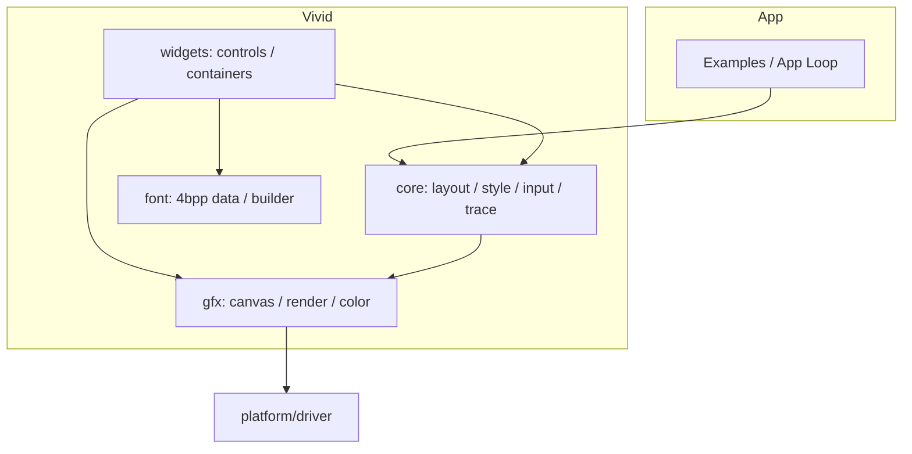
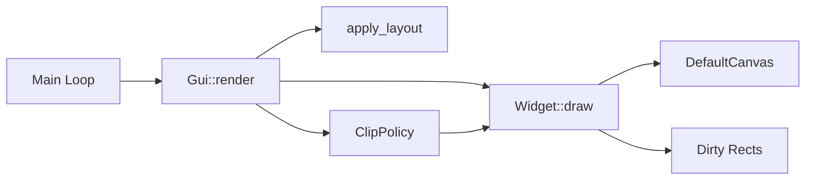
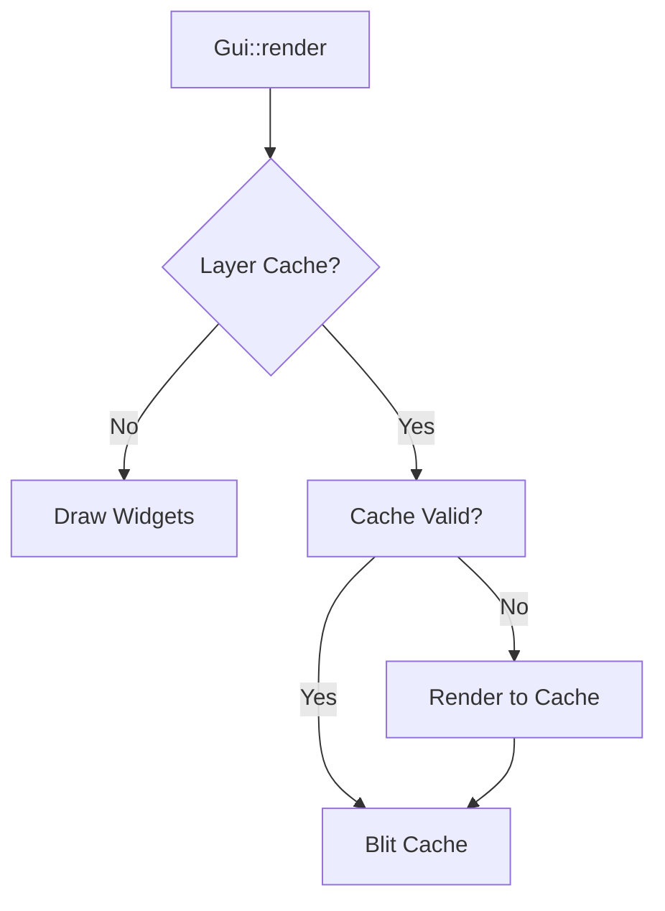
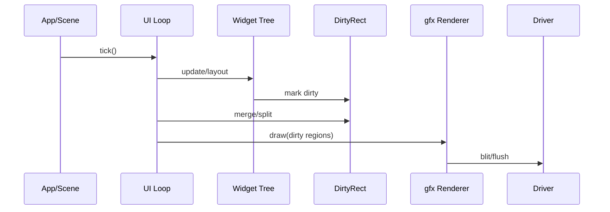
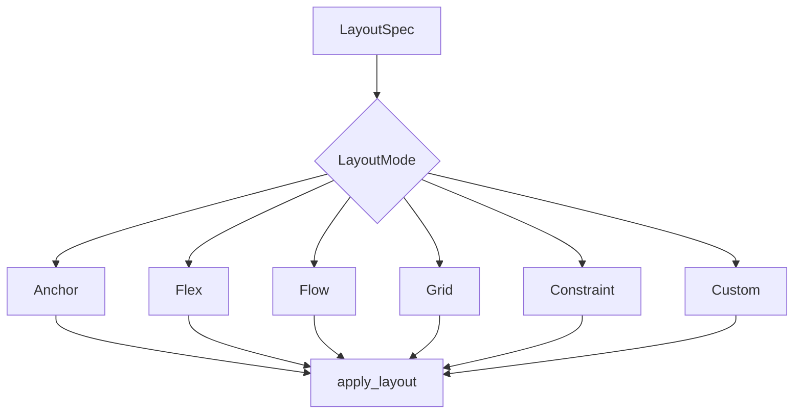
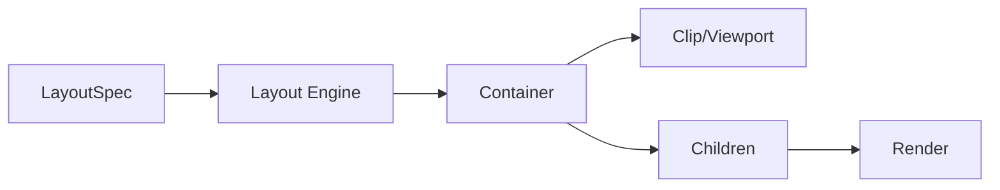

# Charm Vivid 架构说明

本文件用于描述 Vivid 的当前架构、边界与主要模块，便于后续补齐能力与迁移控件。

## 1. 分层结构

- core：数据结构、主题/样式、诊断/trace、配置等基础设施。
- gfx：渲染 API 与几何/像素格式抽象。
- widgets：控件与容器实现，尽量保持薄封装，不重复基础设施。
- font：字体数据与生成脚本产物（4bpp 为默认）。

### 分层关系图（逻辑视图）



## 2. 渲染与更新

- 渲染入口由 UI 主循环驱动，控件在更新阶段提交绘制。
- 使用脏矩形/脏区域机制减少刷新面积，保持与底层驱动解耦。
- 绘制 API 统一走 gfx 层，避免控件直接绑定平台细节。
- 子控件裁剪通过 ClipPolicy 统一管理（Rect/LayoutRect/Custom）。





### 渲染/刷新链路（时序视图）



## 3. 布局与容器

- 基础布局能力为 Anchor/Flex/Flow/Grid，容器负责子节点的布局与裁剪。
- 布局入口统一通过 layout engine 执行，支持按 LayoutSpec 切换策略（含 Constraint/Custom）。
- Custom 布局通过注册表挂载（LayoutEngine Registry），便于引入可插拔布局对象。
- Custom Layout 参数约定：custom_id 为布局引擎编号；custom_param0~3 由对应引擎定义，建议在控件/文档中明确含义，未使用保持 0。
- ScrollContainer/ScrollBar 负责滚动与可视区域同步。
- ListView 支持虚拟化与固定行缓存槽位复用，提升滚动性能。
- FoldablePanel 支持内容区滚动与折叠，子控件布局基于内容区矩形。

```mermaid
flowchart LR
  subgraph WidgetTree[控件树]
    Root[Root]
    Header[Header]
    Content[Content]
    Button[Button]
    List[ListView]
    Root --> Header
    Root --> Content
    Content --> Button
    Content --> List
  end
  subgraph RenderTree[渲染树]
    RRoot[Root]
    RHeader[Header]
    RList[ListView (virtual)]
    RRow1[Row 1]
    RRow2[Row 2]
    RRoot --> RHeader
    RRoot --> RList
    RList --> RRow1
    RList --> RRow2
  end
```



### 布局与容器协作



## 4. 输入与事件

- 输入链路由 InputRouter 中心化处理（hit-test/capture/gesture），支持双指 pinch 识别，控件只关注语义事件。
- 焦点与键盘导航由通用逻辑维护，控件实现自身行为。
- 手势事件提供 Swipe/Pinch 的接口占位，按需由控件接入。

### 分层关系图（逻辑视图）


## 5. 文本与字体

- 文本渲染默认 4bpp 字体数据。
- 支持 UTF-8 解码、测量、换行与截断，渲染与排版逻辑集中在 text 组件。
- 字体数据由 `font/font_builder.py` 生成，输出模块化字体数据。
- RichText/CodeBlock 走独立控件，避免复杂样式侵入基础文本。

## 6. 主题与样式

- 主题定义在 core/style 中，通过 `Theme::inherit` 与 `StylePatch` 支持局部覆盖。
- 提供 `ThemePreset` 作为配置入口，便于集中加载主题。
- 控件以 theme token 作为样式入口，避免散落硬编码。
- 主题扩展支持控件局部参数：如 FoldablePanel header/content padding、CloudyGlass 高光与透明度范围。
- StyleSheet 规则优先级为确定性模型：kind specificity > variant specificity > state mask 位数（更多位更具体），同级按插入顺序稳定排序。

## 7. 诊断与可观测性

- 统一接入 trace_core 做机器可读事件输出。
- 日志统一通过 out.logger。

### 分层关系图（逻辑视图）


## 8. 示例与验证

- 示例工程用于验证控件行为与性能路径，避免独立测试与真实场景脱节。
- 当前示例含 ListView/ScrollBar/TableView/TreeView、Stepper/Timeline、MenuTree、RichText/CodeBlock、Image 变换等最小配置。
