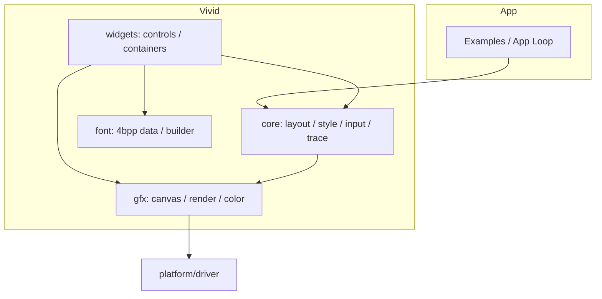
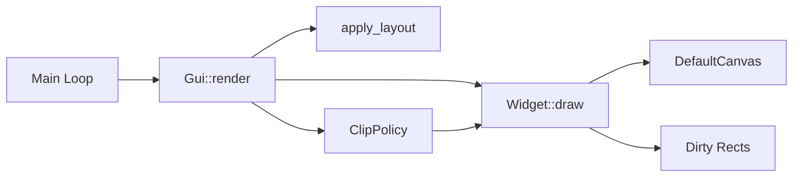
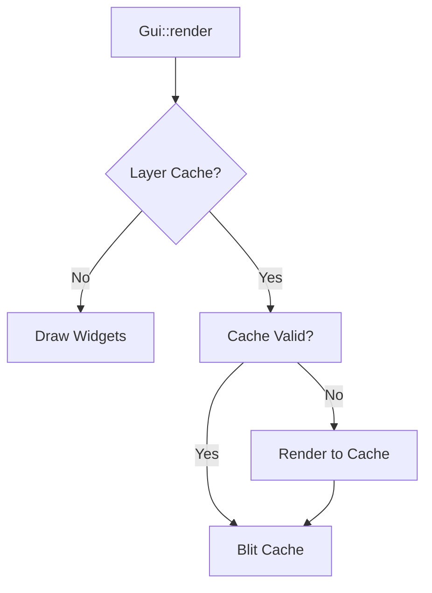
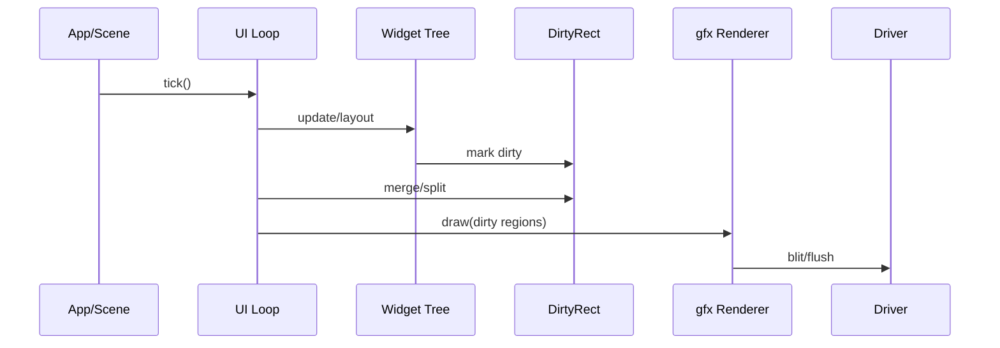
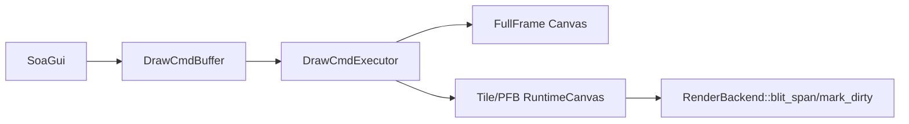
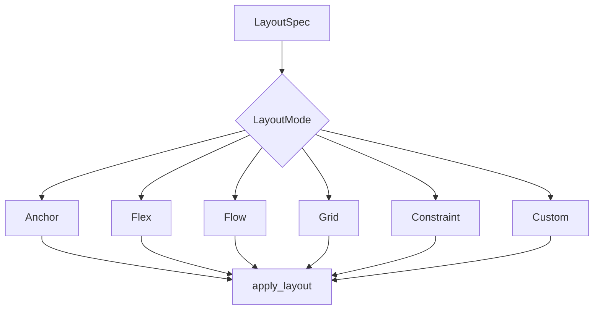
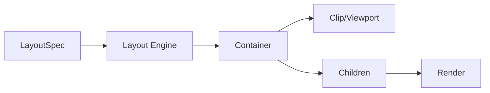

# Charm Vivid 架构说明

本文件用于描述 Vivid 的当前架构、边界与主要模块，便于后续补齐能力与迁移控件。

## 0. Roadmap（Next 3）

1. 行为分支继续 Action 化（收敛输入语义）
   - 验收：`vivid-soa-demo --soa-ci --regress-ui` 为 `ok=1`
2. 结构性 API 第二阶段
   - TableView 表头样式细化 + 横向滚动交互策略
   - 验收：`table_tree_ok=1` 且 `ui_ok=1`
3. A2 下一批控件迁移（Stepper/NumberList/Roller 完成）
   - 验收：`--soa-ci --regress-ui` 通过，且 `failed_cmds=0`

## 1. 分层结构

- core：数据结构、主题/样式、诊断/trace、配置等基础设施。
- gfx：渲染 API 与几何/像素格式抽象。
- widgets：控件与容器实现，尽量保持薄封装，不重复基础设施。
- font：字体数据与生成脚本产物（4bpp 为默认）。

### 分层关系图（逻辑视图）



## 2. 渲染与更新

- 渲染入口由 UI 主循环驱动，控件在更新阶段提交绘制。
- 使用脏矩形/脏区域机制减少刷新面积，保持与底层驱动解耦。
- 绘制 API 统一走 gfx 层，避免控件直接绑定平台细节。
- 子控件裁剪通过 ClipPolicy 统一管理（Rect/LayoutRect/Custom）。





### 渲染/刷新链路（时序视图）



### 2.1 命令缓冲 + Tile/PFB 执行（R1）

- SoA 渲染改为 **record/execute**：控件只记录命令，不直接绘制。
- `DrawCmdBuffer` 固定容量、无堆分配；命令只包含 POD（坐标/颜色/半径/文字索引）。
- `DrawCmdExecutor` 是唯一“画像素”的入口，支持：
  - **FullFrame**：直接执行到 `CanvasBase`（全屏缓冲）。
  - **Tile/PFB**：执行到 `RuntimeCanvas` + `RenderBackend::blit_span`（分块刷新）。
- `SoaGui::render()` 默认走命令缓冲；`SoaGui::render_tiles()` 用于 MCU PFB/Tile。
- 命令缓冲溢出与文本缓冲溢出有显式标志（stats 可观测）。



**SoA demo 支持：**

- `vivid-soa-demo --soa-tile`：Tile/PFB 路径（仅刷新脏区）。
- `vivid-soa-demo --soa-stats`：输出命令数、tile flush、dirty 命中率与 tile hit 率。
- Vivid 仅保留 **SoA 内核**：legacy 路径不再进入默认构建，统一收敛到单一内核边界。

**可移植模板：**

- `Examples/ui/vivid/port_template/tile_backend_template.cppm` 提供 MCU 侧 `RenderBackend` 模板。

### 2.2 命令集扩展与一致性校验（R2）

- 命令集扩展：支持 `DrawLine` / `DrawImage` / `DrawImageNineSlice` / `DrawPath` / `DrawIcon` 等基础原语，保持命令为 POD。
- 热路径保持 record/execute，不引入 runtime patch/派生。
- `vivid-soa-demo --soa-compare` 可在无 UI 模式下对 FullFrame 与 Tile/PFB 输出做哈希一致性校验（并要求命令缓冲不溢出、tile 输出非空）。

### 2.3 Tile 命中裁剪（R3）

- Tile 执行阶段先基于命令包围盒构建命中表（tile_count <= 1024），避免逐 tile 全量扫描。
- tile_count 超过上限时回退到逐 tile 命中检测，保持正确性。

### 2.4 SoA Payload Pools（C1）

- Node 只保留 `kind + payload_handle`（slot+generation），CommonSoA 不再存 payload 字段。
- 每个 kind 对应独立 `PayloadPool`，固定容量、无动态分配；默认容量为 `soa_max_nodes`。
- debug 下校验 slot/generation 与 owner，释放后 generation++，避免悬挂句柄。

### 2.5 控件注册表单一源（Registry）

- `widgets.registry.def` 是唯一源，包含 enable 条目与行为/style/payload 元数据。
- `widgets.def` 仅作为薄封装：由 registry 生成 `VIVID_WIDGET` 列表。
- `widget_registry.cppm` 的 enabled_kinds 构建直接读取 registry，避免手写列表分叉。

### 2.6 构建自治（De-rooting）

- 根 CMake 只负责启用 Vivid 与 featureset 选择，不再直接裁剪 Vivid 内部文件。
- `Modules/ui/vivid/vivid.cmake` 负责：
  - 生成 `soa_pool_caps.cppm`
  - 维护 Vivid 模块清单与裁剪逻辑
  - 注入 Vivid 编译选项与 featureset 宏

## 3. 布局与容器

- 基础布局能力为 Anchor/Flex/Flow/Grid，容器负责子节点的布局与裁剪。
- 布局入口统一通过 layout engine 执行，支持按 LayoutSpec 切换策略（含 Constraint/Custom）。
- Custom 布局通过注册表挂载（LayoutEngine Registry），便于引入可插拔布局对象。
- Custom Layout 参数约定：custom_id 为布局引擎编号；custom_param0~3 由对应引擎定义，建议在控件/文档中明确含义，未使用保持 0。
- ScrollContainer/ScrollBar 负责滚动与可视区域同步。
- ListView 支持虚拟化与固定行缓存槽位复用，提升滚动性能。
- FoldablePanel 支持内容区滚动与折叠，子控件布局基于内容区矩形。

### 3.1 布局失效策略矩阵（代码契约）

布局失效采用“三件套”约束：

1. 文档矩阵（本文）
2. 代码矩阵（`SoaKernel::layout_state_influence_mask`）
3. 回归矩阵（`soa_demo --soa-regress-layout`）

#### 状态位分类

- **布局影响位**：允许触发布局（极少数状态）
- **仅重绘位**：只允许触发绘制，不得触发布局

默认契约（SoA 子集）：

| 状态位 | 布局 | 绘制 | 说明 |
| --- | --- | --- | --- |
| Enabled | 否 | 是 | 禁止因启用状态重排 |
| Hovered | 否 | 是 | 交互态只重绘 |
| Pressed | 否 | 是 | 交互态只重绘 |
| Focused | 否 | 是 | Focus ring 走绘制叠加 |

> 目前 `layout_state_influence_mask` 对 SoA 子集返回 0，等价于“所有状态仅重绘，不触发布局”。

#### 数据变更的布局触发点

以下属于数据变更，必须触发布局失效：

- 文本内容变化（`set_text`）
- 约束/尺寸变化（`set_rect` / `set_layout_kind` / `set_list_row_height`）
- 影响布局的范围/尺寸参数（如 `set_range`）

#### 可执行契约（代码）

- `layout_state_influence_mask(kind)` 决定“哪些状态位可影响布局”。
- 状态变化时：`delta & mask != 0` → `mark_layout_dirty()`，否则只 `mark_paint_dirty()`。
- Layout 计算仅使用 mask 中允许的状态位（其余位在 layout 阶段强制忽略）。
- `layout_state_influence` 为策略开关，关闭时强制按 mask=0 处理（只重绘）。

#### 回归矩阵（trace-only）

`soa_demo --soa-regress-layout` 验证：

- hover/press/drag/scroll **不触发布局**，但 **必须触发绘制失效**。
- 文本变更 **必须触发布局失效**。

```mermaid
flowchart LR
  subgraph WidgetTree[控件树]
    Root[Root]
    Header[Header]
    Content[Content]
    Button[Button]
    List[ListView]
    Root --> Header
    Root --> Content
    Content --> Button
    Content --> List
  end
  subgraph RenderTree[渲染树]
    RRoot[Root]
    RHeader[Header]
    RList[ListView (virtual)]
    RRow1[Row 1]
    RRow2[Row 2]
    RRoot --> RHeader
    RRoot --> RList
    RList --> RRow1
    RList --> RRow2
  end
```



### 布局与容器协作



## 4. 输入与事件

- 输入链路由 SoaKernel 内核化处理（hit-test/capture/drag/cancel），控件不再自行维护 hover/pressed。
- SoA 输入采用 **Action 列表**：输入阶段只记录动作，统一在 dispatch 末尾由内核执行（含焦点状态落地），保证状态写入权唯一。
- 焦点与键盘导航由通用逻辑维护，控件实现自身行为。
- 手势事件提供 Swipe/Pinch 的接口占位，按需由控件接入。

### 分层关系图（逻辑视图）


## 5. 文本与字体

- 文本渲染默认 4bpp 字体数据。
- 支持 UTF-8 解码、测量、换行与截断，渲染与排版逻辑集中在 text 组件。
- 字体数据由 `font/font_builder.py` 生成，输出模块化字体数据。
- RichText/CodeBlock 走独立控件，避免复杂样式侵入基础文本。
- SoA 路径使用 `TextArena + TextId` 存储文本，payload 不再保存指针；溢出时置位 `text_overflowed` 并回退到空文本或占位串。

## 6. 主题与样式

- 主题定义在 core/style 中，通过 `Theme::inherit` 与 `StylePatch` 支持局部覆盖。
- 提供 `ThemePreset` 作为配置入口，便于集中加载主题。
- 控件以 theme token 作为样式入口，避免散落硬编码。
- role 派生通过 `ResolvedTheme` 预编译（仅在 tokens 变更时生成），StyleSheet 热路径不再做派生计算。
- StyleSheet 预编译触发仅依赖 `tokens_version` 与 `stylesheet_version`，热路径只做索引查表。
- 预编译样式输出 `ResolvedStyleView`：颜色表按 state 维度查表，metrics 走 `metrics_id -> metrics_pool` 去重索引，避免热路径搬运大对象。
- 主题扩展支持控件局部参数：如 FoldablePanel header/content padding、CloudyGlass 高光与透明度范围。
- StyleSheet 规则优先级为确定性模型：kind specificity > variant specificity > state mask 位数（更多位更具体），同级按插入顺序稳定排序。

### 6.1 Style 状态掩码矩阵（StyleState mask）

目的：按控件裁剪 style 维度，避免表尺寸爆炸；Focused 不进入 style（只用于 focus ring 绘制）。

- `style_state_mask_for_kind(kind)` 为编译期常量；`state_count = 1 << popcount(mask)`。
- mask 只包含 `Hovered / Pressed / Disabled` 三类状态位（Focused 不进入 style）。

| 分类 | mask | 说明 | 控件 |
| --- | --- | --- | --- |
| readonly | Disabled | 展示类控件，仅允许禁用态影响样式 | Container、ScrollContainer、Dial、Arc、Image、Label、Led、Progress、ModalDialog、ProgressBarSimple、DynamicNebula、CrtScreen、Bar、PopupLayer、MessageBox、RadioGroup、Chart、Waveform、Gauge、PrimitivesCanvas、PerfOverlay、Timeline、RichText、CodeBlock、ProgressWheel、WaveformView、BatteryGauge、HistogramView、RingIndication、TextBox、ProgressFlowing、CloudyGlass、ProgressBarRound、SpinningWheel、ImageBox、MeterPointer、ProgressBarDrill、SpectrumView、BusyWheel、ConsoleBox、BatteryGasGauge、Histogram、List、ListView、IconList、TextTrackingList、TextList、TableView、TreeView、TextInput、TextArea、NumberInput |
| press_only | Pressed + Disabled | 允许按下态但不跟随 hover | Slider、ScrollBar、Roller、Spinner、NumberList、SpinZoomWidget |
| interactive | Hovered + Pressed + Disabled | 典型交互控件 | Button、Checkbox、Radio、Switch、SegmentedControl、Dropdown、TabView、Stepper、Menu、MenuItem、ToggleGroup、ListItem、FoldablePanel |

> 备注：TextInput/TextArea/NumberInput 在 SoA-only 路径中按只读处理，当前 mask 仅保留 Disabled。

## 7. 诊断与可观测性

- 统一接入 trace_core 做机器可读事件输出。
- 日志统一通过 out.logger。

### 分层关系图（逻辑视图）


## 8. 示例与验证

- 示例工程用于验证控件行为与性能路径，避免独立测试与真实场景脱节。
- 当前示例含 ListView/ScrollBar/TableView/TreeView、Stepper/Timeline、MenuTree、RichText/CodeBlock、Image 变换等最小配置。
