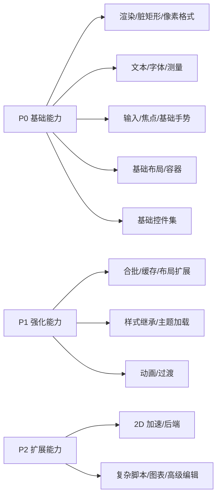
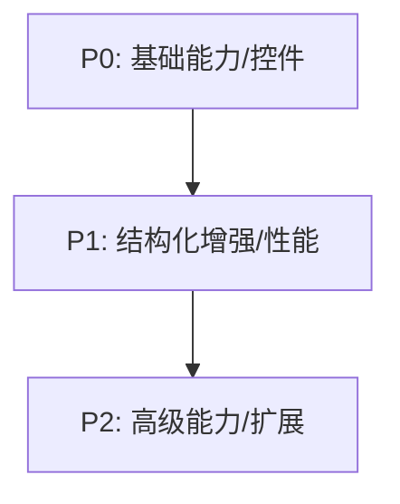

# Charm Vivid 功能清单与优先级（草案）

说明：
- P0：短期必须补齐的基础能力
- P1：中期重点能力与控件
- P2：后续扩展与增强

## 优先级总览（图示）





```mermaid
flowchart LR
  Render[渲染] --> Text[字体/文本]
  Text --> Widgets[控件]
  Render --> Widgets
  Input[输入路由] --> Widgets
  Theme[主题/样式] --> Widgets
  Trace[trace/日志] --> Diagnostics[可观测性]
``````

## 1. 基础渲染与资源
- P0 渲染原语：线/矩形/圆/圆角矩形/图片/九宫格
- P0 脏矩形链路：标记 -> 合并 -> 分区刷新
- P0 像素格式：RGB565/RGB888/ARGB8888
- P1 渲染合批（同材质/同纹理）
- P1 GPU/DMA 适配层（可选）
- P2 专用 2D 加速后端

## 2. 字体与文本
- P0 UTF-8 解码
- P0 4bpp 字体渲染（默认）
- P0 文本测量：宽度/高度/基线
- P1 自动换行/省略号
- P1 多字体验证与回退
- P2 复杂脚本 shaping

## 3. 事件与输入
- P0 鼠标/触摸：按下/抬起/移动/滚轮
- P0 点击/拖拽/长按
- P0 焦点与键盘导航
- P1 手势（滑动/捏合，路由层识别）
- P1 输入路由中心化（InputRouter）
- P2 多指/压感

## 4. 布局与容器
- P0 基础布局：Flex/Anchor
- P0 容器：ScrollContainer、PopupLayer
- P1 栅格/流式布局（已提供最小实现）
- P1 约束布局（Constraint）
- P1 LayoutSpec 可配置布局引擎（统一入口）
- P2 虚拟列表布局

## 5. 已具备的基础控件（当前已有）
- P0 button / label / image（缩放/裁剪/对齐/旋转/采样/裁剪模式/边界模式） / spin_zoom_widget / checkbox / switch
- P0 radio / radio_group
- P0 slider / dial / roller / dropdown
- P0 list / icon_list / number_list / text_tracking_list / text_list / menu / menu_item
- P0 menu 支持多级展开/收起（menu_tree，含键盘导航）
- P0 list_view（含虚拟化与固定行缓存槽位）
- P0 progress / spinner / bar / progress_bar_round / gauge / arc
- P0 progress_wheel / progress_flowing（含无值模式） / waveform_view / battery_gauge / histogram_view / ring_indication（含刻度/阴影） / text_box / foldable_panel / cloudy_glass
- P0 text / text_area / text_input / number_input / rich_text（粗体/颜色/等宽） / code_block
- P0 message_box / modal_dialog / tabview / scroll_container / popup_layer / scrollbar
- P0 segmented_control / toggle_group
- P0 table_view / tree_view（最小骨架与示例数据源）

## 6. 典型能力验证入口（示例）
- ListView 虚拟化与池复用（player demo）
- TableView / TreeView 最小数据源与点击选择（player demo）
- FoldablePanel 滚动与裁剪（player demo）
- ProgressFlowing 无值模式（player debug）
- CloudyGlass 高光/阴影/圆角（player debug）

## 7. 待补齐的基础控件
- P1 选择类：range_selector（待定）

## 8. 高级组件
- P1 表格/表头（table_view）
- P1 树形列表（tree_view）
- P1 进度与状态：stepper、timeline（已提供最小骨架）
- P2 图表扩展（多曲线/交互）
- P2 富文本/代码编辑

## 9. 主题与样式
- P0 主题结构化（Theme/Style）
- P1 样式继承与局部覆盖（已在部分控件落地示例）
- P1 主题加载（配置/资源入口已提供：ThemePreset）
- P1 约束式样式表 PoC（StyleSheet）
- P2 运行时 DSL/CSS

## 10. 动画与过渡
- P1 简单时间轴 + easing
- P1 属性插值（alpha/位置/尺寸）
- P2 复杂转场与滤镜

## 11. 诊断与可观测性
- P0 trace/日志/计数器（已接入）
- P1 性能 overlay（FPS/脏区/绘制时间）
- P2 可回放的渲染/输入记录

## 12. 关键缺口与风险
- 动画系统尚未统一到控件全量路径（仍有局部手写逻辑）
- 复杂文本排版与 shaping 未实现（国际化风险）
- 高级图表交互缺口（缩放/选区/标注）
- GPU/DMA 后端未接入（大屏或高帧率场景受限）

```mermaid
flowchart LR
  Clip[ClipPolicy] --> Rect[Rect/LayoutRect]
  Clip --> Custom[Custom Insets]
  Scroll[ScrollContainer] --> Custom
  Fold[FoldablePanel] --> Rect
  Custom --> Render[Clip in render]
```

## 13. 架构改进清单（参考 ARM-2D / LVGL）
- 布局助手：提供轻量 layout iterator，输入区域与 item size/spacing，输出序列 Rect（减轻控件内部计算）。
- 缓存策略：引入 CachePolicy（控件/容器声明可缓存性），统一渲染阶段决策与配置入口。
- 可观测性扩展：trace 记录 layout rect / clip rect / draw rect，便于回放与性能定位。
- 主题基线：支持主题包/默认样式基线与一键切换，减少 demo 内零散配置。
- 前后端拆分：参考 Arm-2D 的“前端校验 + 后端执行”，把几何/裁剪/参数归一化集中在 core。
- 辅助服务：增加时间滑块/缓动帮助器（线性/半余弦）供动画与进度类控件复用。
- 资源加载：支持“按需资源加载/虚拟资源”接口，降低大资源对 RAM 的压力。


