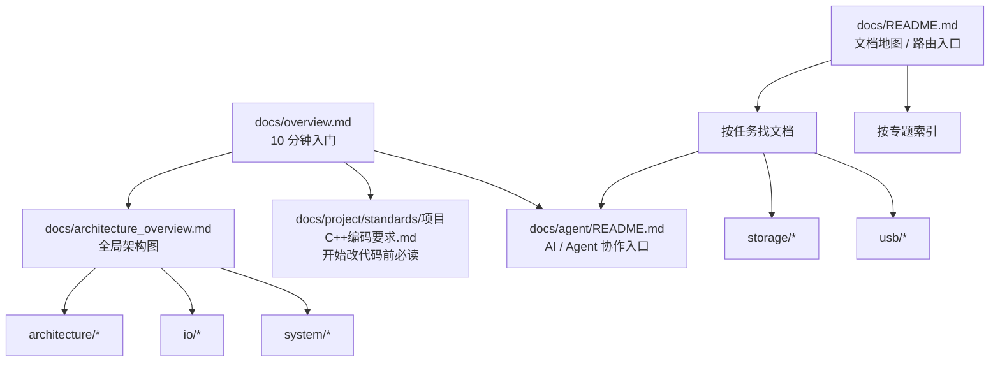

# 文档索引

本页是 `docs/` 的文档地图与路由入口。  
用于按任务或专题查找文档，不替代新同学入门文档 `docs/overview.md`。

如果你是新同学，建议先读 `docs/overview.md`。

## 快速开始
- 入门指南：`docs/overview.md`
- 架构总览：`docs/architecture_overview.md`
- 系统编译器路线图：`docs/architecture/system_compiler_roadmap.md`
- 资源契约 v0：`docs/system/resource_contract_v0.md`
- bringup 证据流水线 v0：`docs/system/bringup_evidence_pipeline_v0.md`
- 驱动模型：`docs/architecture/driver_model.md`
- 依赖边界与禁区：`docs/architecture/dependency_contract.md`
- IO 核心契约：`docs/io/io_channel_contract.md`、`docs/io/io_reactor_contract.md`、`docs/io/io_registry_contract.md`
- 装配与启动：`docs/system/init_graph_contract.md`
- Recipe / Plan 草案：`docs/system/init_plan_recipe_draft.md`
- Init Plan Review 规则：`docs/system/init_plan_review_rules.md`
- Materialized Graph 观察导出：`docs/system/init_materialized_graph_observe.md`
- Materialized Graph 工具链里程碑：`docs/system/init_materialized_graph_tooling_milestone.md`
- 网络协议栈双表面设计：`docs/io/net_stack_dual_surface_design.md`
- 网络 socket v0 契约：`docs/io/net_socket_v0_contract.md`
- 网络协议栈阶段复盘：`docs/io/net_stack_stage_review.md`
- 网络协议栈底座收口任务单：`docs/io/net_stack_foundation_tasklist.md`
- POSIX 兼容总览：`docs/system/posix_support_overview.md`
- POSIX 分层与演进原则：`docs/system/posix_subsystem_principles.md`
- POSIX 三层执行模型：`docs/system/posix_three_layer_contract.md`
- POSIX 用户态运行时：`docs/system/posix_user_runtime_minimal_design.md`
- 输入链路：`docs/input/input_layering_decision.md`

## 文档体系图



## 按任务找文档

| 我要做什么 | 先看什么 |
| --- | --- |
| 看 Charm 中长期主轴 | `docs/architecture/system_compiler_roadmap.md` → `docs/architecture/charm_methodology_charter.md` |
| 看资源边界如何进入系统语言 | `docs/system/resource_contract_v0.md` → `docs/system/ssu_contract.md` → `docs/system/init_graph_contract.md` |
| 看 bringup 如何从装配图变成证据 | `docs/system/bringup_evidence_pipeline_v0.md` → `docs/system/init_materialized_graph_observe.md` → `docs/system/init_graph_contract.md` |
| 新增板级能力 | `docs/system/init_graph_contract.md` → `docs/io/io_layering_overview.md` |
| 设计驱动/外设模型 | `docs/architecture/driver_model.md` → `docs/architecture/device_model_overview.md` → `docs/io/io_layering_overview.md` |
| 接入文件系统 | `docs/storage/block_device_contract.md` → `docs/storage/fs_vfs_mount_rules.md` |
| 实现 USB 设备 | `docs/usb/usb_arch_plan.md` → `docs/usb/usb_dsl_overview.md` |
| 实现 USB Host 运行期发现 | `docs/architecture/driver_model.md` → `docs/architecture/device_model_overview.md` |
| 开始改代码 | `docs/overview.md` → `docs/project/standards/项目C++编码要求.md` |
| 和 AI 协作 | `docs/agent/README.md` |
| 做代码审查 | `docs/agent/skills/code-review/` |
| 做网络协议栈设计 | `docs/io/net_stack_dual_surface_design.md` |
| 看网络协议栈阶段复盘 | `docs/io/net_stack_stage_review.md` |
| 拆网络底座收口任务 | `docs/io/net_stack_foundation_tasklist.md` |
| POSIX 兼容总览 | `docs/system/posix_support_overview.md` |
| POSIX 分层与演进原则 | `docs/system/posix_subsystem_principles.md` |
| POSIX 三层执行模型 | `docs/system/posix_three_layer_contract.md` |
| POSIX 用户态运行时 | `docs/system/posix_user_runtime_minimal_design.md` |
| POSIX 兼容/BusyBox 验收 | `docs/system/posix_compat_roadmap.md` |
| Linux 生态兼容任务清单 | `docs/system/posix_linux_compat_tasklist.md` |
| POSIX spawn 草案 | `docs/system/posix_spawn_minimal_design.md` |
| POSIX fd 表草案 | `docs/system/posix_fd_table_minimal_design.md` |
| POSIX errno 映射 | `docs/system/posix_errno_mapping.md` |
| POSIX 错误语义约定 | `docs/system/posix_error_semantics.md` |
| BusyBox 验收清单 | `docs/system/posix_busybox_phase_checklist.md` |

## 按专题索引

### 文档分层图
```text
docs/
├─ overview.md                新同学 10 分钟入口
├─ architecture_overview.md   全局架构图
├─ README.md                  文档总索引
├─ agent/                     AI / Agent 协作体系
├─ architecture/              架构规则与依赖边界
├─ io/                        IO 核心契约
├─ system/                    装配、启动、系统服务
└─ ...
```

### 总览
- `docs/architecture_overview.md`

### 架构与依赖
- `docs/architecture/system_compiler_roadmap.md`
- `docs/architecture/dependency_contract.md`
- `docs/architecture/dependency_whitelist.md`
- `docs/architecture/driver_model.md`
- `docs/architecture/device_model_overview.md`
- `docs/architecture/capability_recovery_rules.md`
- `docs/architecture/capability_recovery_matrix.md`

### IO 与输入
- `docs/io/io_layering_overview.md`
- `docs/io/io_channel_contract.md`
- `docs/io/io_reactor_contract.md`
- `docs/io/io_registry_contract.md`
- `docs/io/net_stack_dual_surface_design.md`
- `docs/io/net_socket_v0_contract.md`
- `docs/io/net_stack_stage_review.md`
- `docs/io/net_stack_foundation_tasklist.md`
- `docs/input/input_layering_decision.md`
- `docs/input/input_protocol_map.md`

### 存储/文件系统
- `docs/storage/block_device_contract.md`
- `docs/storage/mal_overview.md`
- `docs/storage/mal_fatfs_demo.md`
- `docs/storage/fs_vfs_mount_rules.md`
- `docs/storage/fs_block_cache_strategy.md`
- `docs/storage/fs_fatfs_demo.md`
- `docs/storage/filex_charm_map.md`

### USB
- `docs/usb/usb_arch_plan.md`
- `docs/usb/usb_dsl_overview.md`
- `docs/usb/usb_cdc_contract.md`
- `docs/usb/usb_strings_overview.md`
- `docs/architecture/driver_model.md`（USB Host runtime / capability export）
- `docs/architecture/device_model_overview.md`（USB Host discovery / lifecycle）

### 系统与启动
- `docs/system/resource_contract_v0.md`
- `docs/system/bringup_evidence_pipeline_v0.md`
- `docs/system/init_graph_contract.md`
- `docs/system/init_plan_recipe_draft.md`
- `docs/system/init_plan_review_rules.md`
- `docs/system/init_materialized_graph_observe.md`
- `docs/system/init_materialized_graph_tooling_milestone.md`
- `docs/system/service_component_init.md`
- `docs/system/power_lowpower_overview.md`
- `docs/system/at_system.md`
- `docs/system/av_pipeline_overview.md`
- `docs/system/posix_support_overview.md`
- `docs/system/posix_subsystem_principles.md`
- `docs/system/posix_three_layer_contract.md`
- `docs/system/posix_user_runtime_minimal_design.md`
- `docs/system/posix_compat_roadmap.md`
- `docs/system/posix_linux_compat_tasklist.md`
- `docs/system/posix_spawn_minimal_design.md`
- `docs/system/posix_fd_table_minimal_design.md`
- `docs/system/posix_errno_mapping.md`
- `docs/system/posix_error_semantics.md`
- `docs/system/posix_busybox_phase_checklist.md`
- `docs/boot/bootloader_overview.md`
- `docs/boot/bootloader_xymodem.md`

### Trace
- `docs/trace/trace_core_entry.md`
- `docs/trace/trace_core_ids.md`

### VSF 参考
- `docs/reference/vsf/vsf_comparison.md`
- `docs/reference/vsf/vsf_component_scan.md`
- `docs/reference/vsf/vsf_storage_map.md`
- `docs/reference/vsf/vsf_tcpip_map.md`
- `docs/reference/vsf/vsf_usb_map.md`

### 项目规范与协作
- `docs/project/standards/project_conventions.md`
- `docs/project/standards/项目C++编码要求.md`
- `docs/project/collaboration/《协作期待与规范》.md`
- `docs/project/collaboration/《现代 C++ 单片机代码协作认知》.md`
- `docs/project/tracking/推进TODO与分工.md`
- `docs/project/tracking/refactor_todo_ownership.md`
- `docs/project/tracking/player_issue_log.md`
- `docs/project/tooling/Powershell设置utf8.md`

### UI
- `docs/ui/player_ui.md`
- `docs/ui/player_vivid_patterns.md`

### 方法论总纲
- `docs/architecture/charm_methodology_charter.md`
