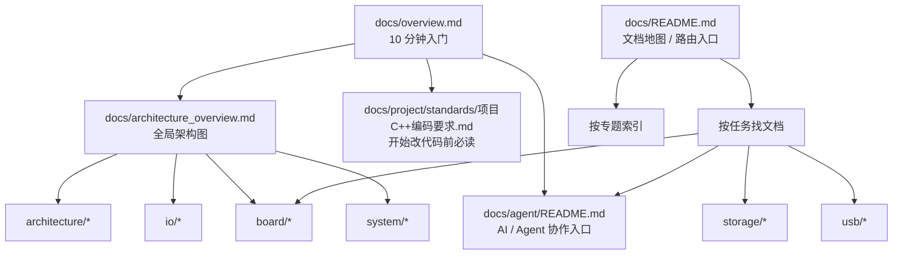

# 文档索引

本页是 `docs/` 的文档地图与路由入口。  
用于按任务或专题查找文档，不替代新同学入门文档 `docs/overview.md`。

如果你是新同学，建议先读 `docs/overview.md`。

## 先按这个顺序读

如果你是第一次进仓库，先别试图一口气看完所有专题，建议按这条路径建立认知：

1. `docs/overview.md`：10 分钟入门
2. `docs/architecture_overview.md`：全局架构、依赖红线、公开入口
3. `docs/README.md`：按任务继续路由
4. `docs/board/README.md` 或 `docs/system/posix_support_overview.md`：按当前任务选专题入口

## 先分清哪类文档最值得信

遇到同一主题下文档很多时，优先按下面的权威层级判断：

1. `README.md` / `*_overview.md`
   用来找入口、理解主题边界，不直接替代具体契约。
2. `*_contract.md`
   现行行为、边界和接口约束优先以契约文档为准。
3. `*_plan.md` / `*_roadmap.md` / `*_draft.md`
   表达方向、设计草案或迁移计划，不自动等同于已落地事实。
4. `*_review.md` / `*_summary.md` / `*_v0.md`
   记录阶段性结论、阶段快照或实验收口，需要结合当前代码和上位文档阅读。
5. `*_tasklist.md` / `*_checklist.md`
   主要服务推进、验收和排期，不应直接充当长期对外接口说明。
6. `reference/*` / `generated/*`
   前者偏参考材料，后者偏生成结果，都不是默认的一手入口。

## 文档维护入口

如果你要新增、整理或归档文档，先看 `docs/documentation_maintenance.md`。  
这份约定会定义：

- 什么时候该更新入口文档
- 什么时候应该落成契约文档
- 什么时候只该放进计划、复盘或任务清单
- 旧文档应该如何标注替代关系，避免继续制造重复入口

## 文档状态说明

为降低认知负担，先区分文档类型：

- `现行入口 / 稳定契约`：默认优先遵守，适合作为日常开发入口。
- `总览 / 路由文档`：帮助理解全局结构与阅读路径，不直接替代具体契约。
- `阶段总结 / 路线图 / v0`：记录某一阶段的结论、快照或方向，不自动等同于长期稳定规范。
- `任务单 / checklist / tasklist`：用于推进、验收、排期，不等同于对外长期接口契约。
- `草案 / draft / 提案`：尚未完全收口，使用时应结合当前代码与上位文档判断。

看到这些标题或后缀时，可先做如下判断：

- `*_contract.md`：优先视为契约文档
- `*_overview.md` / `README.md`：优先视为入口或总览
- `*_tasklist.md` / `*_checklist.md`：优先视为推进材料
- `*_draft.md` / `*草案*.md`：优先视为讨论材料
- `*_v0.md` / `*review*.md` / `*summary*.md`：优先视为阶段成果或阶段记录

## 快速开始（现行 / 稳定入口优先）
- 入门指南：`docs/overview.md`
- 架构总览：`docs/architecture_overview.md`
- 文档总索引：`docs/README.md`
- 系统文档入口：`docs/system/README.md`
- 项目文档入口：`docs/project/README.md`
- 架构文档入口：`docs/architecture/README.md`
- IO 文档入口：`docs/io/README.md`
- 输入文档入口：`docs/input/README.md`
- 音频文档入口：`docs/audio/README.md`
- 存储文档入口：`docs/storage/README.md`
- Boot 文档入口：`docs/boot/README.md`
- USB 文档入口：`docs/usb/README.md`
- 板级资料入口：`docs/board/README.md`
- RK3506 上板资料：`docs/board/rk3506/README.md`
- RK3506 post-DDR handoff 契约：`docs/board/rk3506/post_ddr_handoff_contract.md`
- 驱动模型：`docs/architecture/driver_model.md`
- 依赖边界与禁区：`docs/architecture/dependency_contract.md`
- IO 文档入口：`docs/io/README.md`
- IO 核心契约：`docs/io/io_channel_contract.md`、`docs/io/io_reactor_contract.md`、`docs/io/io_registry_contract.md`
- 装配与启动：`docs/system/init_graph_contract.md`
- ARMv7-A 平台契约：`docs/system/armv7a_platform_contract.md`
- 最小内核运行时 bridge 契约：`docs/system/minimal_kernel_runtime_bridge_contract.md`
- 最小内核运行时证据矩阵：`docs/system/minimal_kernel_runtime_evidence_matrix.md`
- 最小内核运行时总回归：`scripts/minimal_kernel_runtime_smoke.ps1`
- 最小内核 runtime mailbox 契约：`docs/system/minimal_kernel_runtime_mailbox_contract.md`
- 最小内核 task message API 契约：`docs/system/minimal_kernel_task_message_api_contract.md`
- 最小内核 task message table 契约：`docs/system/minimal_kernel_task_message_table_contract.md`
- 最小内核 task message dispatch 契约：`docs/system/minimal_kernel_task_message_dispatch_contract.md`
- 最小内核 task message service loop 契约：`docs/system/minimal_kernel_task_message_service_loop_contract.md`
- 最小内核 task message service drain 契约：`docs/system/minimal_kernel_task_message_service_drain_contract.md`
- 最小内核 task message service pump 契约：`docs/system/minimal_kernel_task_message_service_pump_contract.md`
- 最小内核 task message syscall bridge 契约：`docs/system/minimal_kernel_task_message_syscall_bridge_contract.md`
- 最小内核 task message syscall frame transport 契约：`docs/system/minimal_kernel_task_message_syscall_frame_contract.md`
- 最小内核 task message syscall frame caller 契约：`docs/system/minimal_kernel_task_message_syscall_frame_caller_contract.md`
- 最小内核 task message syscall client 契约：`docs/system/minimal_kernel_task_message_syscall_client_contract.md`
- 最小内核 task message syscall pump 契约：`docs/system/minimal_kernel_task_message_syscall_pump_contract.md`
- 最小内核 task message runtime service 契约：`docs/system/minimal_kernel_task_message_runtime_service_contract.md`
- 最小内核 task message runtime API 契约：`docs/system/minimal_kernel_task_message_runtime_api_contract.md`
- 最小内核 task message syscall API 契约：`docs/system/minimal_kernel_task_message_syscall_api_contract.md`
- 最小内核 task message session API 契约：`docs/system/minimal_kernel_task_message_session_api_contract.md`
- 最小内核 task message session dispatch 契约：`docs/system/minimal_kernel_task_message_session_dispatch_contract.md`
- 最小内核 task message session acceptor / channel facade 契约：`docs/system/minimal_kernel_task_message_session_acceptor_contract.md`
- 最小内核 task message session endpoint facade 契约：`docs/system/minimal_kernel_task_message_session_endpoint_contract.md`
- 最小内核 task message session protocol surface 契约：`docs/system/minimal_kernel_task_message_session_protocol_contract.md`
- 最小内核 task message session protocol schema 契约：`docs/system/minimal_kernel_task_message_session_protocol_schema_contract.md`
- 最小内核 task message session service facade 契约：`docs/system/minimal_kernel_task_message_session_service_contract.md`
- 最小内核 task message session service loop 证据契约：`docs/system/minimal_kernel_task_message_session_service_loop_contract.md`
- 最小内核 task message session roundtrip 证据契约：`docs/system/minimal_kernel_task_message_session_roundtrip_contract.md`
- 最小内核 task-side runtime service 契约：`docs/system/minimal_kernel_runtime_service_contract.md`
- 最小内核 task runtime API 契约：`docs/system/minimal_kernel_task_runtime_api_contract.md`
- 最小内核 task syscall API 契约：`docs/system/minimal_kernel_task_syscall_api_contract.md`
- 最小内核 task syscall catalog 契约：`docs/system/minimal_kernel_task_syscall_catalog_contract.md`
- 最小内核 task syscall dispatch 契约：`docs/system/minimal_kernel_task_syscall_dispatch_contract.md`
- 最小内核 task syscall table 契约：`docs/system/minimal_kernel_task_syscall_table_contract.md`
- 最小内核 task syscall frame 契约：`docs/system/minimal_kernel_task_syscall_frame_contract.md`（当前存在历史编码损坏，待恢复，不作为首选入口）
- 最小内核 trap/syscall 契约：`docs/system/minimal_kernel_trap_syscall_contract.md`
- 最小内核 trap ingress adapter 契约：`docs/system/minimal_kernel_trap_ingress_contract.md`
- ARMv7-A SVC 到 trap frame 映射证据：`docs/system/armv7a_runtime_trap_mapping_contract.md`
- 网络协议栈双表面设计：`docs/io/net_stack_dual_surface_design.md`
- POSIX 兼容总览：`docs/system/posix_support_overview.md`
- POSIX 分层与演进原则：`docs/system/posix_subsystem_principles.md`
- POSIX 三层执行模型：`docs/system/posix_three_layer_contract.md`
- POSIX 用户态运行时：`docs/system/posix_user_runtime_minimal_design.md`
- 输入链路：`docs/input/input_layering_decision.md`

## 阶段文档 / 任务单 / 草案入口

如果你当前做的是路线设计、阶段复盘、排期拆解，优先从这里进入：

- 系统编译器路线图：`docs/architecture/system_compiler_roadmap.md`
- System Compiler 词汇表 v0：`docs/architecture/system_compiler_vocabulary_v0.md`
- Artifact Report v0：`docs/system/artifact_report_v0.md`
- Canonical World v0：`docs/system/canonical_world_v0.md`
- Witness Bundle v0：`docs/system/witness_bundle_v0.md`
- World Compare v0：`docs/system/world_compare_v0.md`
- System Compiler Biography v0：`docs/system/system_compiler_biography_v0.md`
- System Compiler Biography Index v0：`docs/system/system_compiler_biography_index_v0.md`
- System Compiler Biography Index Compare v0：`docs/system/system_compiler_biography_index_compare_v0.md`
- System Compiler World Shelf Review v0：`docs/system/system_compiler_world_shelf_review_v0.md`
- System Compiler Front Page Route v0：`docs/system/system_compiler_front_page_route_v0.md`
- System Compiler Front Page Route Compare v0：`docs/system/system_compiler_front_page_route_compare_v0.md`
- System Compiler Front Page Entry Capability v0：`docs/system/system_compiler_front_page_entry_capability_v0.md`
- System Compiler Front Page Entry Landing v0：`docs/system/system_compiler_front_page_entry_landing_v0.md`
- System Compiler Front Page Entry Landing Compare v0：`docs/system/system_compiler_front_page_entry_landing_compare_v0.md`
- System Compiler Front Page Entry Opener v0：`docs/system/system_compiler_front_page_entry_opener_v0.md`
- Explain Surface / Artifact Report v0：`docs/system/explain_surface_v0.md`
- 资源契约 v0：`docs/system/resource_contract_v0.md`
- bringup 证据流水线 v0：`docs/system/bringup_evidence_pipeline_v0.md`
- Recipe / Plan 草案：`docs/system/init_plan_recipe_draft.md`
- Init Plan Review 规则：`docs/system/init_plan_review_rules.md`
- Materialized Graph 观察导出：`docs/system/init_materialized_graph_observe.md`
- Materialized Graph 工具链里程碑：`docs/system/init_materialized_graph_tooling_milestone.md`
- 网络 socket v0 契约：`docs/io/net_socket_v0_contract.md`
- 网络协议栈阶段复盘：`docs/io/net_stack_stage_review.md`
- 网络协议栈底座收口任务单：`docs/io/net_stack_foundation_tasklist.md`
- 网络底座 v0 关单清单：`docs/io/net_stack_v0_closure_checklist.md`

## 文档体系图



## 按任务找文档

| 我要做什么 | 先看什么 |
| --- | --- |
| 看 Charm 中长期主轴 | `docs/architecture/system_compiler_roadmap.md` → `docs/architecture/charm_methodology_charter.md` |
| 看 system compiler 核心词汇与当前仓库映射 | `docs/architecture/system_compiler_vocabulary_v0.md` → `docs/architecture/system_compiler_roadmap.md` |
| 看 system compiler 最小结论对象怎么长 | `docs/system/artifact_report_v0.md` → `docs/system/explain_surface_v0.md` → `schemas/README.md` |
| 看 canonical world / witness bundle 怎么组织一组证据世界 | `docs/system/canonical_world_v0.md` → `docs/system/witness_bundle_v0.md` → `Examples/kernel/canonical_worlds/README.md` |
| 看一个 world 相对基线如何 drift / collapse | `docs/system/world_compare_v0.md` → `docs/system/witness_bundle_v0.md` → `schemas/README.md` |
| 看 system compiler 如何把证据世界压成顶层交付封面 | `docs/system/system_compiler_biography_v0.md` → `docs/system/world_compare_v0.md` → `schemas/README.md` |
| 看多个 biography shelf 如何作为一组交付物做 compare | `docs/system/system_compiler_biography_index_v0.md` → `docs/system/system_compiler_biography_index_compare_v0.md` → `docs/system/system_compiler_world_shelf_review_v0.md` → `schemas/README.md` |
| 看 system compiler 如何对外解释自己 | `docs/system/explain_surface_v0.md` → `docs/system/init_materialized_graph_observe.md` → `schemas/README.md` |
| 看资源边界如何进入系统语言 | `docs/system/resource_contract_v0.md` → `docs/system/ssu_contract.md` → `docs/system/init_graph_contract.md` |
| 看 bringup 如何从装配图变成证据 | `docs/system/bringup_evidence_pipeline_v0.md` → `docs/system/init_materialized_graph_observe.md` → `docs/system/init_graph_contract.md` |
| 新增板级能力 | `docs/system/init_graph_contract.md` → `docs/io/io_layering_overview.md` |
| 上 RK3506 板 / 查早期寄存器 | `docs/board/rk3506/README.md` → `docs/board/rk3506/post_ddr_handoff_contract.md` → `docs/system/armv7a_platform_contract.md` |
| 推进 ARMv7-A 平台 bring-up | `docs/system/armv7a_platform_contract.md` → `docs/boot/bootloader_overview.md` |
| 推进最小内核运行时 glue / bridge | `docs/system/minimal_kernel_runtime_bridge_contract.md` → `docs/system/armv7a_minimal_kernel_staging_plan.md` |
| 查看最小内核运行时证据覆盖 | `docs/system/minimal_kernel_runtime_evidence_matrix.md` → `docs/system/minimal_kernel_runtime_bridge_contract.md` |
| 回归最小内核运行时总入口 | `scripts/minimal_kernel_runtime_smoke.ps1` → `docs/system/README.md` |
| 推进第一个 stateful kernel object / runtime mailbox | `docs/system/minimal_kernel_runtime_mailbox_contract.md` → `docs/system/minimal_kernel_runtime_bridge_contract.md` |
| 推进 task-facing message surface / current-task mailbox facade | `docs/system/minimal_kernel_task_message_api_contract.md` → `docs/system/minimal_kernel_runtime_mailbox_contract.md` |
| 推进 server-side task message routing / label table | `docs/system/minimal_kernel_task_message_table_contract.md` → `docs/system/minimal_kernel_task_message_api_contract.md` |
| 推进 task message dispatch / receive-reply bridge | `docs/system/minimal_kernel_task_message_dispatch_contract.md` → `docs/system/minimal_kernel_task_message_table_contract.md` |
| 推进 task message service loop / wait-timeout bridge | `docs/system/minimal_kernel_task_message_service_loop_contract.md` → `docs/system/minimal_kernel_task_message_dispatch_contract.md` |
| 推进 task message budgeted drain / 单次唤醒多请求进展 | `docs/system/minimal_kernel_task_message_service_drain_contract.md` → `docs/system/minimal_kernel_task_message_service_loop_contract.md` |
| 推进 task message service pump / bootstrap-rearm-hold 编排 | `docs/system/minimal_kernel_task_message_service_pump_contract.md` → `docs/system/minimal_kernel_task_message_service_drain_contract.md` |
| 推进 task message -> syscall bridge / 单字 message ingress v0 | `docs/system/minimal_kernel_task_message_syscall_bridge_contract.md` → `docs/system/minimal_kernel_task_message_service_pump_contract.md` → `docs/system/minimal_kernel_task_syscall_table_contract.md` |
| 推进 task message -> syscall frame transport / tokenized multi-arg ingress v1 | `docs/system/minimal_kernel_task_message_syscall_frame_contract.md` → `docs/system/minimal_kernel_task_message_syscall_bridge_contract.md` → `docs/system/minimal_kernel_task_syscall_frame_contract.md` |
| 推进 task message -> syscall frame caller / client-side publish-reply glue | `docs/system/minimal_kernel_task_message_syscall_frame_caller_contract.md` → `docs/system/minimal_kernel_task_message_syscall_frame_contract.md` → `docs/system/minimal_kernel_task_syscall_api_contract.md` |
| 推进 task message -> syscall client / async `sys_* + step(event)` seam | `docs/system/minimal_kernel_task_message_syscall_client_contract.md` → `docs/system/minimal_kernel_task_message_syscall_frame_caller_contract.md` → `docs/system/minimal_kernel_task_syscall_api_contract.md` |
| 推进 task message -> syscall pump / queued client orchestration seam | `docs/system/minimal_kernel_task_message_syscall_pump_contract.md` → `docs/system/minimal_kernel_task_message_syscall_client_contract.md` → `docs/system/minimal_kernel_task_syscall_api_contract.md` |
| 推进 task message -> runtime service / queued remote service facade | `docs/system/minimal_kernel_task_message_runtime_service_contract.md` → `docs/system/minimal_kernel_task_message_syscall_pump_contract.md` → `docs/system/minimal_kernel_runtime_service_contract.md` |
| 推进 task message -> task runtime API / current-task async runtime facade | `docs/system/minimal_kernel_task_message_runtime_api_contract.md` → `docs/system/minimal_kernel_task_message_runtime_service_contract.md` → `docs/system/minimal_kernel_task_runtime_api_contract.md` |
| 推进 task message -> task syscall API / async `sys_*` facade | `docs/system/minimal_kernel_task_message_syscall_api_contract.md` → `docs/system/minimal_kernel_task_message_runtime_api_contract.md` → `docs/system/minimal_kernel_task_syscall_api_contract.md` |
| 推进 task message -> session API / single in-flight async session facade | `docs/system/minimal_kernel_task_message_session_api_contract.md` → `docs/system/minimal_kernel_task_message_syscall_api_contract.md` → `docs/system/minimal_kernel_task_message_runtime_api_contract.md` |
| 推进 task message -> session dispatch / server-side `accept-serve-close` seam | `docs/system/minimal_kernel_task_message_session_dispatch_contract.md` → `docs/system/minimal_kernel_task_message_session_api_contract.md` → `docs/system/minimal_kernel_task_syscall_table_contract.md` |
| 推进 task message -> session acceptor / server-side accepted channel facade | `docs/system/minimal_kernel_task_message_session_acceptor_contract.md` → `docs/system/minimal_kernel_task_message_session_dispatch_contract.md` → `docs/system/minimal_kernel_task_message_session_roundtrip_contract.md` |
| 推进 task message -> session endpoint / server-side endpoint semantic facade | `docs/system/minimal_kernel_task_message_session_endpoint_contract.md` → `docs/system/minimal_kernel_task_message_session_acceptor_contract.md` → `docs/system/minimal_kernel_task_message_session_service_loop_contract.md` |
| 推进 task message -> session protocol / server-side operation surface | `docs/system/minimal_kernel_task_message_session_protocol_contract.md` → `docs/system/minimal_kernel_task_message_session_endpoint_contract.md` → `docs/system/minimal_kernel_task_message_session_roundtrip_contract.md` |
| 推进 task message -> session protocol schema / typed operation facade | `docs/system/minimal_kernel_task_message_session_protocol_schema_contract.md` → `docs/system/minimal_kernel_task_message_session_protocol_contract.md` → `docs/system/minimal_kernel_task_message_session_service_loop_contract.md` |
| 推进 task message -> session service / server-side service ownership facade | `docs/system/minimal_kernel_task_message_session_service_contract.md` → `docs/system/minimal_kernel_task_message_session_acceptor_contract.md` → `docs/system/minimal_kernel_task_message_service_pump_contract.md` |
| 推进 task message -> session service loop / server-side ownership live weld | `docs/system/minimal_kernel_task_message_session_service_loop_contract.md` → `docs/system/minimal_kernel_task_message_session_service_contract.md` → `docs/system/minimal_kernel_task_message_syscall_api_contract.md` |
| 推进 task message session roundtrip / first live client-server accepted-channel weld | `docs/system/minimal_kernel_task_message_session_roundtrip_contract.md` → `docs/system/minimal_kernel_task_message_session_protocol_contract.md` → `docs/system/minimal_kernel_task_message_session_api_contract.md` |
| 推进 task-side runtime service / syscall facade | `docs/system/minimal_kernel_runtime_service_contract.md` → `docs/system/minimal_kernel_trap_syscall_contract.md` |
| 推进 task runtime API / future current-task syscall facade | `docs/system/minimal_kernel_task_runtime_api_contract.md` → `docs/system/minimal_kernel_runtime_service_contract.md` |
| 推进 task syscall API / future syscall surface naming | `docs/system/minimal_kernel_task_syscall_api_contract.md` → `docs/system/minimal_kernel_task_runtime_api_contract.md` |
| 推进最小 syscall 编号 / catalog / trap 映射 | `docs/system/minimal_kernel_task_syscall_catalog_contract.md` → `docs/system/minimal_kernel_task_syscall_api_contract.md` |
| 推进最小 syscall request / dispatch bridge | `docs/system/minimal_kernel_task_syscall_dispatch_contract.md` → `docs/system/minimal_kernel_task_syscall_catalog_contract.md` |
| 推进最小静态 syscall handler table | `docs/system/minimal_kernel_task_syscall_table_contract.md` → `docs/system/minimal_kernel_task_syscall_dispatch_contract.md` |
| 推进最小 numbered syscall frame bridge | 恢复前先读 `docs/system/minimal_kernel_task_syscall_table_contract.md` → `docs/system/minimal_kernel_trap_syscall_contract.md` → `docs/system/minimal_kernel_trap_ingress_contract.md` |
| 推进最小 trap / syscall 边界 | `docs/system/minimal_kernel_trap_syscall_contract.md` → `docs/system/armv7a_minimal_kernel_staging_plan.md` |
| 推进 trap frame / ingress adapter 边界 | `docs/system/minimal_kernel_trap_ingress_contract.md` → `docs/system/minimal_kernel_trap_syscall_contract.md` |
| 推进 ARMv7-A SVC / trap frame 映射验证 | `docs/system/armv7a_runtime_trap_mapping_contract.md` → `docs/system/minimal_kernel_trap_ingress_contract.md` |
| 设计驱动/外设模型 | `docs/architecture/driver_model.md` → `docs/architecture/device_model_overview.md` → `docs/io/io_layering_overview.md` |
| 看音频播放链路设计 | `docs/audio/README.md` → `docs/system/charm_audio_architecture.md` |
| 接入文件系统 | `docs/storage/block_device_contract.md` → `docs/storage/fs_vfs_mount_rules.md` |
| 实现 USB 设备 | `docs/usb/usb_arch_plan.md` → `docs/usb/usb_dsl_overview.md` |
| 实现 USB Host 运行期发现 | `docs/architecture/driver_model.md` → `docs/architecture/device_model_overview.md` |
| 开始改代码 | `docs/overview.md` → `docs/project/README.md` → `docs/project/standards/README.md` |
| 和 AI 协作 | `docs/agent/README.md` |
| 做代码审查 | `docs/agent/skills/code-review/` |
| 做网络协议栈设计 | `docs/io/net_stack_dual_surface_design.md` |
| 看网络协议栈阶段复盘 | `docs/io/net_stack_stage_review.md` |
| 拆网络底座收口任务 | `docs/io/net_stack_foundation_tasklist.md` |
| 看网络底座是否已可关单 | `docs/io/net_stack_v0_closure_checklist.md` |
| 看 Vivid object-level widget `observe_*`、SoA helper 与 `SceneAccess` 边界 | `docs/ui/vivid_widget_state_observe.md` → `Examples/ui/vivid/widget_state_demo` → `Examples/ui/vivid/dropdown_popup_demo` → `Examples/ui/vivid/menu_tree_demo` → `Examples/ui/vivid/scene_state_demo` |
| 做主框架全仓体检 / 收敛排期 | `docs/project/tracking/README.md` → `docs/project/tracking/主框架全仓审查与收敛_backlog.md` |
| POSIX 兼容总览 | `docs/system/posix_support_overview.md` |
| POSIX 分层与演进原则 | `docs/system/posix_subsystem_principles.md` |
| POSIX 三层执行模型 | `docs/system/posix_three_layer_contract.md` |
| POSIX 用户态运行时 | `docs/system/posix_user_runtime_minimal_design.md` |
| POSIX 兼容/BusyBox 验收 | `docs/system/posix_compat_roadmap.md` |
| Linux 生态兼容任务清单 | `docs/system/posix_linux_compat_tasklist.md` |
| POSIX spawn 草案 | `docs/system/posix_spawn_minimal_design.md` |
| POSIX fd 表草案 | `docs/system/posix_fd_table_minimal_design.md` |
| POSIX errno 映射 | `docs/system/posix_errno_mapping.md` |
| POSIX 错误语义约定 | `docs/system/posix_error_semantics.md` |
| BusyBox 验收清单 | `docs/system/posix_busybox_phase_checklist.md` |
| POSIX v0 收口清单 | `docs/system/posix_v0_closure_checklist.md` |

## 按专题索引

### 文档分层图
```text
docs/
├─ overview.md                新同学 10 分钟入口
├─ architecture_overview.md   全局架构图
├─ README.md                  文档总索引
├─ agent/                     AI / Agent 协作体系
├─ architecture/              架构规则与依赖边界
├─ audio/                     音频设计与实时链路约束
├─ benchmarks/                性能与 benchmark 落点
├─ board/                     板级 bring-up 与 SoC 资料收口
├─ io/                        IO 核心契约
├─ reference/                 外部对照与参考材料
├─ system/                    装配、启动、系统服务
└─ ...
```

### 总览
- `docs/architecture_overview.md`

### 架构与依赖
- `docs/architecture/README.md`
- `docs/architecture/system_compiler_roadmap.md`
- `docs/architecture/system_compiler_vocabulary_v0.md`
- `docs/architecture/dependency_contract.md`
- `docs/architecture/dependency_whitelist.md`
- `docs/architecture/driver_model.md`
- `docs/architecture/device_model_overview.md`
- `docs/architecture/signal_state_contract_v0.md`
- `docs/architecture/signal_state_v0.md`
- `docs/architecture/capability_recovery_rules.md`
- `docs/architecture/capability_recovery_matrix.md`

### Board / 板级 bring-up
- `docs/board/README.md`
- `docs/board/rk3506/README.md`
- `docs/board/rk3506/post_ddr_handoff_contract.md`

### IO 与输入
- `docs/io/README.md`
- `docs/io/io_layering_overview.md`
- `docs/io/io_channel_contract.md`
- `docs/io/io_reactor_contract.md`
- `docs/io/io_registry_contract.md`
- `docs/io/net_stack_dual_surface_design.md`
- `docs/io/net_socket_v0_contract.md`
- `docs/io/net_stack_stage_review.md`
- `docs/io/net_stack_foundation_tasklist.md`
- `docs/io/net_stack_v0_closure_checklist.md`
- `docs/input/README.md`
- `docs/input/input_layering_decision.md`
- `docs/input/input_protocol_map.md`

### 音频
- `docs/audio/README.md`
- `docs/system/charm_audio_architecture.md`
- `docs/audio/audio_design_v1.md`

### 存储/文件系统
- `docs/storage/README.md`
- `docs/storage/block_device_contract.md`
- `docs/storage/mal_overview.md`
- `docs/storage/mal_fatfs_demo.md`
- `docs/storage/fs_vfs_mount_rules.md`
- `docs/storage/fs_block_cache_strategy.md`
- `docs/storage/fs_fatfs_demo.md`
- `docs/storage/filex_charm_map.md`

### USB
- `docs/usb/README.md`
- `docs/usb/usb_arch_plan.md`
- `docs/usb/usb_dsl_overview.md`
- `docs/usb/usb_cdc_contract.md`
- `docs/usb/usb_strings_overview.md`
- `docs/architecture/driver_model.md`（USB Host runtime / capability export）
- `docs/architecture/device_model_overview.md`（USB Host discovery / lifecycle）

### 系统与启动
- `docs/system/README.md`
- `docs/system/artifact_report_v0.md`
- `docs/system/canonical_world_v0.md`
- `docs/system/witness_bundle_v0.md`
- `docs/system/world_compare_v0.md`
- `docs/system/system_compiler_biography_v0.md`
- `docs/system/system_compiler_biography_index_v0.md`
- `docs/system/system_compiler_biography_index_compare_v0.md`
- `docs/system/system_compiler_world_shelf_review_v0.md`
- `docs/system/system_compiler_front_page_route_v0.md`
- `docs/system/system_compiler_front_page_route_compare_v0.md`
- `docs/system/system_compiler_front_page_entry_capability_v0.md`
- `docs/system/system_compiler_front_page_entry_landing_v0.md`
- `docs/system/system_compiler_front_page_entry_landing_compare_v0.md`
- `docs/system/system_compiler_front_page_entry_opener_v0.md`
- `docs/system/explain_surface_v0.md`
- `docs/system/resource_contract_v0.md`
- `docs/system/bringup_evidence_pipeline_v0.md`
- `docs/system/init_graph_contract.md`
- `docs/system/init_plan_recipe_draft.md`
- `docs/system/init_plan_review_rules.md`
- `docs/system/init_materialized_graph_observe.md`
- `docs/system/init_materialized_graph_tooling_milestone.md`
- `docs/system/armv7a_platform_contract.md`
- `docs/system/minimal_kernel_runtime_bridge_contract.md`
- `docs/system/minimal_kernel_runtime_evidence_matrix.md`
- `docs/system/minimal_kernel_runtime_mailbox_contract.md`
- `docs/system/minimal_kernel_task_message_api_contract.md`
- `docs/system/minimal_kernel_task_message_table_contract.md`
- `docs/system/minimal_kernel_task_message_dispatch_contract.md`
- `docs/system/minimal_kernel_task_message_service_loop_contract.md`
- `docs/system/minimal_kernel_task_message_service_drain_contract.md`
- `docs/system/minimal_kernel_task_message_service_pump_contract.md`
- `docs/system/minimal_kernel_task_message_syscall_bridge_contract.md`
- `docs/system/minimal_kernel_task_message_syscall_frame_contract.md`
- `docs/system/minimal_kernel_task_message_syscall_frame_caller_contract.md`
- `docs/system/minimal_kernel_task_message_syscall_client_contract.md`
- `docs/system/minimal_kernel_task_message_syscall_pump_contract.md`
- `docs/system/minimal_kernel_task_message_runtime_service_contract.md`
- `docs/system/minimal_kernel_task_message_runtime_api_contract.md`
- `docs/system/minimal_kernel_task_message_syscall_api_contract.md`
- `docs/system/minimal_kernel_task_message_session_api_contract.md`
- `docs/system/minimal_kernel_task_message_session_dispatch_contract.md`
- `docs/system/minimal_kernel_task_message_session_acceptor_contract.md`
- `docs/system/minimal_kernel_task_message_session_endpoint_contract.md`
- `docs/system/minimal_kernel_task_message_session_protocol_contract.md`
- `docs/system/minimal_kernel_task_message_session_service_contract.md`
- `docs/system/minimal_kernel_task_message_session_service_loop_contract.md`
- `docs/system/minimal_kernel_task_message_session_roundtrip_contract.md`
- `docs/system/minimal_kernel_runtime_service_contract.md`
- `docs/system/minimal_kernel_task_runtime_api_contract.md`
- `docs/system/minimal_kernel_task_syscall_api_contract.md`
- `docs/system/minimal_kernel_task_syscall_catalog_contract.md`
- `docs/system/minimal_kernel_task_syscall_dispatch_contract.md`
- `docs/system/minimal_kernel_task_syscall_table_contract.md`
- `docs/system/minimal_kernel_task_syscall_frame_contract.md`（当前存在历史编码损坏，待恢复）
- `docs/system/minimal_kernel_trap_syscall_contract.md`
- `docs/system/minimal_kernel_trap_ingress_contract.md`
- `docs/system/armv7a_runtime_trap_mapping_contract.md`
- `docs/system/service_component_init.md`
- `docs/system/power_lowpower_overview.md`
- `docs/system/at_system.md`
- `docs/system/av_pipeline_overview.md`
- `docs/system/posix_support_overview.md`
- `docs/system/posix_subsystem_principles.md`
- `docs/system/posix_three_layer_contract.md`
- `docs/system/posix_user_runtime_minimal_design.md`
- `docs/system/posix_compat_roadmap.md`
- `docs/system/posix_linux_compat_tasklist.md`
- `docs/system/posix_spawn_minimal_design.md`
- `docs/system/posix_fd_table_minimal_design.md`
- `docs/system/posix_errno_mapping.md`
- `docs/system/posix_error_semantics.md`
- `docs/system/posix_busybox_phase_checklist.md`
- `docs/boot/README.md`
- `docs/boot/bootloader_overview.md`
- `docs/boot/bootloader_xymodem.md`

### Trace
- `docs/trace/README.md`
- `docs/trace/trace_core_entry.md`
- `docs/trace/trace_core_ids.md`

### 参考 / 对照材料
- `docs/reference/README.md`
- `docs/reference/vsf/README.md`
- `docs/reference/Charm Audio Design.md`
- `docs/reference/vsf/vsf_comparison.md`
- `docs/reference/vsf/vsf_component_scan.md`
- `docs/reference/vsf/vsf_storage_map.md`
- `docs/reference/vsf/vsf_tcpip_map.md`
- `docs/reference/vsf/vsf_usb_map.md`

说明：VSF 相关条目主要保留为早期历史参考，不再默认充当当前架构输入入口。

### Benchmark / 性能记录
- `docs/benchmarks/README.md`
- `docs/benchmarks/spi_transfer.md`

### 项目规范与协作
- `docs/project/README.md`
- `docs/project/standards/README.md`
- `docs/project/tracking/README.md`
- `docs/project/standards/project_conventions.md`
- `docs/project/standards/项目C++编码要求.md`
- `docs/project/collaboration/《协作期待与规范》.md`
- `docs/project/collaboration/《现代 C++ 单片机代码协作认知》.md`
- `docs/project/escape_hatches.md`
- `docs/project/tracking/主框架全仓审查与收敛_backlog.md`
- `docs/project/tracking/推进TODO与分工.md`
- `docs/project/tracking/refactor_todo_ownership.md`
- `docs/project/tracking/player_issue_log.md`
- `docs/project/tooling/Powershell设置utf8.md`

### UI
- `docs/ui/README.md`
- `docs/ui/player_ui.md`
- `docs/ui/player_vivid_patterns.md`
- `docs/ui/vivid_widget_state_observe.md`

### 方法论总纲
- `docs/architecture/charm_methodology_charter.md`
