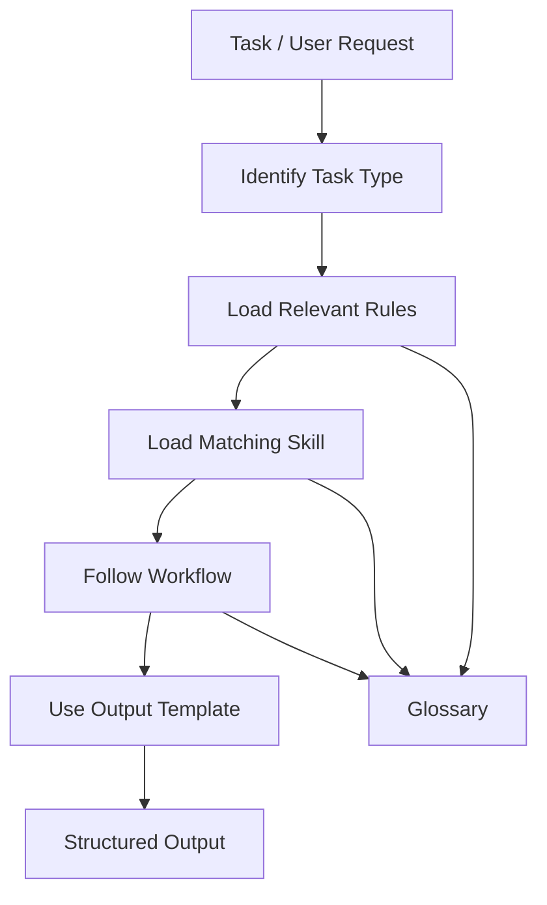
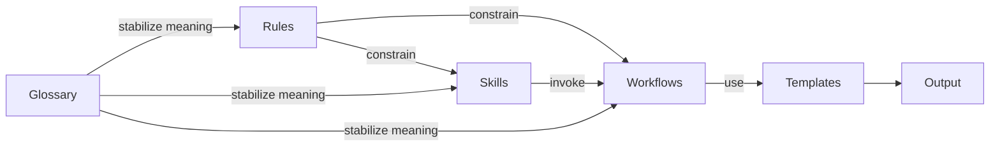
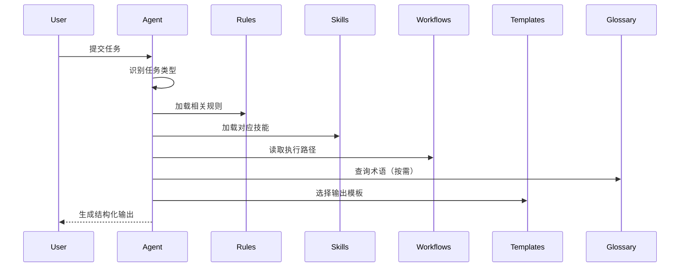

# Charm Agent 文档入口

本目录用于存放面向 AI / Agent 协作的规则、技能、模板、工作流与术语说明。

它的目标不是收集零散 prompt，而是逐步形成一套 **可长期演进、可版本管理、可任务路由、可稳定输出** 的 Charm Agent 协作体系。

---

## 一句话理解

在 Charm 项目中：

* **Rules** 定义边界
* **Skills** 定义任务能力
* **Workflows** 定义执行路径
* **Templates** 定义输出结构
* **Glossary** 定义术语锚点

---

## Agent Quick Entry

当 Agent 在 Charm 仓库中执行任务时，默认按以下顺序工作：

1. 识别任务类型
2. 加载相关 rules
3. 加载对应 skill
4. 按 workflow 执行任务
5. 用 template 组织输出
6. 遇到项目术语时查 glossary

### 任务到文档的推荐路由

| 任务类型                    | 推荐读取顺序                                                                                                                                    |
| ----------------------- | ----------------------------------------------------------------------------------------------------------------------------------------- |
| Code Review             | `rules/` → `skills/code-review/` → `workflows/review-workflow.md` → `templates/review-output.md`                                          |
| Code Generation         | `rules/` → `skills/codegen/` → `workflows/codegen-workflow.md` → `templates/codegen-output.md`                                            |
| Architecture Discussion | `rules/` → `glossary.md` → `skills/architect-review/` → `workflows/architect-review-workflow.md` → `templates/architect-review-output.md` |

---

## 目录结构

```text
docs/agent/
├─ README.md
├─ glossary.md
│
├─ rules/
│   ├─ README.md
│   ├─ collaboration.md
│   ├─ embedded-modern-cpp.md
│   └─ charm-architecture.md
│
├─ skills/
│   ├─ README.md
│   ├─ code-review/
│   ├─ codegen/
│   └─ architect-review/
│
├─ templates/
│   ├─ review-output.md
│   ├─ codegen-output.md
│   └─ architect-review-output.md
│
└─ workflows/
    ├─ review-workflow.md
    ├─ codegen-workflow.md
    └─ architect-review-workflow.md
```

---

## 系统结构图



---

## 各部分职责

### `rules/`

用于存放长期稳定、跨任务生效的规则。

它回答的问题是：

> **在 Charm 中，AI 应该遵守什么？**

包括但不限于：

* 如何协作
* 现代嵌入式 C++ 的技术立场
* Charm 项目的架构纪律与工程约束

### `skills/`

用于存放面向具体任务的技能说明。

它回答的问题是：

> **在 Charm 中，AI 遇到这类任务时应该怎样工作？**

例如：

* 代码审查
* 代码生成
* 架构评审

### `templates/`

用于存放输出模板。

它回答的问题是：

> **在 Charm 中，AI 应该如何稳定组织输出？**

例如：

* review 输出模板
* codegen 输出模板
* architect review 输出模板

### `workflows/`

用于存放任务执行路径。

它回答的问题是：

> **在 Charm 中，AI 完成这类任务时，应按什么顺序读取和执行？**

例如：

* review workflow
* codegen workflow
* architect-review workflow

### `glossary.md`

用于统一术语理解。

它回答的问题是：

> **在 Charm 中，这些项目内术语是什么意思？**

例如：

* `init.graph`
* `CoreSystemChain`
* `BoardChain`
* `extra nodes`
* `io.registry`
* `util::Result<T>`
* `charm.system.clock`

---

## Agent Loading Strategy

Agent 在执行任务时应采用 **增量加载策略**，而不是一次性加载整个 `docs/agent/` 目录。

### 加载原则

1. 不要默认加载全部内容
2. 先识别任务类型
3. 只加载当前任务需要的 rules / skills / workflow / template
4. 在需要时再查询 `glossary.md`
5. 当任务从一种类型切换到另一种类型时，再切换对应 skill

### 这样做的目的

* 减少上下文噪声
* 保持推理稳定
* 避免错误引用无关规则
* 提高任务路由的准确性

---

## Agent 行为原则

在 Charm 项目中，Agent 应遵循以下原则：

1. **规则优先**
   Rules 定义项目边界，skills 不得覆盖 rules。

2. **先设计再实现**
   当需求或架构存在不确定性时，应先讨论方案，而不是直接生成代码。

3. **优先保持系统一致性**
   不因局部实现便利而破坏系统分层、初始化纪律或 IO 纪律。

4. **输出结构化**
   review / codegen / architect discussion 应尽量使用统一模板。

5. **信息不足时保持诚实**
   如果缺少关键上下文，应明确指出，而不是假设。

---

## 规则、技能、模板、工作流之间的关系

### 关系总览



### Rules 是边界

Rules 定义长期边界。它们不负责一步一步教 AI 做任务，但会明确：

* 什么是允许的
* 什么是不允许的
* 什么是项目立场
* 什么是项目级约束

### Skills 是任务说明

Skills 建立在 rules 之上，用来说明某类任务应如何展开，例如：

* 先看什么
* 先检查什么
* 应如何分级问题
* 应如何组织结论

### Templates 是输出骨架

Templates 不决定判断内容，只帮助 AI 稳定表达。

### Workflows 是执行路径

Workflows 决定真实任务中的执行顺序，例如：

* 先读哪个规则
* 什么时候切换 skill
* 什么时候该停下来先讨论
* 什么时候该用模板输出

### Glossary 是术语锚点

Glossary 用来防止 AI 在关键术语上产生漂移，避免用外部经验替代项目内含义。

---

## 当前核心规则

| 文件                             | 作用                      | 适合场景                  |
| ------------------------------ | ----------------------- | --------------------- |
| `rules/collaboration.md`       | 定义协作方式、讨论节奏、沟通方式        | 需求不明确、多方案讨论、先讨论再实现    |
| `rules/embedded-modern-cpp.md` | 定义现代嵌入式 C++ 技术立场        | 接口设计、抽象方向、是否退回传统写法    |
| `rules/charm-architecture.md`  | 定义 Charm 项目的具体工程纪律与架构要求 | 分层、初始化、IO、错误模型、时间源一致性 |

---

## 当前核心技能

| 技能                         | 用途                      |
| -------------------------- | ----------------------- |
| `skills/code-review/`      | 用于代码审查、PR 审查、实现合规性检查    |
| `skills/codegen/`          | 用于代码生成、接口草拟、模块骨架设计      |
| `skills/architect-review/` | 用于架构评审、能力归属判断、分层与装配问题讨论 |

---

## 当前模板

* `templates/review-output.md`
* `templates/codegen-output.md`
* `templates/architect-review-output.md`

这些模板帮助 Agent 在不同任务中保持稳定输出结构。

---

## 当前工作流

* `workflows/review-workflow.md`
* `workflows/codegen-workflow.md`
* `workflows/architect-review-workflow.md`

这些 workflow 用于约束 Agent 在真实任务中的执行顺序。

---

## 推荐读取路径

### 场景 1：代码审查

1. `rules/charm-architecture.md`
2. `rules/embedded-modern-cpp.md`
3. `skills/code-review/SKILL.md`
4. `skills/code-review/checklist.md`
5. `workflows/review-workflow.md`
6. `templates/review-output.md`

### 场景 2：代码生成

1. `rules/collaboration.md`
2. `rules/embedded-modern-cpp.md`
3. `rules/charm-architecture.md`
4. `skills/codegen/SKILL.md`
5. `workflows/codegen-workflow.md`
6. `templates/codegen-output.md`

### 场景 3：架构评审

1. `rules/charm-architecture.md`
2. `rules/embedded-modern-cpp.md`
3. `glossary.md`
4. `skills/architect-review/SKILL.md`
5. `workflows/architect-review-workflow.md`
6. `templates/architect-review-output.md`

---

## 仓库维护与本机生效

### 仓库内维护

本目录下的 Agent 文档应在仓库内维护，并通过正常代码评审流程变更。

这样做的目的包括：

* 保持版本可追踪
* 让规则、技能、模板、工作流的调整有 review 记录
* 避免个人本地规则长期漂移
* 让团队协作建立在同一套可审查文档之上

### 本机生效

当需要在个人环境中实际生效时，可将仓库中的对应内容同步到个人 Agent / Codex 配置目录。

#### 示例

```text
Windows
C:\Users\<you>\.codex\
  ├─ skills/
  ├─ rules/
  └─ templates/
```

仓库是维护源，个人目录是运行副本。

> **repo = source of truth**
> **.codex = runtime copy**

不建议长期只在个人目录中修改而不回写仓库。

---

## 可选配置文件

仓库根目录提供 `config.toml`，用于声明 Agent 文档入口、规则/技能装配顺序与路由策略。

该文件不是运行时强制依赖，但可作为团队共识的“默认协作配置”，便于在不同环境快速同步。

---

## 推荐协作流程

1. 需求先描述清楚目标、约束、输入、输出
2. 复杂改动先讨论方案，再进入落地
3. 构建或验证要求应提前说明
4. 提交应尽量分批、小步、可回滚

---

## 维护原则

维护本目录时，应遵循以下原则：

* 只保留协作必须知道的内容
* 不写大段空话，尽量写成可执行条目
* 规则变更应先在仓库 review，再同步到个人目录
* 技能不得重复规则正文，应尽量引用已有规则
* 模板只负责输出结构，不承载项目规则
* workflow 只负责执行路径，不重复大段背景说明
* glossary 只解释术语，不替代规则文件本身

---

## 编写约定

* 正文使用中文
* 文件名、目录名、配置键名使用英文
* 规则文件应说明：用途、适用场景、不适用场景、相关文件
* 技能文件应说明：用途、使用场景、不要用于什么、依赖哪些规则
* 模板只负责输出结构
* workflow 只负责执行路径
* glossary 只解释术语，不替代规则

---

## 总体目标

本目录的目标不是收集零散 prompt，而是逐步形成一套可长期演进的 Charm Agent 协作体系。

它希望让 Agent 在 Charm 项目中做到：

* 有边界
* 有方向
* 有执行路径
* 有稳定输出
* 有统一术语
* 有长期一致性

---

## 附：最小运行模型


