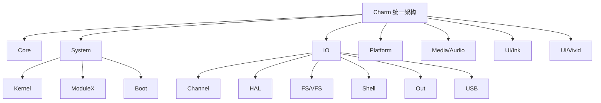
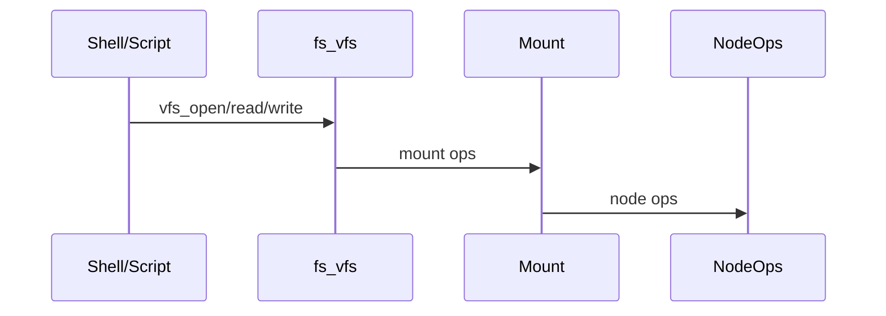
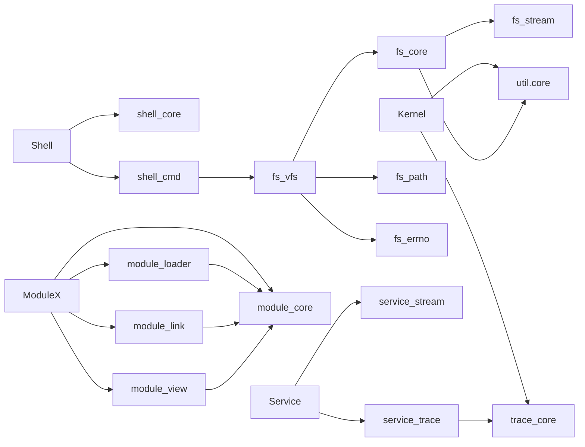
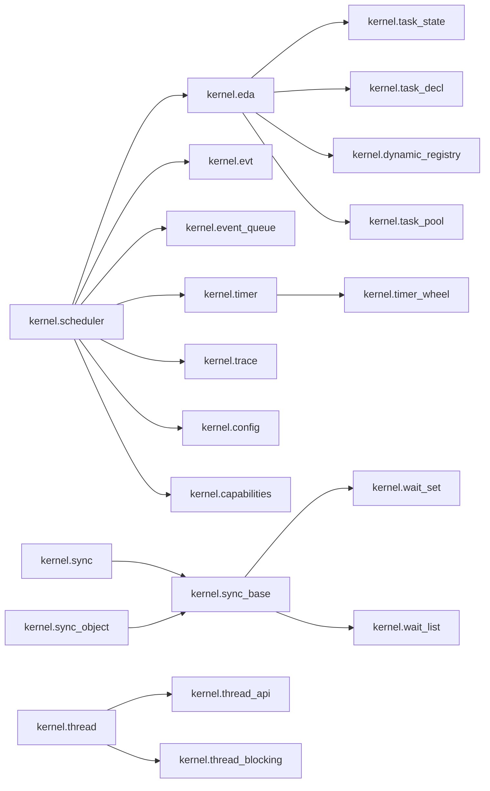
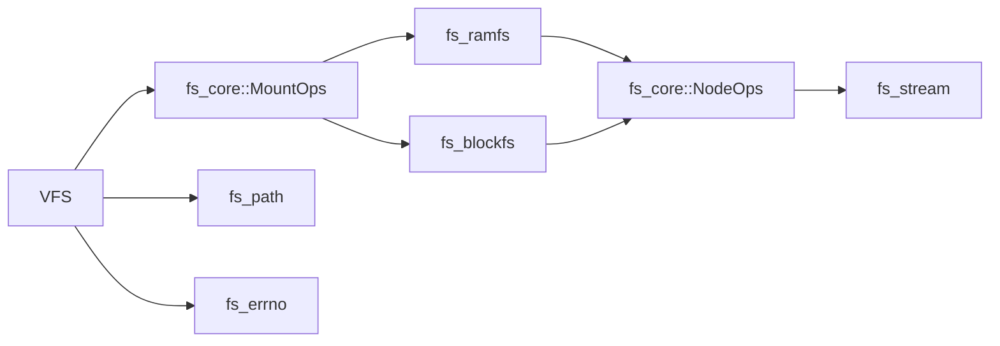
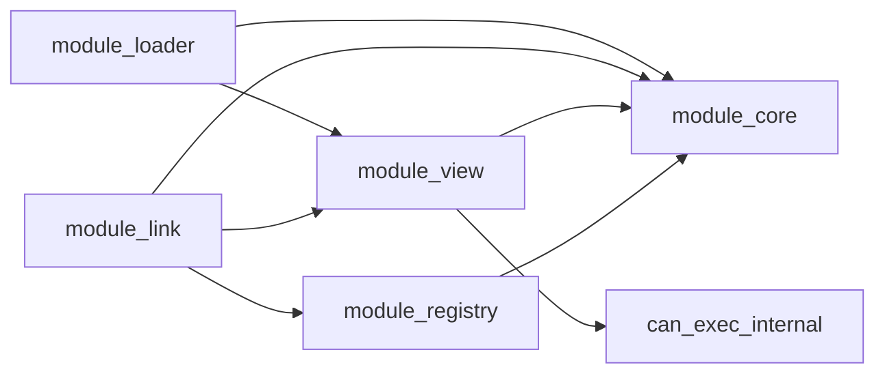
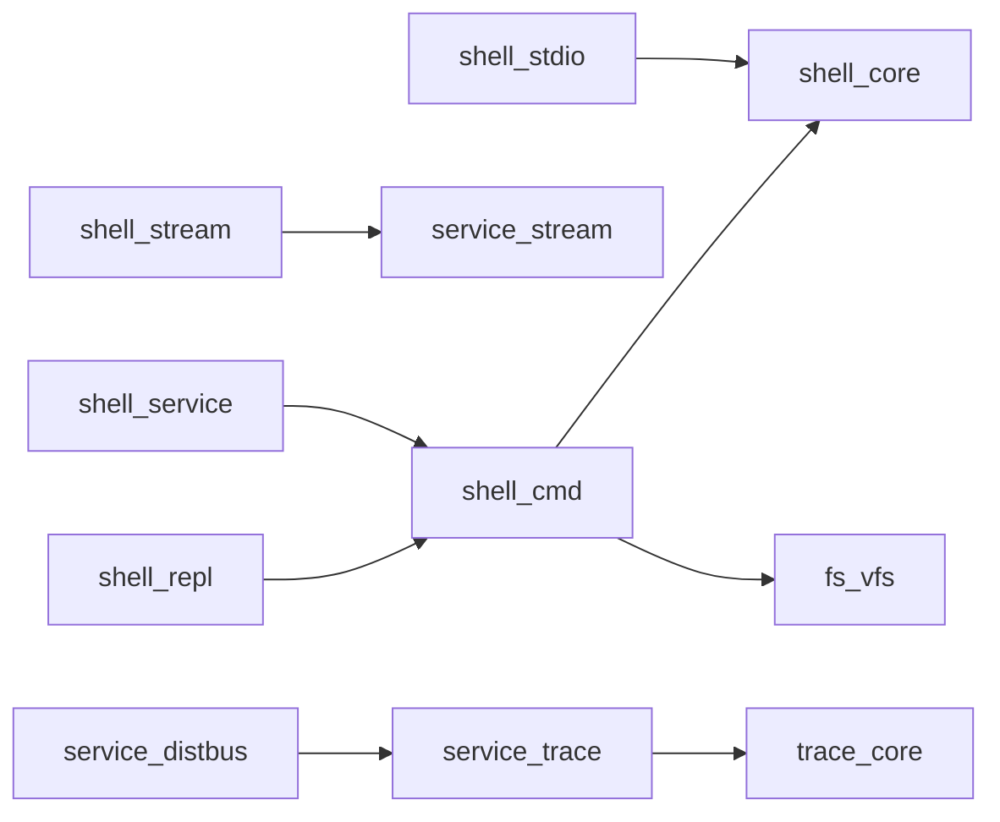
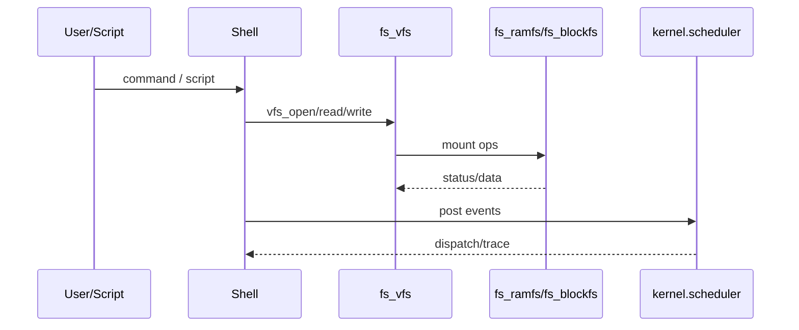

# Charm 架构全景（收敛版）

本页是 Charm 的全局架构图与依赖红线说明。  
不承担文档路由或新同学入门职责。

## 设计原则（只记 5 条）
- 所有能力必须走 init.graph 装配
- Channel 只能 non-blocking
- 协议层禁止 busy-spin/自带超时
- 默认禁止隐式全局入口
- 依赖只允许单向向上

## 快速阅读路径
1. 分层与入口：本页 1.0 / 1.1
2. 依赖红线：1.2
3. 装配规则：init.graph（见 `docs/system/init_graph_contract.md`）
4. IO 核心契约：`docs/io/*`

## 本页不负责什么
- 具体 IO 契约细节：见 `docs/io/*`
- 具体系统装配细节：见 `docs/system/*`
- 协作与 Agent 规则：见 `docs/agent/*`


## 1. 架构分层

```
Charm（统一架构）
├─ Core（util/trace/service/alg/init）
├─ System（Kernel/ModuleX/Boot/InitChain）
├─ IO（Channel/Reactor/Registry/HAL/FS/Shell/Out）
├─ Media（Audio）
├─ UI/Ink（低资源 UI）
└─ UI/Vivid（富 UI）
```

## 1.0 统一入口模块（强约束入口）

将“分层”落到编译期入口，所有上层代码优先使用这些入口模块：

- Foundation：`charm.foundation`（对外只暴露 util/trace/service/alg）
- System：`charm.system`（system/init/bringup 汇总入口）
- Runtime：`charm.runtime`（system + io）
- Domains：`charm.domain`（media + ui）

UI/Vivid 公开入口：
- 正式 public：`charm.ui.vivid`
- 过渡 deprecated：`charm.font.font_noto_ascii_12`、`charm.font.font_noto_sc_12`（禁止新增依赖）
- 非作为组合入口的资源：`charm.font.defaults_noto`（允许显式 import，禁止再从聚合入口 re-export）
- 已删除旧名：`input.gesture`、`charm.ui.vivid.full`、`service.fifo`、`gui.ui_input_router_bridge`、`charm.widgets.text`、`input_router_bridge`（禁止新增依赖）
- 内部 private：`charm.core.soa_*`、`gui.ui_semantics_bridge`、`ui.vivid.core.*`、`ui.vivid.widgets.*`、`ui.ink.ui.*`（标 internal 者）、以及任意 `*bridge*/*compat*/*alias*` 模块（禁止新增依赖）
- UI Kernel 契约：docs/ui/ui_kernel_contract.md



## 1.1 目录布局（统一）

```
Modules/
  core/        # util/trace/service/alg/init
  system/      # kernel/modulex/boot/init/bringup
  io/          # channel/reactor/registry/hal/fs/shell/out/usb
  platform/    # board_caps/irq/clock
  io/channel/  # 统一字节通道（out/AT/协议复用）
  io/reactor/  # 事件驱动 IO 反应堆
  io/registry/ # IO 能力注册与发现
  media/       # audio
  ui/ink/      # Charm-ink UI
  ui/vivid/    # Charm-vivid UI
  charm.foundation.cppm  # 分层入口：Foundation
  charm.runtime.cppm     # 分层入口：Runtime
  charm.domain.cppm      # 分层入口：Domains
  thirdparty/  # dr_libs/etl 等第三方源码
  platform/    # win/... 及后续 MCU 平台

  # Shell 目录拆分（模块名保持不变）
  io/shell/
    core/      # shell_core/shell_stream/shell_time
    cli/       # shell_cmd/shell_repl/shell_service/shell_stdio

Examples/     # 示例工程
docs/         # 架构与协作文档
Draft/        # 计划/草案（可变动）
```

## 1.1.1 组件文档入口

- Audio：`Modules/media/audio/audio_design.md`
- HAL：`Modules/io/hal/charm_hal_design.md`
- FS/VFS：`docs/storage/fs_vfs_mount_rules.md`
- Block cache：`docs/storage/fs_block_cache_strategy.md`
- FatFs 示例：`docs/storage/fs_fatfs_demo.md`
- IO Channel：`Modules/io/channel/io.channel.cppm`
- IO Channel 契约：`docs/io/io_channel_contract.md`
- IO Reactor：`Modules/io/reactor/io.reactor.cppm`
- IO Reactor 契约：`docs/io/io_reactor_contract.md`
- IO Registry：`Modules/io/registry/io.registry.cppm`
- IO Registry 契约：`docs/io/io_registry_contract.md`
- ModuleX：`Modules/system/modulex/ModuleX_格式草案.md`
- Kernel：`Modules/system/kernel/docs/`
- Kernel 事件队列后端：`Modules/system/kernel/docs/event_queue_backends.md`
- IO 分层总览：`docs/io/io_layering_overview.md`
- 输入分层决策：`docs/input/input_layering_decision.md`
- 输入协议映射：`docs/input/input_protocol_map.md`
- 能力回收规则：`docs/architecture/capability_recovery_rules.md`
- VSF USB 映射：`docs/reference/vsf/vsf_usb_map.md`
- VSF TCPIP 映射：`docs/reference/vsf/vsf_tcpip_map.md`
- USB 体系规划：`docs/usb/usb_arch_plan.md`
- USB DSL 概览：`docs/usb/usb_dsl_overview.md`
- USB CDC 回调契约：`docs/usb/usb_cdc_contract.md`
- USB String/Lang 装配：`docs/usb/usb_strings_overview.md`
- 设备模型草案：`docs/architecture/device_model_overview.md`
- trace_core 统一入口：`docs/trace/trace_core_entry.md`
- trace_core ID 清单：`docs/trace/trace_core_ids.md`
- VFS 挂载规则：`docs/storage/fs_vfs_mount_rules.md`
- MAL 概览：`docs/storage/mal_overview.md`
- MAL + FatFs 示例：`docs/storage/mal_fatfs_demo.md`
- VSF 对照与可借鉴清单：`docs/reference/vsf/vsf_comparison.md`
- Service/Component 初始化顺序：`docs/system/service_component_init.md`
- InitGraph 契约：`docs/system/init_graph_contract.md`

## 1.2 依赖红线（单向依赖）

这是“允许真实耦合”的安全网：只允许向上依赖，禁止反向渗透。

```
Charm.Foundation  <-  Charm.Runtime  <-  Charm.Domains
```

### 初始化顺序（统一约束）

统一通过 `init.graph` 装配系统，避免“入口拼装地狱”：

1) `CoreSystemChain`：`system.clock` / `io.registry` / `io.reactor` / `kernel.eda` / `reactor_pump` 等底座
2) `BoardChain`：`platform.irq` / `hal.uart1` / `driver.usart_channel` 等板级能力
3) `extra nodes`：仅允许服务/应用类节点（禁止底座能力进入 extra）

> 说明：旧式 `service_init/hal_init/component_init` 已移除，新增功能必须走 `init.graph`。

### Foundation（能力基座）
范围：
- `Modules/core/*`（util/trace/service/alg）

规则：
- 只能被上层依赖，禁止依赖 Runtime/Domains
- 任何格式化/日志/统计能力优先收敛到此层

### Runtime（运行时与系统能力）
范围：
- `Modules/system/*`（kernel/modulex/boot）
- `Modules/io/*`（channel/hal/fs/shell/out）
- `Modules/platform/*`

规则：
- 可依赖 Foundation
- 禁止依赖 Domains（UI/Audio 等）
- 向 Domains 提供系统级能力（调度/FS/IO/模块）

### Domains（领域系统）
范围：
- `Modules/media/*`（audio）
- `Modules/ui/*`（ink/vivid）

规则：
- 可依赖 Foundation/Runtime
- 禁止向下反向依赖

### 允许的短期“主动耦合”策略
- 先迁移使用最强能力（例如 UI 改用 out.format，Audio 改用 kernel/EDA）
- 暂不删除旧实现，待依赖稳定后再清理

## 1.3 能力回收清单（优先：UI/Ink + UI/Vivid）

目标：把“最强实现”收敛为真实依赖，但不立即清理旧实现。

### UI/Ink 回收清单
- 格式化/输出：`sprintf`/内部格式化 → `out.format` + `out.api`
- 日志与诊断：内部日志 → `out.logger`（或 `trace_core`）
- 容器与池：自建容器/池 → `core/service/*`（fixed_vector/slot_pool/ring_queue）
- 字符串/视图：自建 span/optional/expected → `core/util/*`
- 统计与时间：内部计数/计时 → `trace_core` / `util.units`
- 输入事件：内部队列 → `service_ring_buffer` / `service_fifo`

### UI/Vivid 回收清单
- 格式化/输出：`sprintf`/内部格式化 → `out.format` + `out.api`
- 诊断与 trace：内部 debug → `trace_core` + `service_trace`
- 容器与池：自建容器/池 → `core/service/*`
- 字符串/视图：内部 span/optional/expected → `core/util/*`
- 资源表/注册表：内部 map/registry → `service_fixed_hash_map` / `service_handle_table`

### 回收执行规则
- 只做“替换使用”，不删除旧 API
- 依赖必须单向（Foundation → Runtime → Domains）
- 每完成一条回收，补一条最小回归验证

### 回收硬规则（必须遵守）
- trace_core 只做“写入/上报”，禁止格式化与策略逻辑
- 容器回收只替换“存储模型”，禁止把领域语义塞回 Foundation
- util.units 只表达量纲，禁止提供时间源/调度语义
- Domain 事件队列禁止阻塞/重试/睡眠（满了直接丢弃）

### 三段式回收流程（执行模板）
1. 使用层变化：仅用新能力，旧 API 保留但禁止新增调用
2. 依赖验证：非法 import 必须在编译期失败
3. 最小回归：编译 + 一个行为验证（不要求完整测试）

## 1.4 第三方依赖与可替换策略

统一策略：**系统优先 → 本地目录 → FetchContent**。这样 PC/CI/MCU 三端行为一致，且便于替换。

### 依赖清单（当前）
- SDL3：`cmake/SDL3.cmake`（PC 音频/窗口）
- dr_mp3 / dr_flac：`cmake/DRLibs.cmake`（音频解码头文件）
- FatFs：`Modules/thirdparty/fatfs`（内置源码）

### 关键开关
- `CHARM_USE_SYSTEM_SDL3` / `CHARM_FETCHCONTENT_SDL3`
- `CHARM_FATFS_ROOT`（仅用于覆盖本地 FatFs 目录）

## 1.5 统一错误模型

- 核心错误码：`util::Errc`（POSIX 负值 + 扩展码）
- 结果类型：`util::Result<T>`（`expected<T, Errc>`）
- 模块可保留 stage/context，但对外只暴露 Errc + 明确的 stage 字段
- 日志/trace 统一记录 Errc（可附 stage/ctx）

## 1.6 错误模型 + 通道层（短规范）

- 所有对外 API 使用 `util::Result<T>`，禁止自建 Error/Err/Errno 类型
- 错误码统一为 `util::Errc`，允许内部 stage/context，但对外只暴露 Errc + stage
- IO/协议层只依赖 `io::Channel`，平台只实现一次通道
- out/AT/协议统一走通道，不直接绑定 UART/CDC/TCP

## 2. 当前已具备的拼图

### Kernel
- EDA：任务注册/动态注册、优先级、事件队列、定时器
- 同步/等待：sync base/obj/unified、wait token/set/list
- 线程模型：thread/thread_api/thread_blocking
- 可观测性：trace、统计、alert、replay、JSON 输出
- 事件策略：dedup/debounce/coalesce/boost/rate-limit

### Platform
- platform.irq / system.clock 等系统能力接口
- Windows/STM32 参考实现（board_caps）

### HAL
- `hal_core/irq/gpio/uart/timer/spi/i2c/input`
- HAL Win stub + board_caps 时钟注入

### Audio
- 组件：source/decoder/fifo/sink/player/SRC/声道转换
- 解码：WAV/FLAC/MP3
- 模式：FollowInput / FixedRate（含重配事务）
- 回归：stable/lowlat、fixed-rate、reconfig、force-mono
- 文档：`Modules/media/audio/audio_design.md`

### Service
- ring_buffer/fifo/heap/pool/json/trace/distbus
- stream + buffer

### Shell
- cmd/repl/stdio/core/time
- shell_service（jobs/vars/alias/script）

### Out
- out.core/out.api/out.format/out.ansi/out.logger
- out.sink/out.domain/out.channel（统一走 io.channel）

### IO Channel
- io.channel（统一字节通道）
- io.reactor（事件驱动反应堆，唯一 drain 由 PumpTask 负责）
- io.registry（能力注册/发现，替代全局默认通道）
- io.channel.adapters（UART/CDC/TCP 通道适配模板）
- out.channel（out 走通道）
- at.driver_reactor（AT 走通道 + Reactor 驱动）
- input.service（统一采样入口，绑定 `hal_input` + `system.clock`）
> 默认通道已移除；新代码必须通过 `io.registry` 或 RuntimeContext 注入通道。

### USB
- 设备端骨架：descriptor/common、EP0 状态机
- 类草案：CDC/UAC/MSC
- 驱动接口：`usb.ep0_driver`
- 示例：`Examples/usb/usb_cdc_minimal`

### Device Model
- 设备/驱动/注册表骨架（device.desc/driver/registry）
- 示例：`Examples/system/device_registry_demo`
- 示例：`Examples/system/device_bus_demo`

### UI/Ink
- core/render/ui/widgets/platform/input/semantics/theme

### UI/Vivid
- core/gfx/widgets/font/assets

### FS/VFS
- fs_core/vfs/ramfs/block/blockfs/path/errno/stream
- fatfs 适配入口（需 `CHARM_ENABLE_FATFS`）
- list/mkdir/dirty 支持

### ModuleX
- module_core/loader/link/registry/view
- XIP 执行策略辅助
- demo：load/exec/dep/reloc

### Bootloader
- boot_core/flow/storage/flash/policy/uart
- A/B 选择、版本/签名策略、UART 烧写入口

### Algorithms
- FFT/滤波/统计
- 颜色空间转换与像素打包
- 抖动算法（Bayer/Floyd-Steinberg）
- 压缩（RLE/PackBits/Heatshrink/LZ4）

## 3. 典型运行路径（简图）

```
Shell/Script
  -> VFS (fs_vfs)
  -> Mount (fs_ramfs / fs_blockfs)
  -> NodeOps (read/write/seek/flush)

Scheduler
  -> EventQueue/Timer
  -> Task Registry
  -> Task Handler
  -> Trace/Stats

ModuleX
  -> ImageView validate
  -> Loader load
  -> Linker deps/externals/reloc
  -> exec policy
```



## 4. 模块依赖图（简化）



## 5. Kernel 子系统依赖（简化）



## 6. FS/VFS 内部结构（简化）



## 7. ModuleX 内部结构（简化）



## 8. Shell/Service 结构（简化）



说明：Shell 目录已拆分为 `core/cli`，POSIX facade 已移除。

## 9. 运行期数据流（简化）



## 10. 当前收敛状态

- Windows 主线 M0–M3：已通过
- InitGraph + CoreSystemChain + BoardChain：已落地
- io.channel/io.reactor/io.registry：契约已固化
- HAL/Service/Shell/FS/ModuleX demos：已通过
- STM32：编译通过（待烧录验证）

## 10.1 当前关注点（Current Focus）

- UI/Vivid：Action 化收敛 + TableView 结构性 API 第二阶段
- UI/Vivid：registry 单一源（widgets.registry.def）+ 生成化分发表
- 验收命令：`vivid-soa-demo --soa-ci --regress-ui`

## 11. 风险与限制

- Shell 管道为“输出作为参数”语义，非真实流式 stdin/stdout
- ModuleX 内部入口执行需 `xip_text` 且入口在 text 段内，尚未做签名校验
- VFS dirty 为内存标记，暂无崩溃恢复


