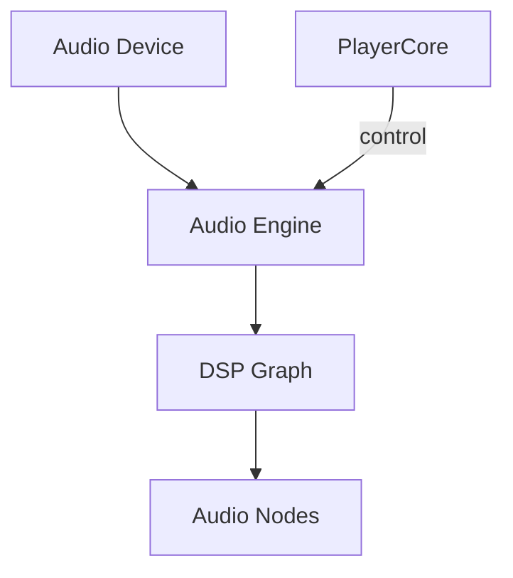
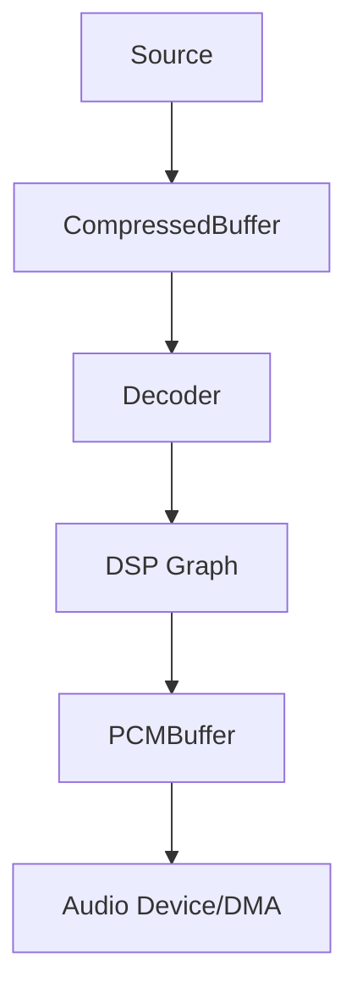
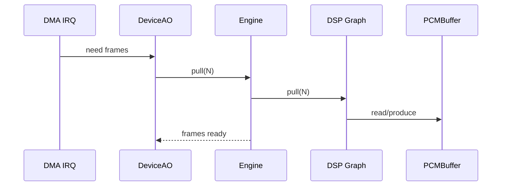

# Charm Audio 架构 v0

> 状态：archived。本文保留早期 Pull Engine、缓冲布局和版本路线讨论；固定内存区域、buffer 时长与 v1/v2/v3 排期不代表当前跨平台契约。

本文定义 Charm Audio 的 **v0 架构形态**。目标是先做出稳定、可验证的 HiFi 播放链路，同时为未来扩展为音频框架预留接口。

## 1. 目标与范围

- 目标：稳定、低 jitter、可控延迟的 MCU 音频播放链路
- 约束：设备时钟驱动（DAC/I2S/DMA），禁止软件节拍主导
- 形态：Pull Engine + 混合模型（CompressedBuffer + DSP Graph + PCMBuffer）

## 2. 核心原则

1. **Device 时钟主导**：系统由 DMA 中断节拍驱动，Graph 必须 pull。
2. **DMA 为第一公民**：IRQ 只做最短路径，不做 decode。
3. **控制面 / 数据面分离**：控制用 Actor，数据用 DSP Graph。
4. **静态 Graph 优先**：v0 不做动态 graph 与插件系统。

## 3. 系统分层与职责

| 层 | 职责 | 备注 |
| --- | --- | --- |
| Device | DMA/I2S/SPDIF 等硬实时输出 | 只做“拉帧 + 填 DMA” |
| Engine | 时钟域协调、buffer 管理、graph 调度 | Pull Engine 核心 |
| Graph | 描述处理链路与节点连接 | v0 静态拓扑 |
| Node | DSP/Decoder/Mixer 等处理 | 数据面执行 |
| PlayerCore | 播放状态机 | 只做控制面 |



## 4. 混合模型数据路径

```
Storage/Network
      ↓
CompressedBuffer
      ↓
Decoder
      ↓
DSP Graph
      ↓
PCMBuffer
      ↓
Device (DMA/I2S)
```

- CompressedBuffer：吸收 IO jitter（块 → 流）。
- DSP Graph：固定 block size 的数据处理层。
- PCMBuffer：设备 jitter absorber（20–50ms）。



## 5. 关键缓冲结构

- **CompressedBuffer**：SPSC ringbuffer（存储 → 解码）。
- **PCMBuffer**：SPSC ringbuffer（Graph → Device）。
- 推荐：两级 buffer，避免 IO 抖动与 DMA 抖动互相污染。

> STM32H7 提示：PCMBuffer 建议放 D2 SRAM，CompressedBuffer 放 SDRAM，避免 DCache 影响 DMA 一致性。

### 5.1 PCMBuffer 尺寸建议

计算公式：

```
bytes = sample_rate * channels * bytes_per_sample * duration_ms / 1000
```

示例（44.1kHz, 16bit, stereo, 50ms）：

```
44100 * 2 * 2 * 0.05 ≈ 8.8KB
```

建议范围：**20–50ms**。

### 5.2 CompressedBuffer 尺寸建议

- MP3/FLAC：128–256KB 起步
- IO 抖动越大，buffer 越大

## 6. 运行时主流程（Pull Engine）

```
DMA half IRQ
  → DeviceAO
  → Engine.pull(frames)
  → Graph.pull(frames)
  → PCMBuffer.read
  → 填充 DMA buffer
```



## 7. Node 接口形态（Pull + Process）

- Graph 对外统一 **pull(frames)** 语义。
- DSP 节点内部可使用 **process(in, out)** 语义。
- 通过轻量适配层兼容两者，保持 pull 主模型。

```mermaid
graph TD
    Device[Device/DMA] --> Engine[Engine]
    Engine --> Graph[Graph Pull]
    Graph -->|pull N frames| Upstream[Upstream Node]
    Upstream --> Temp[Temp Buffer]
    Temp -->|process| Dsp[DSP Node (process)]
    Dsp --> Out[Output Buffer]
```

## 8. 控制面/数据面关键事件

控制面（Actor）：

- `DeviceNeedFrames`
- `DecoderNeedData`
- `SourceNeedData`
- `TrackChange`

数据面（Graph）：

- `pull(frames)`
- `process(in, out)`

## 9. Sample Rate 切换流程

1. stop DMA
2. flush PCMBuffer
3. reconfigure I2S/DAC
4. restart DMA
5. decoder reset

## 10. 资源与内存布局建议

- PCMBuffer：**D2 SRAM**（DMA 友好）
- CompressedBuffer：**SDRAM**
- Decoder workspace：SDRAM 或 TCM（视算法）
- DMA buffer：与 PCMBuffer 同域，避免缓存不一致

## 11. 约束与禁则

- IRQ 内禁止 decode / malloc / logging
- Graph 数据面禁止锁竞争
- DeviceAO 不允许阻塞等待 IO
- 采样率切换必须清理 DMA 与 PCMBuffer

## 12. 观测与验收

最小验收指标：

- `underrun = 0`
- DMA 中断抖动在可控范围内
- PCMBuffer 低水位不频繁触发
- CPU 利用率稳定，无长时间尖峰

## 13. v0 不做的事情

- 动态 graph / 插件系统
- 多流 mixer 的通用框架
- Frame Scheduler（先稳定 Pull Engine）

## 14. 后续扩展路径

- v1：静态 graph + 多节点（EQ/Volume/Mixer）
- v2：动态 graph + routing
- v3：Frame Scheduler / 多流低延迟

---

**结论**：v0 采用 Pull Engine + 混合模型 + 静态 DSP Graph，先保证稳定、可测、低 jitter，再逐步扩展成完整音频框架。
