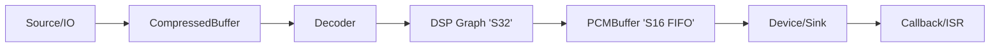
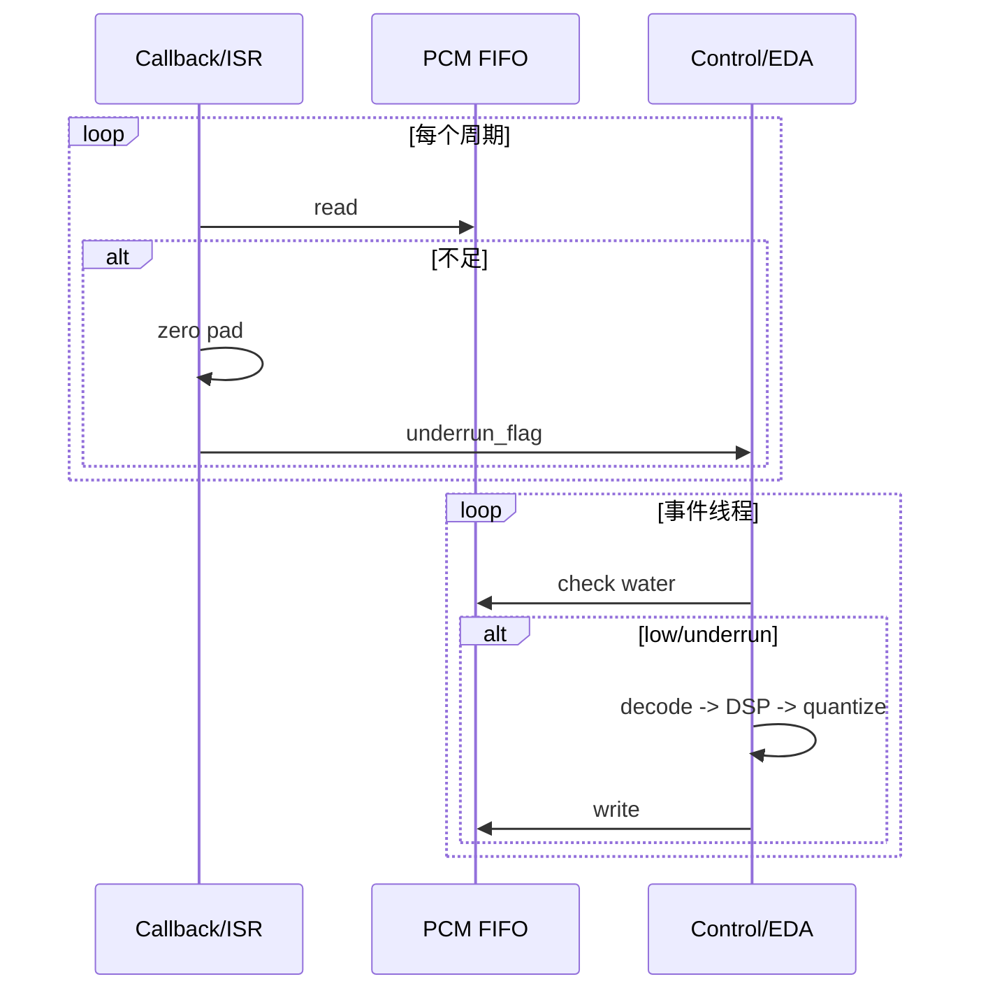
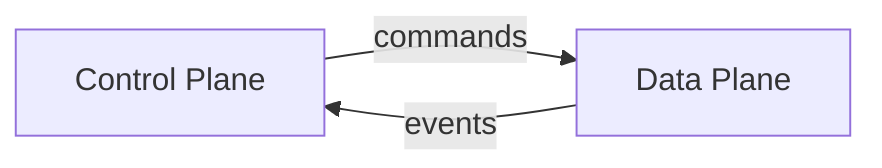

# Audio 子系统设计 v1

> 目标：以最小可落地版本建立 MCU/PC 同构的音频播放内核，优先保证实时链路稳定与可移植性。

## 1. 设计目标

- **同构行为**：SDL3 callback == I2S DMA ISR，回调路径完全一致。
- **实时路径最短**：回调/ISR 仅做 FIFO 读取 + 不足补零 + 计数，不做状态切换/解码。
- **控制/数据面分离**：控制面负责状态与命令；数据面只处理 PCM 流。
- **可移植**：不依赖系统音量、平台 API；UI 只通过播放引擎设置参数。

## 2. 非目标（v1 不做）

- 动态 DSP Graph / 插件系统
- 复杂虚拟化缓存与多路混音框架
- 复杂树形路由/多设备时钟同步

## 3. 核心管线（v1）



关键点：
- **内部处理统一 S32**，**FIFO 存 S16**，量化点固定在写入 FIFO 之前。
- **PCMBuffer** 用于隔离解码抖动与设备时钟，避免 underrun。

## 4. Pull Engine（设备驱动回填）

- DMA/SDL3 回调拉取 PCM：
  - 只读 FIFO
  - 不足补零
  - 设置 underrun 标志
- 任何状态切换都由控制面完成（非实时线程）。



## 5. 水位策略

- 默认：`low=40ms` / `high=150ms` / `chunk≈100ms`
- 统一换算：
  - `frames = rate * ms / 1000`
  - `bytes = frames * frame_size`

建议：水位阈值以 **ms** 配置，运行时按输出格式换算。

## 6. 控制面 / 数据面分离

- **控制面**：播放状态机、命令队列、seek/stop/reconfig
- **数据面**：解码、DSP、量化、FIFO



## 7. Driver 模式选择（不使用虚函数）

- 推荐：**Type-Erased Driver**
  - 实现用模板
  - 对外提供稳定的运行时接口

```cpp
// 对外
struct AudioDriverApi {
  void* ctx;
  Result<void> (*play)(void*, ...);
  // ...
};

// 适配器
template <typename D>
AudioDriverApi make_driver(D& drv) {
  return {&drv, [](void* c, ...){ return static_cast<D*>(c)->play(...); }};
}
```

好处：
- 编译期零开销实现
- 运行时可替换（PlayerCore 不感知具体驱动）

## 8. 设备音量（可移植）

- **不使用系统音量**（不可移植）
- 统一在 PCM/DSP 层做增益：`samples * gain`
- UI 只调 `PlaybackEngine::set_volume()`

## 9. v1 里程碑

1. Pipe 骨架可跑（Source→Decoder→DSP→PCMBuffer→Device）
2. Pull Engine 回调同构（SDL3 + I2S）
3. 控制面/数据面分离清晰
4. 可移植音量控制可用

## 10. 后续扩展（v2/v3）

- 多源混音与动态 DSP Graph
- 更复杂时钟同步
- 资源池与动态内存替换（MCU）

---

> 本文为 v1 指导性设计文档，强调“最小可落地 + 同构行为”。