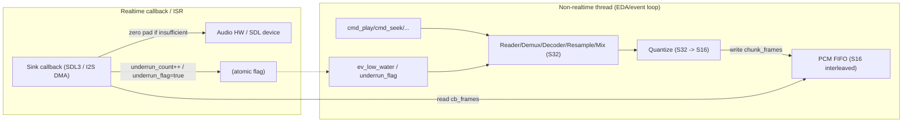
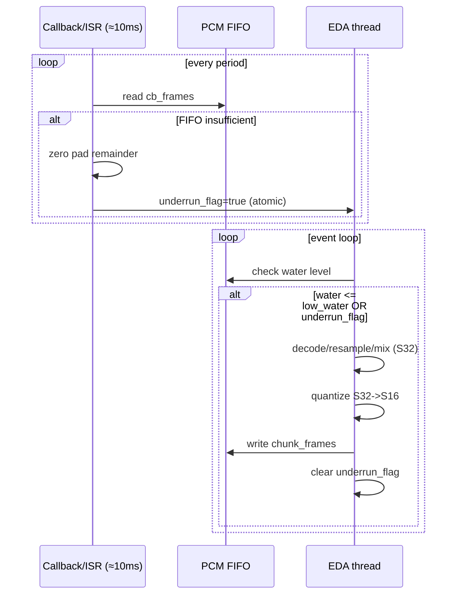

# Audio 设计草案（L1/L2/L3）

> 目标：**PC/MCU 同构行为** + **实时路径最短**。  
> 约束：**pipeline 内部使用 S32**，**FIFO 存 S16**，量化点固定在写入 FIFO 之前。

---

## L1 接口签名（稳定 API）

### 1) 基础类型

```cpp
enum class Errc : uint16_t {
  ok = 0,
  invalid_arg,
  not_supported,
  io_error,
  decode_error,
  end_of_stream,
  bad_state,
  timeout,
};

struct Err {
  Errc code{};
  uint16_t ext{};        // 模块内扩展码（SDL/decoder/driver 等）
};

template<class T>
using Result = std::expected<T, Err>;

enum class SampleType : uint8_t { s16, s24_in_32, s32, f32 };

struct AudioFormat {
  uint32_t rate = 48000;
  uint16_t channels = 2;
  SampleType sample_type = SampleType::s16;
  bool interleaved = true;

  uint16_t bytes_per_sample() const;
  uint16_t frame_size() const;      // channels * bytes_per_sample (interleaved)
};
```

### 2) IDataSource：顺序读 + 随机读

```cpp
struct IDataSource {
  virtual ~IDataSource() = default;

  virtual Result<size_t> read(std::span<std::byte> out) = 0;
  virtual Result<int64_t> seek(int64_t offset, int whence) = 0;  // SEEK_SET/CUR/END
  virtual Result<int64_t> tell() = 0;
  virtual Result<int64_t> size() = 0;

  // 可选：并行预读/索引查表
  virtual Result<size_t> read_at(int64_t offset, std::span<std::byte> out) {
    return std::unexpected(Err{Errc::not_supported, 0});
  }
};
```

### 3) PCM FIFO：SPSC + span 友好

```cpp
struct PcmFifoView {
  std::span<std::byte> a;
  std::span<std::byte> b; // wrap-around 段
};

struct IPcmFifo {
  virtual ~IPcmFifo() = default;

  virtual size_t capacity_bytes() const = 0;
  virtual size_t size_bytes() const = 0;
  virtual size_t free_bytes() const = 0;

  virtual PcmFifoView writable_view() = 0;
  virtual void commit_write(size_t bytes) = 0;

  virtual PcmFifoView readable_view() = 0;
  virtual void commit_read(size_t bytes) = 0;

  virtual void clear() = 0;
};
```

### 4) IAudioSink：纯 pull（回调驱动）

```cpp
using FillCallback = size_t(*)(std::span<std::byte> dst, void* user) noexcept;

约束（必须遵守）：
- 返回值 `filled_bytes` 必须满足 `0 <= filled_bytes <= dst.size()`
- `filled_bytes % frame_size == 0`
- `dst.size()` 由 sink 保证是 `frame_size` 的整数倍
- 若 FIFO 数据不足，只读取“最后一个完整 frame”，其余交给补零

struct SinkConfig {
  AudioFormat fmt;
  uint32_t preferred_period_frames = rate / 100; // 建议：约 10ms，实际以设备支持为准
};

struct IAudioSink {
  virtual ~IAudioSink() = default;

  virtual Result<void> open(const SinkConfig& cfg) = 0;
  virtual Result<void> start() = 0;
  virtual Result<void> stop() = 0;
  virtual void close() = 0;

  virtual void set_fill_callback(FillCallback cb, void* user) = 0;

  virtual AudioFormat format() const = 0;
  virtual uint32_t actual_period_frames() const = 0;
  virtual double output_latency_seconds() const = 0;
};
```

### 5) IDecoder：压缩 -> PCM（源格式）

```cpp
struct StreamInfo {
  AudioFormat fmt;
  int64_t duration_frames = -1;
};

struct IDecoder {
  virtual ~IDecoder() = default;

  virtual Result<StreamInfo> open(IDataSource& src) = 0;
  virtual Result<void> seek_frame(int64_t frame_index) = 0;
  virtual Result<size_t> decode_frames(std::span<std::byte> pcm_out) = 0;
  virtual Result<void> close() = 0;
};
```

---

## L2 管线与时序（water level / underrun）

### 1) 统一换算链（ms ↔ frames ↔ bytes）

唯一换算链条：

```
frames = rate * ms / 1000
bytes  = frames * frame_size
frame_size = channels * bytes_per_sample (interleaved)
```

建议：所有阈值都以 **毫秒** 配置，运行时根据 `AudioFormat` 转为 bytes。

示例（48k / 2ch / s16）：

```
bytes_per_sample = 2
frame_size = 4
1ms = 48 frames = 192 bytes
```

### 2) 水位阈值建议

默认值（推荐）：
- `low_water_ms`：40ms
- `high_water_ms`：120~150ms

可调范围：
- `low_water_ms`：30~80ms
- `high_water_ms`：100~300ms

转换：

```cpp
low_water_bytes  = ms_to_bytes(low_water_ms, fmt);
high_water_bytes = ms_to_bytes(high_water_ms, fmt);
```

### 3) 量化点固定在 FIFO 之前

pipeline 内部：S32  
FIFO 存储：S16

处理链路（示例）：

```
Reader -> (Demux) -> Decoder -> (Resample/Mix/DSP in S32)
        -> Quantize(S32->S16) -> PCM FIFO -> Sink
```

量化建议：
- S32->S16：饱和裁剪 + 右移（或带噪量化，后续可选）
- 量化完成后再写 FIFO，确保实时路径只 memcpy

### 4) SPSC underrun 原子策略

**实时路径（回调/ISR）** 只做：读 FIFO、补零、计数与置位。

建议使用：
- `std::atomic<uint32_t> underrun_count;`
- `std::atomic<uint8_t> underrun_flag;`  // 0/1

**写端（回调/ISR）**：

```cpp
if (filled < need) {
  underrun_count.fetch_add(1, std::memory_order_relaxed);
  underrun_flag.store(1, std::memory_order_relaxed);
}
```

**读端（事件线程）**：

```cpp
if (underrun_flag.exchange(0, std::memory_order_acq_rel) != 0) {
  // 触发 Buffering / 统计 / UI 事件
}
```

> SPSC 场景下无需重型内存序；`exchange` 用 `acq_rel` 可确保事件线程看见最新计数。

### 5) SDL3/I2S 同构回调伪代码（20 行）

> **共性**：只读 FIFO + 不足补零 + 标记 underrun。

```cpp
size_t audio_fill(std::span<std::byte> dst, void* user) noexcept {
  auto* fifo = static_cast<IPcmFifo*>(user);
  size_t need = dst.size();
  size_t filled = 0;

  while (filled < need) {
    auto v = fifo->readable_view();
    if (v.a.empty() && v.b.empty()) break;

    auto copy_one = [&](std::span<std::byte> src) {
      size_t n = std::min(src.size(), need - filled);
      std::memcpy(dst.data() + filled, src.data(), n);
      fifo->commit_read(n);
      filled += n;
    };

    if (!v.a.empty()) copy_one(v.a);
    else if (!v.b.empty()) copy_one(v.b);
  }

  if (filled < need) {
    std::memset(dst.data() + filled, 0, need - filled);
    underrun_count.fetch_add(1, std::memory_order_relaxed);
    underrun_flag.store(1, std::memory_order_relaxed);
  }
  return filled; // 仅返回实际从 FIFO 读取的字节数
}
```

---

## L3 Player 状态机

### 状态

- `Idle`
- `Opening`
- `Buffering`
- `Playing`
- `Paused`
- `Stopping`
- `Error`

### 命令（进入 EDA 队列，统一序列化）

- `cmd_play(url/path)`
- `cmd_pause()`
- `cmd_resume()`
- `cmd_seek(ms or frame)`
- `cmd_stop()`
- `cmd_close()`

### 事件（pipeline 产生）

- `ev_low_water`
- `ev_underrun`
- `ev_end_of_stream`
- `ev_error(Err)`
- `ev_format_changed(StreamInfo)`（可选）

### 转移（Buffering ↔ Playing 可逆）

- `Idle` + `cmd_play` -> `Opening`
- `Opening` 成功 -> `Buffering`
- `Buffering` 达到高水位 -> `Playing`
- `Playing` + `ev_low_water/ev_underrun` -> `Buffering`
- `Playing` + `cmd_pause` -> `Paused`
- `Paused` + `cmd_resume` -> `Buffering` -> `Playing`
- 任意非 `Idle` + `cmd_stop` -> `Stopping` -> `Idle`
- 任意 + `ev_error` -> `Error`（可 `cmd_stop` 回到 `Idle`）

### 推荐策略

- `Paused` 时可选择：sink 继续输出补零，或 sink 暂停输出  
  （PC/MCU 行为保持一致即可）
- `Buffering` 一律先填到 `high_water` 再启动 sink，避免连续 underrun

### 并发安全顺序（seek/stop/close）

- `stop()`：先让 sink 停止回调（pause/stop），确保不会再调用 FillCallback  
  然后事件线程清空 FIFO / 关闭 decoder，最后 `close()` 释放资源
- `seek()`：事件线程执行 `sink.pause -> clear FIFO -> decoder.seek -> prefill -> sink.resume`
- 回调线程只做 FIFO 读与计数，不触发状态转换；状态切换由事件线程处理

---

## L2-扩展：时序图 / 水位图 / 推荐参数（基于实测 baseline）

### 1) FIFO 时序与事件流（简图）

```
             (非实时线程 / EDA事件)
  cmd_play ───────────┐
                       v
                +-------------+
                | Reader/Dec  |  decode S32
                +-------------+
                       |
                       v  (S32 -> S16 quantize point)
                +-------------+
                | Quantize    |
                +-------------+
                       |
                       v  write (chunk_frames)
                +-------------+        (实时回调/ISR)
                |  PCM FIFO   | <-------------------------+
                |  S16 inter  |                           |
                +-------------+                           |
                       ^                                  |
                       |                                  |
              ev_low_water / underrun_flag                |
                       |                                  |
                       +---------- sink callback fills ----+
                                (read + zero pad)
```

### 1.1 FIFO 时序与事件流（Mermaid）



**文本流程**
1) Sink callback 每 `period_ms≈10ms` 拉取 `cb_frames` 帧（= `cb_bytes = cb_frames * frame_size`）。  
2) callback 只做：`fifo.read -> 不足补零 -> underrun_count/flag`。  
3) EDA 线程检查 `water_ms <= low_water_ms` 时补给（decode + quantize + fifo write）。  
4) 每次补给写入 `chunk_frames`，形成锯齿水位波。  

### 2) 水位策略图（锯齿 + low/high）

```
water(ms)
  ^
  |            /\      /\      /\
  |           /  \    /  \    /  \
H |----------/----\--/----\--/----\-----  high_water_ms
  |         /      \/      \/      \
  |        /
L |-------/--------------------------------  low_water_ms
  |
  +-------------------------------------------------> t
      refill         refill         refill
```

### 2.1 水位策略（Mermaid）



**实测 baseline（FLAC@44.1kHz）**
- `cb_frames≈441`（period≈10ms）
- `water range≈50..106ms`
- `underrun=0`

### 3) 推荐参数表

**A) 稳定优先（默认）**
- `low_water_ms = 40ms`（≈ 4 * period）
- `high_water_ms = 120~150ms`（≈ 12~15 * period）
- `chunk_frames = 4096`（≈ 92.9ms @44.1k）

**B) 延迟优先（当前实测接近）**
- `low_water_ms = 30~40ms`
- `high_water_ms = 100~120ms`
- `chunk_frames = 2048`（≈ 46ms @44.1k）

> 结论：B 档已验证可用；若需要更稳的 Buffering/Playing 语义，建议收敛到 A 档。

### 4) 自动推导（便于移植）

```
period_ms = 1000 * cb_frames / sample_rate
bytes_per_ms = sample_rate * frame_size / 1000
water_ms = water_bytes / bytes_per_ms
```

阈值推荐：
- `low_water_ms = k_low * period_ms`（k_low≈4）
- `high_water_ms = k_high * period_ms`（k_high≈12~15）
- `chunk_frames = k_chunk * cb_frames`（k_chunk≈4~10）

---

## L2-附录：FIFO 容量建议（ms）

> FIFO 容量不是实际延迟；实际延迟主要由 `water_level`（尤其 high_water）决定。

| Profile                 | low_water_ms | high_water_ms | chunk_ms (≈) | FIFO capacity (ms) | 适用场景 |
| ----------------------- | -----------: | ------------: | -----------: | -----------------: | -------- |
| Low-latency             |           40 |           120 |       ~40–50 |            **200** | PC 交互、快速响应、underrun 已稳定为 0 |
| Stable-default          |           40 |           150 |      ~80–100 |            **300** | 默认工程配置、IO/调度偶发抖动更抗 |
| Extra-stable (optional) |        50–80 |           200 |         ~100 |            **500** | 极端 IO 抖动、网络/大缓存需求（非首选） |

推导规则（便于移植）：
- `fifo_capacity_ms >= high_water_ms + 2 * chunk_ms + safety_ms`
- `safety_ms` 推荐 20–50ms（PC）/ 30–80ms（MCU）

---

## L4 后端实现结构（PC / STM32）

> 目标：**SDL3 callback == I2S DMA ISR**，完全同构的 FillCallback 路径。

### 1) PC 端结构（SDL3）

目录建议：

```
audio/
  sink/
    sdl3/
      sdl3_sink.hpp
      sdl3_sink.cpp
  platform/
    pc/
      pc_audio_backend.cpp
```

SDL3 Sink 模板：

```cpp
class Sdl3AudioSink final : public IAudioSink {
public:
  Result<void> open(const SinkConfig&) override;
  Result<void> start() override;
  Result<void> stop() override;
  void close() override;

  void set_fill_callback(FillCallback, void*) override;

  AudioFormat format() const override;
  uint32_t actual_period_frames() const override;
  double output_latency_seconds() const override;

private:
  static void sdl_audio_callback(void* userdata, Uint8* stream, int len);

  FillCallback fill_cb_{};
  void* fill_user_{};

  SDL_AudioDeviceID dev_{};
  SDL_AudioSpec spec_{};

  std::atomic<uint8_t> underrun_flag_{0};
  std::atomic<uint64_t> underrun_count_{0};
};
```

核心回调（同构于 MCU ISR）：

```cpp
void Sdl3AudioSink::sdl_audio_callback(void* userdata, Uint8* stream, int len) {
  auto* self = static_cast<Sdl3AudioSink*>(userdata);
  std::span<std::byte> dst{
      reinterpret_cast<std::byte*>(stream),
      static_cast<size_t>(len)};

  size_t written = 0;
  if (self->fill_cb_) {
    written = self->fill_cb_(dst, self->fill_user_);
  }

  if (written < dst.size()) {
    std::memset(dst.data() + written, 0, dst.size() - written);
    self->underrun_flag_.store(1, std::memory_order_relaxed);
    self->underrun_count_.fetch_add(1, std::memory_order_relaxed);
  }
}
```

关键约束：
- 不分配、不锁、不解码、不切状态
- 只读 FIFO、必要时补零、打 underrun 计数

### 2) STM32 端结构（I2S DMA 双缓冲）

同构模板：

```cpp
void I2S_DMA_HalfComplete_Callback() {
  fill_half(0);
}

void I2S_DMA_Complete_Callback() {
  fill_half(1);
}

void fill_half(int index) {
  auto* dst = &dma_buffer[index * half_size_bytes];
  std::span<std::byte> span{reinterpret_cast<std::byte*>(dst), half_size_bytes};

  size_t written = 0;
  if (fill_cb_) {
    written = fill_cb_(span, fill_user_);
  }

  if (written < span.size()) {
    std::memset(span.data() + written, 0, span.size() - written);
    underrun_flag_.store(1, std::memory_order_relaxed);
    underrun_count_++;
  }
}
```

要点：
- SDL3 callback == DMA half/full ISR
- FillCallback / FIFO / underrun 策略完全一致
- 量化已在 pipeline 完成，ISR 只做 memcpy + 补零

---

## L4-STM32：落地版参数模板（I2S DMA 双缓冲）

### 1) 同构映射关系

- SDL3：每次 callback 拉 `cb_frames`
- STM32：每次 DMA half/full complete 回调拉 `half_buffer_frames`

约束：
- `half_buffer_frames == period_frames`
- `dma_frames_total = 2 * half_buffer_frames`
- ISR 只做：`FillCallback(span) -> 不足补零 -> underrun 计数/flag`

### 2) period / half-buffer 推导（默认 10ms）

给定 `period_ms`（推荐 10ms）：

```
raw_frames = rate * period_ms / 1000
half_buffer_frames = align_up(raw_frames, align_frames)
```

对齐建议：
- `align_frames = 4`（保守且硬件友好；也可用 8/16）

备注：
- PC/SDL3 实测的 `cb_frames` 由设备/SDL 决定（可能为 441）。
- STM32 侧建议对齐到 `align_frames`（如 4）得到 `half_frames=444`。
- 两者不要求数值完全相等，只要 **period_ms 近似一致**，并按倍数推导水位即可保持同构行为。

例：44.1kHz
- `raw=441`，`align=4` -> `444`（period≈10.07ms）

### 3) DMA buffer 时长与大小

```
dma_frames_total = 2 * half_buffer_frames
dma_ms_total = 1000 * dma_frames_total / rate
dma_bytes_total = dma_frames_total * frame_size
```

例：44.1kHz / 2ch / S16 / half=444
- `frame_size=4 bytes`
- `dma_frames_total=888`
- `dma_bytes_total=3552 bytes`

### 4) FIFO 水位阈值（沿用 L2 倍数）

推荐默认（稳定优先）：
- `low_water_ms = 4 * period_ms`
- `high_water_ms = 12~15 * period_ms`
- `chunk_frames = 4~10 * half_buffer_frames`

换算：
```
bytes_per_ms = rate * frame_size / 1000
low_water_bytes = low_water_ms * bytes_per_ms
high_water_bytes = high_water_ms * bytes_per_ms
```

### 5) I2S DMA 同构回调模板

```cpp
using FillCallback = size_t(*)(std::span<std::byte> dst, void* user) noexcept;

struct I2sDmaSink {
  void set_fill_callback(FillCallback cb, void* user) noexcept {
    fill_cb_ = cb;
    fill_user_ = user;
  }

  std::span<std::byte> dma_buffer;   // 双缓冲
  size_t half_bytes = 0;

  std::atomic<bool> underrun_flag{false};
  std::atomic<uint64_t> underrun_count{0};

  void on_half_complete() noexcept { fill_half(0); }
  void on_full_complete() noexcept { fill_half(1); }

private:
  void fill_half(int index) noexcept {
    auto* base = dma_buffer.data() + (static_cast<size_t>(index) * half_bytes);
    std::span<std::byte> dst{base, half_bytes};

    size_t written = 0;
    if (fill_cb_) {
      written = fill_cb_(dst, fill_user_);
    }

    if (written < dst.size()) {
      std::memset(dst.data() + written, 0, dst.size() - written);
      underrun_flag.store(true, std::memory_order_relaxed);
      underrun_count.fetch_add(1, std::memory_order_relaxed);
    }
  }

  FillCallback fill_cb_{};
  void* fill_user_{};
};
```

约束：
- `fill_cb_` 只能从 FIFO 读 S16；不得阻塞/分配/加锁
- underrun_flag 由事件线程消费（`exchange(false)`）

---

## 44.1k / 48k 默认参数表（period=10ms, align=4, S16×2ch）

定义：
- `half_frames = align(rate * period_ms / 1000)`，`dma_frames = 2 * half_frames`
- `dma_bytes = dma_frames * frame_size`，`frame_size = channels * 2 = 4 bytes`
- 水位阈值：`low = 4*period`，`high = 12*period`（低延迟）或 `15*period`（稳定）
- chunk：`chunk_frames = 4*half`（低延迟）或 `8*half`（稳定）

### 基础（DMA & period）

| Sample rate | half_frames (≈10ms) | period_ms (actual) | dma_frames | dma_bytes |
| ----------: | ------------------: | -----------------: | ---------: | --------: |
|       44100 |                 444 |             10.068 |        888 |      3552 |
|       48000 |                 480 |             10.000 |        960 |      3840 |

### 低延迟优先（推荐用于 PC 验证/交互）

| Sample rate | low_water_ms | high_water_ms | low_water_frames | high_water_frames | chunk_frames |
| ----------: | -----------: | ------------: | ---------------: | ----------------: | -----------: |
|       44100 |           40 |           120 |             1764 |              5292 | 1776 (4×444) |
|       48000 |           40 |           120 |             1920 |              5760 | 1920 (4×480) |

### 稳定优先（推荐默认工程配置）

| Sample rate | low_water_ms | high_water_ms | low_water_frames | high_water_frames | chunk_frames |
| ----------: | -----------: | ------------: | ---------------: | ----------------: | -----------: |
|       44100 |           40 |           150 |             1764 |              6615 | 3552 (8×444) |
|       48000 |           40 |           150 |             1920 |              7200 | 3840 (8×480) |

### 备注

- `low_water_ms=40ms` 用于覆盖调度抖动；系统繁忙可提升到 50–80ms。
- `high_water_ms` 不宜过大，否则 Buffering->Playing 语义会变弱。
- `chunk_frames` 越大波动越大但 refill 次数更少；越小延迟更低但 refill 更频繁。
- FIFO 容量建议至少 `>= high_water + 2*chunk`（以 frames 或 ms 维度计算），避免 refill 溢出。
