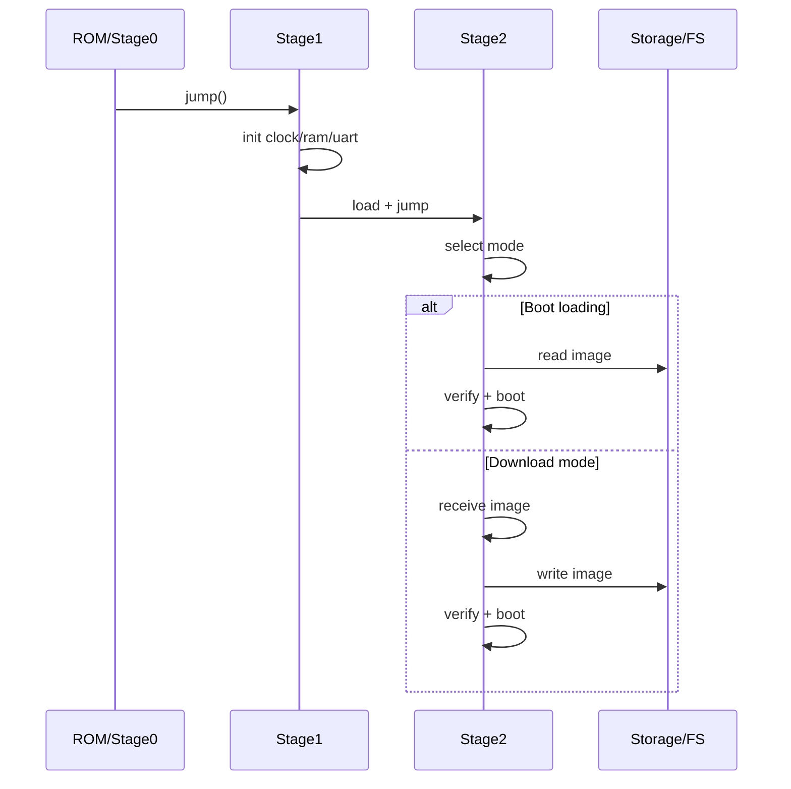

# Bootloader 主线规划（Charm）

目标：形成“可移植的 Stage2 + 可裁剪的 Stage1”的稳定骨架，并与现有模块（FS/USB/AT/EDA）对齐。

## 1. 分层职责

### BL0 / ROM / 极简 Stage0
- 上电后最小初始化（栈、时钟、跳转）
- 强硬件相关，体积极小

### Stage1（板级启动层）
- 初始化基础外设（时钟/内存/串口/USB）
- 搬运与启动 Stage2
- 提供最小日志输出（UART 或 USB CDC）

### Stage2（可移植引导层）
- 统一启动模式与镜像管理
- 支持下载/校验/回滚
- 与文件系统/传输协议解耦

## 2. 阶段目标

### A) 最小可用
- Stage1 + Stage2
- 下载模式：UART 传输固件 → 写入 Flash → 启动
- 自主启动：直接从 Flash 启动

### B) 工程化
- 校验：CRC/Hash
- 分区：A/B
- 回滚策略：失败自动切回

### C) 生态化
- USB CDC 下载
- FAT/MSC 读取镜像
- EDA/AT 统一控制接口

## 3. 启动模式

- 启动加载模式（Boot loading）
  - 不需用户交互
  - 直接从存储介质加载镜像
- 下载模式（Down loading）
  - 通过 UART/USB/网络等加载镜像
  - 写入存储后再启动

## 4. 传输与存储映射

- 传输：
  - UART：X/Y/ZModem
  - USB CDC：自定义协议或简化帧
  - （可选）TFTP
- 存储：
  - 原始 Flash
  - FAT 文件系统（文件形式镜像）
  - 外置存储（SD/USB）

## 5. 与 Charm 现有模块对齐

- 日志/诊断：`out.logger` / `trace_core`
- 传输：
  - UART：`hal_uart`
  - USB CDC：`usb.class_cdc`
- 存储与文件系统：
  - `fs_block` / `fs_mal`
  - `fs_fatfs` / `fs_vfs`
- 事件：
  - EDA 事件队列（Stage2 内部调度）

## 6. 时序图（简化）

## 7. 实施路径（建议）

1) 先实现 Stage2 的最小内核：
   - 命令队列 + 传输接入 + 写入/校验
2) 再落地 Stage1 的板级初始化模板：
   - 以 STM32 为例扩展
3) 最后补充工程化能力：
   - A/B + 回滚 + USB/MSC
