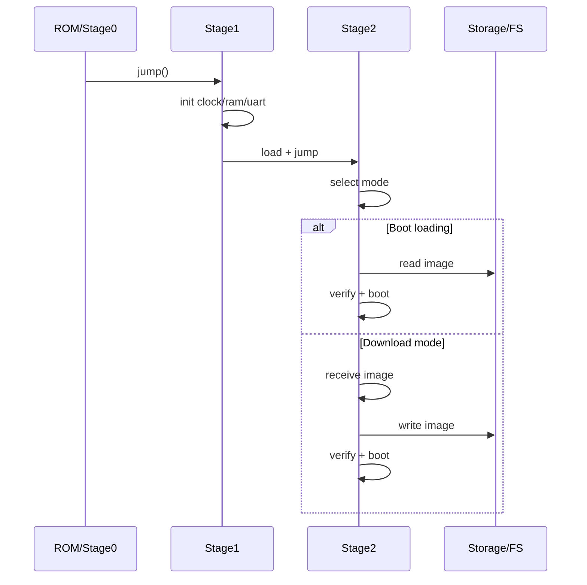

# Bootloader 主线规划（Charm）

目标：形成“可移植的 Stage2 + 可裁剪的 Stage1”的稳定骨架，并与现有模块（FS/USB/AT/EDA）对齐。

## 1. 分层职责

### BL0 / ROM / 极简 Stage0
- 上电后最小初始化（栈、时钟、跳转）
- 强硬件相关，体积极小

### Stage1（板级启动层）
- 初始化基础外设（时钟/内存/串口/USB）
- 搬运与启动 Stage2
- 提供最小日志输出（UART 或 USB CDC）

### Stage2（可移植引导层）
- 统一启动模式与镜像管理
- 支持下载/校验/回滚
- 与文件系统/传输协议解耦

当前仓库内已具备一条最小可验证链路：
- `boot_core` / `boot_storage` / `boot_flash`：镜像头、存储抽象与按擦写粒度写入 Flash
- `boot_flow` / `boot_policy`：A/B 槽位选择、镜像校验、成功确认与回滚策略骨架
- `boot_plan`：把“策略决策 / 跳转前预备 / 成功确认”收敛为统一的启动计划接口
- `boot_launch`：把 `BootPlan` 进一步解析为分区、镜像头与可跳转 entry 元数据
- `boot_load`：把 `BootTarget` 收敛成显式加载契约，统一表达 XIP 与 copy-to-RAM 两类加载路径
- `boot_board_load`：把 `platform::board::BootLoadDesc` 桥接到 `boot_load`，让板级只处理 payload 基址解析与可选搬运
- `boot_exec`：在镜像已经 ready 之后，只负责 pre-jump 状态准备与实际 jump
- `boot_board_exec`：把 `platform::board::BootExecDesc` 桥接到 `boot_exec`，让板级实现不必直接依赖 Boot 内部类型
- `boot_handoff`：把 `BootPlan -> BootTarget -> BootLoadPlan -> BootLoadedImage -> BootExecution -> rollback prepare` 收敛成一个更轻的启动前 handoff 对象，并通过 accessor 暴露阶段视图
- `boot_uart` / `boot_xymodem`：串口接入与 X/YModem 下载到目标分区的 Stage2 侧封装
- `boot_session`：把下载、镜像校验、`BootInfo.pending` 落盘与 `BootPlan` 决策串成一个显式 Stage2 会话入口，结果对象收敛到 `BootPlan + transfer + compact flags`
- `Examples/boot/bootloader_demo`：可在主机侧演示“下载到 Slot B -> 校验 -> 生成 BootPlan -> 回滚预备 -> 标记成功”

当前有几类“prepare”语义需要刻意区分：
- `prepare_selected_boot()` / `prepare_boot_plan()`：写回 BootInfo fallback，确保试启动失败时能回到旧 `active`
- `prepare_boot_loaded_image()`：按加载契约完成 XIP 就绪或 copy-to-RAM 搬运，确保 payload 进入可执行状态
- `prepare_boot_execution()`：板级执行面 pre-jump hook，例如关中断、cache/TLB 维护、地址映射切换等
- `prepare_boot_handoff()`：把回滚预备、目标解析、加载解析与执行解析统一收口，供 Stage2/板级跳转路径直接使用

为了让板级实现更稳定，当前把板级启动契约拆成了 load/exec 两层：
- `platform::board::BootLoadDesc` 只负责 payload 基址解析与可选加载，Boot 子系统统一管理 `BootLoadKind`、payload 偏移、entry 偏移和 XIP/copy-to-RAM 语义
- load/exec hook 已进一步改为 request 结构体入参，后续扩展字段时不必持续打碎函数签名
- `platform::board::BootExecDesc` 只负责 jump 前机器状态准备与实际跳转，不再反向参与 payload 地址解析
- `platform::board::BootBoardCaps` 已独立承载 boot 专属能力，避免 boot 阶段直接依赖整板 `BoardCaps`

## 2. 阶段目标

### A) 最小可用
- Stage1 + Stage2
- 下载模式：UART 传输固件 → 写入 Flash → 启动
- 自主启动：直接从 Flash 启动

### B) 工程化
- 校验：CRC/Hash
- 分区：A/B
- 回滚策略：失败自动切回

### C) 生态化
- USB CDC 下载
- FAT/MSC 读取镜像
- EDA/AT 统一控制接口

## 3. 启动模式

- 启动加载模式（Boot loading）
  - 不需用户交互
  - 直接从存储介质加载镜像
- 下载模式（Down loading）
  - 通过 UART/USB/网络等加载镜像
  - 写入存储后再启动

## 4. 传输与存储映射

- 传输：
  - UART：X/Y/ZModem
  - USB CDC：自定义协议或简化帧
  - （可选）TFTP
- 存储：
  - 原始 Flash
  - FAT 文件系统（文件形式镜像）
  - 外置存储（SD/USB）

## 5. 与 Charm 现有模块对齐

- 日志/诊断：`out.logger` / `trace_core`
- 传输：
  - UART：`hal_uart`
  - USB CDC：`usb.class_cdc`
- 存储与文件系统：
  - `fs_block` / `fs_mal`
  - `fs_fatfs` / `fs_vfs`
- 事件：
  - EDA 事件队列（Stage2 内部调度）

## 6. 时序图（简化）

## 7. 实施路径（建议）

1) 先实现 Stage2 的最小内核：
   - 命令队列 + 传输接入 + 写入/校验
2) 再落地 Stage1 的板级初始化模板：
   - 以 STM32 为例扩展
3) 最后补充工程化能力：
   - A/B + 回滚 + USB/MSC

## 8. 当前进展（2026-04）

- Stage2 最小链路已在仓库内跑通主机侧验证：
  - UART/X-YModem 接收
  - 写入目标 Flash 分区
  - 下载完成后的 Stage2 会话收口（verify + pending）
  - 基于镜像头与策略生成统一 `BootPlan`
  - 基于 `BootPlan` 解析启动目标分区、头部与 entry 偏移
  - 通过 `boot_load` / `boot_exec` 拆分统一加载与跳转接口
  - 支持 `copy_to_ram` 与 `xip` 两类加载路径的显式表达
  - 跳转前的试启动回滚预备（未确认成功则回到旧 active）
  - 会话内的 `pending -> active` 成功确认
- 当前仍偏向“主机侧可验证骨架”，尚未进入板级 Stage1 搬运与跳转实现。
- 下一阶段建议优先推进：
  - 在现有 `boot_session` 基础上继续扩展更完整的 Stage2 状态机/命令流
  - 为 `boot_xymodem` / `boot_session` 增加更多错误路径与边界条件测试
  - 再向真实 UART / 板级 Flash 驱动适配收敛
