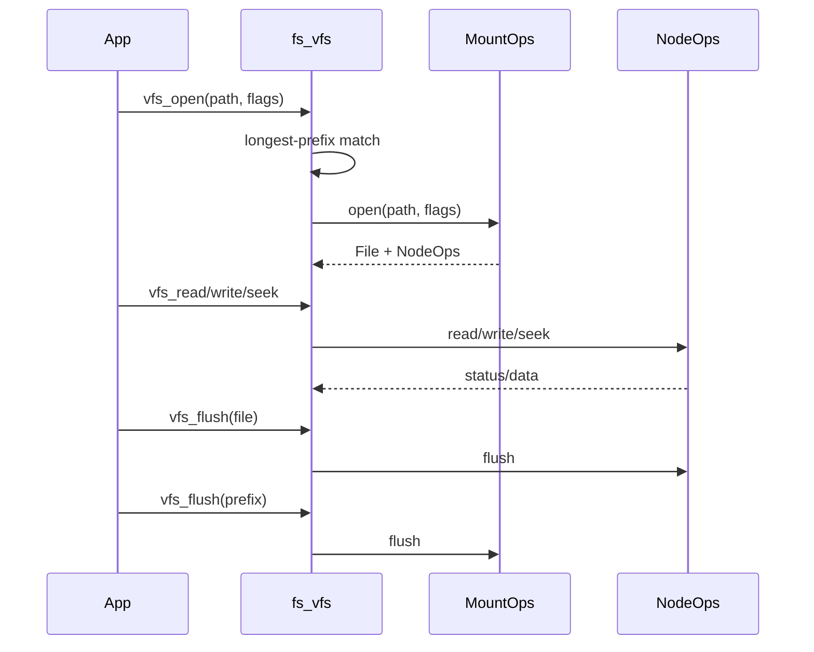

# VFS 挂载与多盘规则（草案）

目标：统一 VFS 路径解析与多盘规划，避免上层协议出现隐式耦合。

## 1. 当前规则

- VFS 通过 `add_mount(prefix, mount)` 注册前缀，按“最长前缀匹配”选中挂载点。
- FatFs 支持多盘注册，`disk_*` 按 `pdrv` 路由到对应设备。

## 2. 建议的多盘前缀规则

推荐路径规则（保持最简单的一致性）：
- `"/"`：默认挂载（单盘）
- `"/d0"`：磁盘 0
- `"/d1"`：磁盘 1
- 以此类推

例如：
- `add_mount("/d0", fat0.mount_point())`
- `add_mount("/d1", fat1.mount_point())`

上层使用：
- `vfs_open("/d0/music/track.flac")`
- `vfs_open("/d1/logs/run.log")`

## 3. FatFs 的 pdrv 对接

注册接口：
- `fatfs_register_block_device(dev, pdrv)`

建议约定：
- 每个 `FatFsMount` 对应一个 `pdrv`
- 多盘时保持 `pdrv` 与 VFS 前缀一一对应

## 4. 约束与注意事项

- `pdrv` 上限由 `CHARM_FATFS_MAX_PDRV` 控制（默认 4）。
- `disk_*` 仅在对应 `pdrv` 注册设备后可用。

## 5. VFS 调度流程（最小闭环）

说明：
- `vfs_close` 仅释放资源，不保证落盘。
- 需要强一致时，显式调用 `vfs_flush(file)` 或 `vfs_flush(prefix)`。

