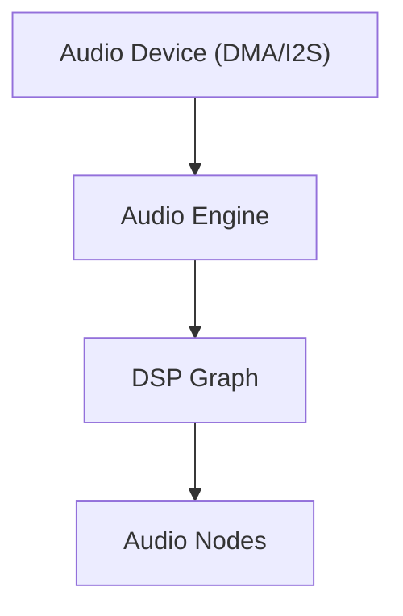
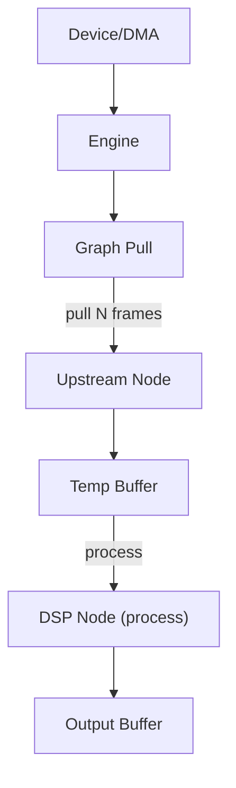

你这个问题其实触到了**嵌入式架构的一个核心分叉**：

> **驱动是“运行时对象”，还是“编译期能力”？**

很多框架（例如一些 HAL / BSP）没有把这件事想清楚，于是出现一堆折中设计，既有函数表又有模板又有虚函数，最后复杂度上去了但收益不大。

你的两个方案其实代表两种**完全不同的哲学**。

---

# 一、方案 1：函数表 + ctx（C 风格驱动对象）

你这个设计其实是经典 **Driver Object Model**：

```
AudioDriver
 ├─ ctx
 └─ vtable (函数表)
```

这套东西在很多系统里都存在，例如：

* Linux Device Driver Model
* Zephyr RTOS
* ESP-IDF

本质就是：

```
driver = { ctx, api }
```

优点：

1️⃣ **运行时可替换**

例如：

```
AudioDriver drv;

if (board == A)
    drv = es9018_driver();
else
    drv = i2s_codec_driver();
```

UI / PlayerCore **完全不知道底层是什么**。

---

2️⃣ **二进制稳定**

函数表是一种**ABI稳定接口**。

这意味着：

```
PlayerCore
   ↓
AudioDriverApi
   ↓
driver implementation
```

甚至可以：

* 驱动在另一个模块
* 驱动来自动态加载
* 驱动来自插件

---

3️⃣ **跨语言**

这个结构其实就是：

```
C ABI
```

任何语言都能实现。

---

但问题也明显：

### 缺点 1：类型信息丢失

`void* ctx` 是最大的问题。

编译器完全不知道类型。

---

### 缺点 2：函数表维护成本

每个 driver 必须写：

```
AudioDriverApi api = {
   .ctx = &self,
   .init = ...
   .play = ...
};
```

---

### 缺点 3：编译器无法优化

因为是函数指针：

* inline 不可能
* devirtualize 不可能

---

# 二、方案 2：Concept + Template

这是**现代 C++ 的驱动模型**。

你可以把它理解成：

> **driver 不是对象，而是 capability**

```
PlayerCore<D>
```

编译期绑定。

---

优点非常明显：

### 1️⃣ 完全零开销

调用会变成：

```
drv_.play(...)
```

直接 inline。

没有：

* vtable
* 函数指针
* ctx

---

### 2️⃣ 类型系统完整

编译器知道：

```
D = ES9018Driver
```

所以：

* inline
* constant propagation
* dead code elimination

都会发生。

---

### 3️⃣ 驱动代码更简单

驱动只需要写：

```
struct ES9018Driver {
    AudioResult play(...)
}
```

不用写函数表。

---

缺点只有一个：

### ❌ 不能运行时切换

因为：

```
PlayerCore<ES9018Driver>
PlayerCore<PCM5102Driver>
```

是两个不同类型。

---

# 三、嵌入式系统真实情况

关键问题其实是：

> **音频 driver 会不会运行时切换？**

现实答案通常是：

**不会。**

一台硬件：

```
MCU -> I2S -> DAC
```

DAC型号是：

* ES9018
* PCM5102A
* WM8731

在固件编译时就确定了。

---

所以很多嵌入式项目最终会采用：

```
template
```

而不是：

```
driver object
```

---

# 四、真正高级的方案（建议你考虑）

其实还有 **第三种架构**，比两个都好。

叫：

> **Type Erased Driver**

本质：

```
template driver
↓
erased 成 runtime driver
```

结构如下：

```
template<typename D>
AudioDriver make_driver(D& drv)
{
    return {
        .ctx = &drv,
        .play = [](void* c, ...){
            return static_cast<D*>(c)->play(...);
        }
    };
}
```

结果：

驱动实现是：

```
struct ES9018Driver
```

但 PlayerCore 看到的是：

```
AudioDriver
```

优点：

1️⃣ 驱动实现 **是 template**

2️⃣ PlayerCore **是 runtime driver**

3️⃣ 驱动代码 **不用写函数表**

4️⃣ UI 可以切 driver

---

这个模式其实被很多现代库使用，比如：

* LLVM
* Folly

---

# 五、从你整个 Charm 架构来看

结合你之前说的：

* Player
* UI
* Driver
* 事件系统

我其实更推荐你这样分层：

```
UI
 ↓
PlayerCore
 ↓
AudioDevice (erased)
 ↓
Driver<D>
 ↓
HAL
```

也就是：

```
template driver
+
runtime erased interface
```

---

# 六、一个更关键的问题（我其实更好奇）

你现在 Player 的结构是不是这样：

```
PlayerCore
 ├─ decode
 ├─ buffer
 └─ audio driver
```

还是：

```
Decoder
   ↓
AudioDevice
   ↓
DMA
```

因为**音频系统真正困难的地方不是 driver API**，而是：

* buffer pipeline
* DMA refill
* latency
* clock sync

如果你愿意，我可以帮你一起设计一个：

**嵌入式音频播放架构（非常干净的那种）**

那会比 driver API 更关键。


好，这个话题其实非常有意思。
如果目标是 **“干净” 的嵌入式音频播放架构**，我们要先把问题从 **Driver API 设计** 提升到 **系统拓扑设计**。

因为在一个成熟播放器里，**驱动只是最底层的一小块**。

真正决定架构优雅程度的是：

* 数据流
* 时钟源
* 缓冲策略
* 状态机

而不是 `play()` 这种 API。

---

# 一、先把音频系统的本质画出来

任何播放器，本质都是一条 **数据管道**：

```
Storage → Decoder → PCM Buffer → Audio Device → DAC → Speaker
```

换成更底层一点：

```
File / Stream
     ↓
Audio Decoder
     ↓
PCM RingBuffer
     ↓
I2S / DMA
     ↓
DAC
```

关键点是：

> **音频播放是“设备驱动系统”，不是“函数调用系统”。**

真正的驱动来自 **DMA + 时钟**。

---

# 二、核心原则（我建议的 4 条）

设计嵌入式播放器时，我通常遵守四个原则：

### 1️⃣ **Audio Device 才是时钟源**

播放节奏不是 CPU 决定的。

而是：

```
DAC sample clock
```

例如：

* ES9018
* PCM5102A

DAC 的采样时钟决定：

```
44.1kHz
48kHz
96kHz
```

所以系统应该是：

```
AudioDevice pull data
```

而不是：

```
Player push data
```

这是很多架构犯的第一个错误。

---

### 2️⃣ **DMA 是第一公民**

播放器本质是：

```
DMA streaming engine
```

CPU只做：

```
decode → fill buffer
```

DMA做：

```
buffer → I2S
```

所以架构必须围绕 **DMA refill**。

---

### 3️⃣ **Player 不直接操作 Driver**

如果 `PlayerCore` 调：

```
drv.play(buffer)
```

其实已经错了。

正确模型是：

```
AudioDevice.request_frames()
```

---

### 4️⃣ **所有模块都是数据处理节点**

你会得到类似 **pipeline**：

```
source → decoder → mixer → output
```

这其实就是一个 **audio graph**。

---

# 三、一个干净的 Player 架构

我建议的结构是：

```
AudioEngine
 ├─ AudioDevice
 ├─ PCMBuffer
 ├─ Decoder
 └─ Source
```

---

## 1️⃣ Source

数据来源：

```
File
HTTP
Memory
Flash
```

接口：

```cpp
struct AudioSource {
    std::size_t read(std::span<std::byte>);
    bool eof();
};
```

---

## 2️⃣ Decoder

例如：

* MP3
* FLAC
* WAV

接口：

```cpp
struct AudioDecoder {
    DecodeResult decode(
        std::span<std::byte> input,
        std::span<int16_t> output);
};
```

输出 **PCM**。

---

## 3️⃣ PCM RingBuffer

这是系统核心。

```
Decoder → RingBuffer → DMA
```

设计：

```
lock free
zero copy
DMA friendly
```

例如：

```
[ PCM PCM PCM PCM PCM PCM ]
  ↑write        ↑read
```

---

## 4️⃣ AudioDevice

这是最关键的部分。

它不应该是：

```
play(buffer)
```

而是：

```
request frames
```

接口应该像这样：

```cpp
struct AudioDevice {
    std::size_t request_frames(std::span<int16_t>);
};
```

含义：

```
DMA half interrupt
↓
device asks for frames
↓
engine fills buffer
```

---

# 四、真正的运行时流程

系统运行是：

```
I2S DMA interrupt
        ↓
AudioDevice
        ↓
AudioEngine.fill()
        ↓
PCM RingBuffer
        ↓
Decoder.decode()
        ↓
Source.read()
```

这是一个 **pull pipeline**。

---

# 五、完整拓扑

```
+------------+
|  Source    |
+------------+
       │
       ▼
+------------+
|  Decoder   |
+------------+
       │
       ▼
+------------+
| PCM Buffer |
+------------+
       │
       ▼
+------------+
| AudioDevice|
+------------+
       │
       ▼
      DMA
       │
       ▼
       DAC
```

---

# 六、PlayerCore 其实只是状态机

Player 只负责：

```
STOPPED
PLAYING
PAUSED
BUFFERING
```

并控制：

```
engine.start()
engine.stop()
engine.flush()
```

---

# 七、这套架构的优点

### 极其干净

每个模块只有 **一个职责**。

---

### 完全支持 MCU

CPU只做：

```
decode
```

DMA负责流。

---

### 支持扩展

以后你可以轻松加：

```
mixer
equalizer
resampler
```

---

# 八、一个关键问题（我必须先确认）

你现在的目标 MCU 是什么级别？

大概是：

A️⃣ **Cortex-M0/M3**

```
RAM < 64KB
```

B️⃣ **Cortex-M4/M7**

```
RAM 256KB+
```

C️⃣ **Linux SoC**

例如：

* Allwinner V3s
* ESP32

因为不同级别，架构会有 **巨大不同**。

---

如果你愿意，我可以继续往下推一个非常关键的部分：

**嵌入式音频系统最难的一块：**

> **PCM RingBuffer + DMA 双缓冲架构**

这部分如果设计好，你的 Player 会非常稳。
很多播放器就是死在这里。


你说的这句话其实非常关键：

> **架构不应该挑剔硬件**

这是对的，但要补一句：

> **架构不依赖具体硬件，但必须尊重数据流和时钟结构。**

音频系统里，**硬件拓扑就是系统物理约束**。
架构如果违背这个约束，系统会变复杂甚至不稳定。

你的系统其实非常标准，而且很理想：

```
eMMC / SD
   ↓ (SDMMC DMA)
STM32H747 + SDRAM
   ↓ (I2S DMA)
DAC
```

DAC 是
ES9039Q2M

MCU 是
STM32H747XIH6

这个拓扑其实可以抽象成**三条独立流水线**。

---

# 一、真正的系统结构（建议模型）

你现在的硬件其实天然分成 **3 个子系统**：

```
Storage Engine
Decode Engine
Audio Engine
```

完整数据流：

```
Storage → CompressedBuffer → Decoder → PCMBuffer → AudioDevice
```

换成更贴近硬件：

```
SD/eMMC DMA
      ↓
Compressed RingBuffer
      ↓
Decoder (CPU)
      ↓
PCM RingBuffer
      ↓
I2S DMA
      ↓
DAC
```

这里有一个非常重要的设计原则：

**两个 RingBuffer。**

很多播放器只做一个 buffer，这是架构不稳的根源。

---

# 二、为什么必须两个 Buffer

因为系统里存在 **两种完全不同的数据速率**。

### 1 Storage 速率（块状）

SD / eMMC：

```
一次读 4KB
一次读 8KB
```

突发：

```
几 MB/s
```

但不稳定。

---

### 2 音频速率（恒定）

例如：

```
44.1kHz
16bit
stereo
```

数据率：

```
44,100 × 2 × 2
≈ 176 KB/s
```

恒定。

---

### 所以必须有：

```
Compressed Buffer
```

把 **块 IO** 平滑成 **流数据**。

---

# 三、推荐的内存拓扑

你的 SDRAM 应该这样分：

```
SDRAM
 ├─ CompressedBuffer   (256KB)
 ├─ PCMBuffer          (64KB)
 └─ Decoder workspace
```

例如：

```
CompressedBuffer 256KB
PCMBuffer        64KB
```

这样可以支持：

* MP3
* FLAC
* WAV

甚至高码率。

---

# 四、DMA 架构（最关键）

你有两个 DMA：

```
SDMMC DMA
I2S DMA
```

它们必须完全 **解耦**。

### Storage DMA

负责：

```
SD → CompressedBuffer
```

触发：

```
buffer low watermark
```

---

### I2S DMA

负责：

```
PCMBuffer → I2S
```

触发：

```
half transfer interrupt
```

---

# 五、系统真正的调度者

很多人以为 Player 是核心。

其实不是。

真正核心是：

```
AudioEngine
```

它维护：

```
CompressedBuffer
PCMBuffer
Decoder
AudioDevice
```

---

# 六、关键运行流程

当 **I2S DMA half interrupt** 发生：

```
I2S IRQ
   ↓
AudioEngine.refill_pcm()
   ↓
Decoder.decode()
   ↓
CompressedBuffer.read()
```

如果：

```
CompressedBuffer 不够
```

就触发：

```
StorageEngine.read_async()
```

---

# 七、这样设计的好处

### 1 完全硬件无关

换硬件：

```
I2S → SPDIF
SD → USB
```

只换模块。

---

### 2 CPU负载稳定

CPU只做：

```
decode
```

不参与流控制。

---

### 3 不会 underrun

因为：

```
Storage jitter
```

被 buffer 吸收。

---

# 八、一个非常重要的 STM32H7 细节

你的 MCU 是
STM32H747XIH6

它有：

```
DCache
AXI bus
DMA
```

如果 PCMBuffer 在 **SDRAM**，必须注意：

```
cache coherence
```

建议：

```
PCMBuffer → D2 SRAM
CompressedBuffer → SDRAM
```

否则 DMA 会被 cache 坑。

---

# 九、如果我们再往前走一步

其实可以把这个系统抽象成 **Audio Graph**：

```
Source → Decoder → Mixer → Output
```

以后你可以轻松加：

```
EQ
Resampler
DSP
Crossfade
```

架构不会变。

---

# 十、我其实想问你一个更关键的问题

你现在这个 Player 的 **终极目标** 是什么级别？

A：

```
简单播放器
MP3/WAV
```

B：

```
HiFi播放器
FLAC / DSD
```

C：

```
完整音频系统
DSP / EQ / Mixer
```

因为如果你的 DAC 已经是
ES9039Q2M

那我猜你其实是在做 **HiFi Player**。

如果是这样，我可以继续帮你把 **整个音频架构推到一个非常高级的层级**，包括：

* 零拷贝 PCM pipeline
* lock-free ringbuffer
* sample rate 切换
* jitter 控制
* audio graph

那会非常有意思。


很好，这一步我们可以把问题从 **“播放器实现”** 提升到 **“音频引擎架构”**。
如果目标是 **HiFi Player + 未来可扩展音频系统**，我会建议按 **5 个核心结构**来设计：

```
Audio Graph
     │
Zero-copy PCM Pipeline
     │
Lock-free RingBuffer
     │
Clock / Sample Rate Control
     │
DMA Audio Device
```

这五层决定了系统是否“高级”。下面逐层拆。

---

# 1 先确定一个最核心原则：Audio 是 Clock Driven

在音频系统里，**唯一真正的时间源是 DAC**。

你的 DAC 是
ES9039Q2M

I2S 时钟来自 MCU 或 DAC。

所以真实系统节奏是：

```
DAC clock
   ↓
I2S DMA request
   ↓
AudioDevice
   ↓
AudioEngine
```

而不是：

```
Player thread → push audio
```

这是很多播放器架构错误的根源。

正确模型：

```
AudioDevice pull frames
```

---

# 2 Zero-Copy PCM Pipeline（非常关键）

很多系统是：

```
decode → temp buffer → copy → playback buffer
```

这在 MCU 上是灾难。

正确模型：

```
Decoder → PCM RingBuffer → DMA
```

**永远只写一次。**

结构：

```
PCM RingBuffer
 ├─ write_ptr (decoder)
 └─ read_ptr  (DMA)
```

Decoder：

```
decode directly → ringbuffer free region
```

DMA：

```
consume directly
```

没有任何 memcpy。

---

### 推荐 buffer 结构

```
PCM RingBuffer
size = 2^N
```

原因：

```
mask = size - 1
```

可以用位运算。

例：

```
index & mask
```

非常快。

---

# 3 Lock-Free RingBuffer

音频 pipeline 非常适合 **SPSC（single producer single consumer）**。

你的系统其实有两个：

```
Storage → Decoder
Decoder → AudioDevice
```

都属于：

```
Single Producer
Single Consumer
```

所以 ringbuffer 可以做到 **完全 lock-free**。

结构：

```
struct RingBuffer
{
    atomic<uint32_t> write;
    atomic<uint32_t> read;
    T buffer[N];
};
```

Producer：

```
free = size - (write - read)
```

Consumer：

```
available = write - read
```

没有锁。

只有两个 atomic。

---

# 4 DMA 双缓冲（硬件级 pipeline）

DMA 实际上是：

```
Ping buffer
Pong buffer
```

DMA运行：

```
DMA → ping
IRQ
DMA → pong
IRQ
```

AudioEngine 在 IRQ 中：

```
refill half buffer
```

结构：

```
PCM RingBuffer → DMA staging buffer → I2S
```

注意：

**DMA buffer 不等于 PCM buffer**

DMA buffer 通常很小：

```
256 frames
```

而 PCM buffer：

```
4096+ frames
```

---

# 5 Sample Rate 切换

HiFi Player 最大的问题之一。

例如：

```
44.1k
48k
96k
192k
```

如果 DAC 不重启 I2S：

会出现：

```
pitch error
```

正确流程：

```
stop DMA
flush PCM
reconfigure I2S
start DMA
```

AudioEngine 负责：

```
clock domain reset
```

播放器层只看到：

```
track change
```

---

# 6 Jitter 控制（HiFi关键）

Jitter来源主要有：

1
I2S clock

2
DMA starvation

3
buffer underrun

其中 MCU 级系统最常见的是：

```
DMA starvation
```

解决方法：

### 大 PCM buffer

```
>= 50ms audio
```

例如：

```
44.1k stereo 16bit
≈ 176KB/s

50ms ≈ 9KB
```

你可以直接：

```
32KB PCM buffer
```

非常安全。

---

### Decoder 不在 IRQ

IRQ 只做：

```
copy / pointer move
```

不要 decode。

---

# 7 Audio Graph（未来扩展的核心）

如果未来想做：

```
EQ
DSP
Mixer
Crossfade
```

必须提前设计 **audio graph**。

结构：

```
Source
  ↓
Decoder
  ↓
Node
  ↓
Node
  ↓
Output
```

Node 统一接口：

```
process(input_frames, output_frames)
```

例如：

```
FLAC decoder
EQ
Volume
Mixer
```

每个都是 Node。

---

# 8 一个我非常推荐的 Engine 结构

```
AudioEngine
 ├─ Graph
 ├─ PCM RingBuffer
 ├─ DMA Device
 ├─ Clock Manager
 └─ Decoder
```

运行逻辑：

```
IRQ
 ↓
AudioDevice requests frames
 ↓
Engine pulls from graph
 ↓
graph processes audio
 ↓
PCM buffer filled
```

---

# 9 一个很重要但很少人注意的点

**Volume 不应该在 DAC 做。**

像
ES9039Q2M

确实有内部 volume。

但如果做 DSP pipeline：

```
Volume → EQ → Mixer
```

更合理。

否则会破坏 pipeline。

---

# 10 你这个项目其实有一个非常有潜力的方向

你的 stack：

```
STM32H747
SDRAM
HiFi DAC
```

其实已经接近一个：

```
embedded audio workstation
```

未来完全可以扩展：

```
USB DAC
SPDIF
network streaming
DSP plugins
```

只要 **Audio Graph 架构正确**。

---

我接下来可以继续往下推一个**真正决定架构水平的部分**：

**“Frame Pull Engine”**

这是很多高级音频系统使用的模型，例如：

* JACK Audio Connection Kit
* Core Audio

它和普通 pipeline 不一样，会让整个系统非常优雅。

如果你愿意，我们可以一起把 **一个 MCU 级 HiFi Audio Engine 的完整架构**设计出来。


很好，我们继续往**真正高级的音频架构核心**推进：
**Frame Pull Engine（帧拉取引擎）**。

这一步其实是很多成熟音频系统的核心思想，例如：

* JACK Audio Connection Kit
* Core Audio

它解决一个关键问题：

> **谁驱动整个音频系统运行？**

答案不是：

```
Player
Decoder
UI
```

而是：

```
Audio Device
```

也就是 **DAC 时钟驱动系统**。

---

# 1 Frame Pull Engine 的核心思想

传统播放器是：

```id="push_model"
Decoder → push → buffer → device
```

这是 **Push Model**。

但高级音频系统使用：

```id="pull_model"
Device → pull → graph → decoder → source
```

这是 **Pull Model**。

系统从**输出端开始向上请求数据**。

---

# 2 整个系统拓扑

如果使用 Pull Engine，结构会变成：

```id="audio_graph"
        Source
          │
          ▼
        Decoder
          │
          ▼
        DSP Node
          │
          ▼
        Mixer
          │
          ▼
        Output Device
```

关键变化是：

**Output Device 是 root node。**

---

# 3 Node 接口设计

整个 graph 中每个节点只需要一个函数：

```cpp
struct AudioNode
{
    std::size_t pull(AudioFrame* dst, std::size_t frames);
};
```

含义：

```
生成 frames 帧音频
```

例如：

```
pull(256)
```

生成 256 帧。

---

# 4 Decoder Node

Decoder 只关心：

```
提供 PCM
```

```cpp
class DecoderNode : public AudioNode
{
public:
    std::size_t pull(AudioFrame* out, std::size_t frames);
};
```

如果 PCM buffer 不够：

```
decode more
```

---

# 5 DSP Node

例如 EQ：

```cpp
class EqNode : public AudioNode
{
public:
    std::size_t pull(AudioFrame* out, std::size_t frames)
    {
        auto n = upstream->pull(temp, frames);
        eq_process(temp, out, n);
        return n;
    }
};
```

DSP 节点永远只是：

```
pull upstream
process
return
```

---

# 6 Mixer Node

如果未来支持：

```
background music
notification sound
crossfade
```

Mixer 会变成：

```cpp
class MixerNode : public AudioNode
{
    AudioNode* inputs[4];
};
```

实现：

```
pull each input
sum
```

---

# 7 Device Node

设备节点是系统根。

例如 I2S：

```cpp
void I2S_IRQHandler()
{
    engine.process(frames);
}
```

引擎执行：

```cpp
root_node->pull(buffer, frames);
```

这一步触发整个 graph。

---

# 8 这样设计的巨大好处

### 1 完全同步

所有 node 都在 **同一个 audio clock** 下运行。

不会出现：

```
decoder faster
device slower
```

---

### 2 不需要复杂线程

MCU 系统通常只有：

```
IRQ
main loop
```

Pull model 非常适合。

---

### 3 pipeline 自动形成

例如：

```
DAC request 256 frames
↓
Mixer request 256 frames
↓
Decoder request 256 frames
↓
Source read
```

系统自动传播。

---

# 9 零拷贝优化

Pull model 非常适合 **zero-copy**。

优化方法：

Node 直接写目标 buffer。

例如：

```cpp
decoder->pull(dst, frames);
```

而不是：

```
decode → temp → copy
```

---

# 10 Frame 定义

建议 frame 定义为：

```cpp
struct AudioFrame
{
    int32_t left;
    int32_t right;
};
```

为什么？

因为：

```
DSP 需要 headroom
```

32bit 可以避免溢出。

最后输出再转换：

```
32 → 24
32 → 16
```

给 DAC。

---

# 11 Sample Rate 切换

Pull engine 很容易处理。

当 track 改变：

```
engine.stop()
device.reconfigure(sample_rate)
engine.start()
```

Graph 不需要改。

---

# 12 多输出支持

如果未来支持：

```
I2S
SPDIF
USB DAC
```

只需要多个 device node。

---

# 13 你的系统会变成

结合你的硬件：

```
SD/eMMC
STM32H747
SDRAM
ES9039 DAC
```

完整结构：

```id="full_architecture"
Source (SD)
   │
Decoder (FLAC/MP3)
   │
DSP
   │
Volume
   │
PCM RingBuffer
   │
I2S Device
   │
ES9039 DAC
```

---

# 14 一个非常重要的设计建议

**Frame size 固定。**

例如：

```
128 frames
256 frames
```

这样：

```
DMA
DSP
decoder
```

都对齐。

很多专业音频系统都这样。

---

# 15 这里其实有一个非常关键的架构问题

你的 **Decoder 是同步 decode** 还是 **后台 decode**？

两种架构：

### A 同步 decode（简单）

```
IRQ → pull → decode
```

优点：

```
简单
```

缺点：

```
IRQ 时间长
```

---

### B 异步 decode（推荐）

```
IRQ → pull PCM buffer
Decoder thread → fill PCM buffer
```

优点：

```
IRQ 非常短
```

几乎所有成熟播放器都这样。

---

# 我想问你一个关键问题

你现在更倾向于哪种架构？

**A**

```
Decoder 在 audio engine 中同步运行
```

**B**

```
Decoder 在后台线程
Engine 只 pull PCM
```

这一步决定了 **整个系统复杂度**。

如果你选 B，我们可以一起把一个 **真正工业级的 MCU 音频架构**完整设计出来。


很好，这个选择其实非常契合你之前说的 **Charm 的 EDA / 状态机驱动架构**。
如果系统已经有成熟的 **事件驱动 + IPC**，那最优解几乎一定是 **异步解码 + pull device**。这样整个音频系统会非常“干净”。

我们可以把整个系统拆成 **5 个 Actor（EDA Active Object）**，而不是传统的“播放器类”。

---

# 1 总体架构（EDA 版 Audio Engine）

在 Charm 的事件驱动模型里，我建议结构是：

```
AudioDeviceAO
     │
     ▼
AudioEngineAO
     │
     ▼
PCMBuffer
     │
     ▼
DecoderAO
     │
     ▼
SourceAO
```

每个模块都是 **Active Object**。

职责：

| Actor         | 作用                |
| ------------- | ----------------- |
| AudioDeviceAO | I2S / DMA         |
| AudioEngineAO | graph / buffer 调度 |
| DecoderAO     | 解码                |
| SourceAO      | 存储读取              |
| PlayerAO      | UI 控制             |

---

# 2 数据流 vs 控制流

一个非常重要的原则：

**数据流 ≠ 控制流**

数据流：

```
Source → Decoder → PCMBuffer → Device
```

控制流：

```
UI → PlayerAO → EngineAO → DecoderAO
```

控制和数据完全分离。

这样架构会非常稳定。

---

# 3 PCM RingBuffer（系统核心）

这是整个系统最重要的数据结构。

建议设计：

```
PCMBuffer
size = 2^N
```

结构：

```cpp
struct PCMBuffer
{
    std::atomic<uint32_t> write;
    std::atomic<uint32_t> read;
    AudioFrame buffer[N];
};
```

producer：

```
DecoderAO
```

consumer：

```
AudioDeviceAO
```

完全 **SPSC lock-free**。

---

# 4 Device AO

Device AO 是 **硬实时边界**。

DMA IRQ：

```cpp
void I2S_IRQHandler()
{
    post(Event::DeviceNeedFrames);
}
```

Device AO 处理：

```
DeviceNeedFrames
     │
     ▼
AudioEngineAO.pull(frames)
```

IRQ 非常短。

---

# 5 Engine AO

Engine 的职责：

```
graph
buffer
sample rate
state
```

它处理：

```
DeviceNeedFrames
```

流程：

```
PCMBuffer.read → DMA buffer
```

如果 buffer 不够：

```
post(DecoderNeedData)
```

---

# 6 Decoder AO

Decoder AO 做两件事：

```
decode compressed
fill PCMBuffer
```

事件：

```
DecoderNeedData
```

流程：

```
read compressed
decode
write PCMBuffer
```

---

# 7 Source AO

负责：

```
SD / eMMC / network
```

事件：

```
SourceRead
```

使用 DMA：

```
SDMMC DMA → compressed buffer
```

---

# 8 整个系统运行流程

设备 IRQ：

```
I2S DMA half complete
```

流程：

```
IRQ
↓
post DeviceNeedFrames
↓
AudioDeviceAO
↓
AudioEngineAO
↓
PCMBuffer.read
↓
DMA buffer fill
```

如果 buffer 不够：

```
AudioEngineAO
↓
post DecoderNeedData
↓
DecoderAO
↓
decode
↓
PCMBuffer.write
```

---

# 9 Sample Rate 切换（EDA版）

Track change：

```
PlayerAO
↓
EngineAO
↓
DeviceAO.stop
↓
reconfigure I2S
↓
flush buffers
↓
restart
```

Decoder 也会 reset。

---

# 10 为什么这套结构很适合 Charm

Charm 的 **EDA + IPC** 有两个巨大优势：

### 1 模块完全解耦

```
DecoderAO
```

甚至可以替换为：

```
NetworkDecoderAO
USBDecoderAO
```

不用改 Engine。

---

### 2 不需要 RTOS 线程

很多系统：

```
thread
mutex
queue
```

复杂。

EDA 系统：

```
event
queue
state machine
```

天然适合 pipeline。

---

# 11 未来扩展（非常容易）

只要 Engine 支持 **graph node**，你就能加：

```
EQ
Compressor
Crossfade
Mixer
Resampler
```

甚至：

```
Plugin DSP
```

---

# 12 一个关键优化（很多系统没做）

**PCMBuffer watermark**

Engine 应该维护：

```
high watermark
low watermark
```

例如：

```
PCM size = 32k frames
low = 8k
high = 24k
```

Decoder 只在：

```
< low
```

时启动。

否则 sleep。

CPU 使用率会很低。

---

# 13 你的系统其实已经接近一个完整 Audio Framework

硬件：

* STM32H747XIH6
* ES9039Q2M

这个配置其实已经足够做一个：

```
Embedded HiFi Audio Engine
```

不仅仅是播放器。

---

# 我其实想问你一个很关键的问题

如果我们继续把这个系统往前推进，有一个非常重要的架构选择：

**PCM buffer 在哪一层？**

方案 A：

```
Decoder → PCMBuffer → Engine
```

方案 B（更高级）：

```
Graph Node → pull PCM
PCMBuffer 只在 device 前
```

也就是：

**buffer 是 graph 的一部分，还是 device 的一部分。**

这一步决定未来 **DSP / mixer / multi-stream** 能不能优雅实现。


很好，这一步其实是**音频架构设计中最关键的一次分叉**。
表面上你问的是 *PCM buffer 在哪一层*，但本质问题是：

> **系统是 “Buffer-driven” 还是 “Clock-driven”**。

我们把两个方案重新抽象一下。

---

# 方案 A

PCMBuffer 在 Decoder 和 Engine 之间

```
Source → Decoder → PCMBuffer → Engine → Device
```

Decoder 负责 **填充 PCM buffer**。
Engine 只负责 **消耗 PCM buffer**。

---

## 优点

### 1 实现简单

这是绝大多数嵌入式播放器采用的模型。

结构非常直观：

```
Decoder Task
     ↓
PCM RingBuffer
     ↓
Audio Device
```

Engine 甚至可以不存在。

---

### 2 解码完全异步

Decoder 可以：

```
decode burst
sleep
decode burst
```

CPU效率很好。

---

### 3 调试非常容易

只要观察：

```
PCM buffer fill level
```

就能知道系统状态。

---

## 缺点

### 1 DSP pipeline 很难优雅

如果未来加入：

```
EQ
Compressor
Crossfade
Mixer
```

你会得到：

```
Decoder → PCMBuffer → DSP → PCMBuffer → Device
```

buffer 会越来越多。

---

### 2 latency 难控制

buffer stack 可能变成：

```
decode buffer
PCM buffer
DSP buffer
DMA buffer
```

延迟越来越大。

---

### 3 mixer 不优雅

如果支持多流：

```
music
notification
system sound
```

你必须：

```
PCMBuffer1
PCMBuffer2
Mixer
```

复杂度会迅速上升。

---

# 方案 B

PCMBuffer 在 Device 前

```
Source → Decoder → DSP → Mixer → PCMBuffer → Device
```

Graph 完全 **pull model**。

Device 请求：

```
N frames
```

Graph 生成：

```
N frames
```

---

## 优点

### 1 DSP 架构极其干净

任何 node 只是：

```
pull upstream
process
return
```

例如：

```
Decoder → EQ → Volume → Mixer → Output
```

没有额外 buffer。

---

### 2 latency 可控

整个 pipeline latency：

```
frame_size
```

例如：

```
256 frames ≈ 5ms
```

非常低。

---

### 3 mixer 天然支持

多流只需要：

```
MixerNode
```

pull 多个 input。

---

### 4 非常容易扩展

未来你想加：

```
DSP plugin
VST-like node
network audio
```

都非常自然。

---

## 缺点

### 1 Decoder 可能阻塞

如果 decoder pull 太慢：

```
Device → pull
Graph → pull
Decoder → decode
```

可能来不及。

---

### 2 必须有 Compressed Buffer

因为 decode 不能在 IRQ。

所以需要：

```
Source → compressed buffer → decoder
```

---

### 3 架构复杂

Pull engine + graph
对设计要求更高。

---

# 一个非常重要的现实问题

你当前硬件：

* STM32H747XIH6
* ES9039Q2M

H7 + SDRAM 的性能其实已经足够。

所以**两个方案都能跑**。

但架构上我会建议：

> **A + B 的混合模型**

这是很多成熟系统的做法。

---

# 推荐架构（混合）

```
Source
   ↓
CompressedBuffer
   ↓
Decoder
   ↓
DSP Graph
   ↓
PCMBuffer
   ↓
Device
```

关键点：

### CompressedBuffer

解决：

```
storage jitter
```

---

### DSP Graph

完全 **pull model**。

---

### PCMBuffer

只做一件事：

```
device jitter absorber
```

通常：

```
20–50ms
```

---

# 实际运行流程

Decoder AO：

```
decode → graph input queue
```

Graph：

```
process frames
```

Device：

```
pull PCM
```

---

# 这样设计的好处

同时获得：

### A 的优点

```
decoder async
稳定
```

### B 的优点

```
graph clean
DSP easy
mixer easy
```

---

# 我非常好奇的一件事

你的 **Charm 架构里已经有一个非常适合音频系统的组件**：

你之前提到的：

```
EDA state machine
IPC
```

所以其实可以做一个更高级的设计：

> **Audio Graph Node 也是 Active Object**

每个 node：

```
EQ AO
Mixer AO
Decoder AO
```

通过 IPC 连接。

这会变成一个 **EDA Audio Graph**。

---

我想问你一个非常关键的问题（这会决定架构的高度）：

你未来希望这个系统只是：

```
HiFi Player Engine
```

还是更像一个：

```
Embedded Audio Framework
```

类似 MCU 版：

* JACK Audio Connection Kit

如果目标是后者，我们可以把 **Charm Audio 子系统**设计成一个非常强的框架级架构。


很好。如果目标是 **Embedded Audio Framework**，那我们就不再把它当作“播放器内部模块”，而是把它设计成 **Charm 体系里的一个子系统（Charm Audio）**。

重点就会从：

```text
播放音乐
```

升级为：

```text
运行音频处理网络（audio processing network）
```

这其实就是很多专业音频系统的核心思想，例如
JACK Audio Connection Kit
或
Core Audio

但我们要把它做成 **MCU 级别可运行、EDA 原生的版本**。

---

# 一、先确定一个顶层模型

如果做 **Audio Framework**，我建议用一个非常清晰的模型：

```text
Audio Device
     │
     ▼
Audio Engine
     │
     ▼
Audio Graph
     │
     ▼
Audio Nodes
```

每一层职责完全不同：

| 层      | 职责                   |
| ------ | -------------------- |
| Device | DMA / I2S / SPDIF    |
| Engine | 调度 graph             |
| Graph  | 管理 node 拓扑           |
| Node   | DSP / decode / mixer |

---

# 二、Audio Graph（系统核心）

Graph 本质是一个 **DAG（有向无环图）**：

```text
Source
  │
Decoder
  │
EQ
  │
Volume
  │
Mixer
  │
Output
```

但注意：

> **Graph 不存数据，只描述连接关系**

类似：

```text
node A → node B → node C
```

---

# 三、Audio Node 统一接口

每个 node 的接口应该极其简单：

```cpp
struct AudioNode
{
    uint32_t (*process)(
        AudioNode* self,
        AudioFrame* out,
        uint32_t frames);
};
```

含义：

```text
生成 frames 帧音频
```

如果 node 需要上游数据：

```text
pull upstream
```

---

# 四、Audio Frame 设计

建议统一内部格式：

```cpp
struct AudioFrame
{
    int32_t left;
    int32_t right;
};
```

理由：

### DSP headroom

DSP 中：

```text
EQ
mix
filter
```

容易溢出。

32bit 可以安全。

最后输出再转换：

```text
32 → 24
32 → 16
```

送 DAC。

---

# 五、Engine 调度

Engine 的任务只有一个：

```text
生成 N 帧音频
```

伪代码：

```cpp
engine.process(frames)
{
    graph.root->process(buffer, frames);
}
```

root 通常是：

```text
Mixer
```

或者：

```text
Output node
```

---

# 六、Device 驱动系统

你的 DAC 是
ES9039Q2M

MCU 是
STM32H747XIH6

设备驱动节奏：

```text
DMA half interrupt
```

IRQ：

```cpp
void DMA_IRQHandler()
{
    post(DeviceNeedFrames);
}
```

Device AO：

```cpp
engine.process(256);
```

生成：

```text
256 frames
```

填充 DMA buffer。

---

# 七、PCMBuffer 的角色

在 Framework 里，PCM buffer 只有一个作用：

```text
clock domain decoupling
```

也就是：

```text
Graph speed
≠
Device speed
```

所以 PCM buffer 只是：

```text
jitter absorber
```

通常：

```text
20–50ms
```

就够。

---

# 八、Decoder Node

Decoder node 很特殊，因为它处理 **压缩音频**。

结构：

```text
Source
   │
CompressedBuffer
   │
Decoder Node
   │
PCM frames
```

Decoder node：

```text
pull PCM
```

如果不够：

```text
decode more
```

---

# 九、Mixer Node

Mixer 非常简单：

```cpp
for each input
    pull frames
    sum
```

未来支持：

```text
music
notification
voice
system sound
```

只需要：

```text
inputs[4]
```

---

# 十、Graph 动态重构

Audio Framework 最强大的能力之一：

```text
动态修改 graph
```

例如：

```text
add EQ
remove EQ
insert DSP
```

流程：

```text
engine pause
modify graph
engine resume
```

---

# 十一、Charm + Audio Graph

Charm 的 **EDA 模型**其实非常适合：

Graph 中每个 node 可以是：

```text
Active Object
```

例如：

```text
Decoder AO
DSP AO
Mixer AO
```

Graph 只是描述：

```text
IPC routing
```

这会变成一个 **EDA DSP network**。

---

# 十二、未来能力（非常强）

如果这个框架完成，你可以轻松支持：

```text
HiFi player
USB DAC
Bluetooth audio
Network streaming
DSP plugins
```

甚至：

```text
modular synthesizer
```

---

# 十三、一个关键设计选择（非常关键）

Audio Graph 有两种实现方式：

### 模式 A：静态 graph

```text
编译期拓扑
```

优点：

```text
零开销
```

缺点：

```text
不灵活
```

---

### 模式 B：动态 graph

```text
runtime node graph
```

优点：

```text
插件
动态 routing
```

缺点：

```text
复杂度更高
```

---

如果目标是 **Framework**，我会推荐一个非常强的设计：

> **静态 graph + 动态 routing**

很多专业系统都是这样。

---

我想问你一个非常关键的问题（这一步会决定框架形态）：

在 Charm Audio 里，你更希望 **Node 是什么？**

A：

```text
C++ class / template node
```

特点：

```text
零成本抽象
```

B：

```text
EDA Actor node
```

特点：

```text
消息驱动
完全解耦
```

这两种路线会把 **Charm Audio 框架**带向完全不同的方向。


很好，这一步其实是在决定 **Charm Audio 的“哲学”**。
你提出的两个 Node 形态，本质上是两个完全不同的系统模型：

```
A  DSP Graph Engine
B  EDA Audio Network
```

这两个方向都成立，但它们适合解决的问题不同。我们冷静拆开。

---

# 一、方案 A：C++ Node（DSP Graph Engine）

Node 是普通对象 / template：

```cpp
struct Node {
    uint32_t process(AudioFrame* out, uint32_t frames);
};
```

Graph 运行：

```
Engine
  ↓
Node.process()
  ↓
Node.process()
  ↓
Device
```

类似很多音频引擎，例如
JACK Audio Connection Kit
和
Core Audio

只是我们做 MCU 版本。

---

## 优点

### 1 真正的实时 DSP 架构

DSP 链：

```
Decoder → EQ → Volume → Mixer → Output
```

每个 node：

```
process()
```

CPU cache locality 非常好。

---

### 2 零开销抽象

非常符合你的开发哲学：

* C++23
* 编译期优化
* 无动态分配
* 无虚函数

可以做到：

```
完全 inline
```

---

### 3 DSP 扩展极其简单

未来加：

```
FIR filter
IIR filter
room correction
crossfeed
```

只需要新 node。

---

### 4 latency 极低

graph latency：

```
frame_size
```

例如：

```
256 frames ≈ 5ms
```

---

## 缺点

### 与 EDA 系统结合较弱

Charm 本身是：

```
EDA
Actor
IPC
```

而 DSP graph 是：

```
函数调用
```

两套模型。

---

### IO / 控制需要桥接

例如：

```
UI
network
file IO
```

必须转换成：

```
graph control
```

---

# 二、方案 B：EDA Node（Audio Actor Network）

每个 node 是 Active Object：

```
DecoderAO
EQAO
MixerAO
OutputAO
```

数据通过 IPC：

```
message → message → message
```

系统类似：

```
Actor DSP network
```

---

## 优点

### 完全符合 Charm 架构

整个系统统一：

```
EDA
state machine
IPC
```

Node 只是 Actor。

---

### IO 非常自然

例如：

```
network stream
bluetooth
USB
```

本来就是事件驱动。

---

### 系统极度解耦

Node 可以：

```
restart
reconnect
reconfigure
```

运行时修改。

---

## 缺点

### DSP 不友好

DSP 算法希望：

```
连续 buffer
SIMD
cache locality
```

Actor message：

```
fragmented
```

效率低。

---

### 延迟难控制

每个 hop：

```
queue
dispatch
```

累积 latency。

---

### MCU 不适合

在 MCU 上：

```
message overhead
```

会比较明显。

---

# 三、一个非常重要的观察

Charm 的 EDA 系统其实更适合处理：

```
控制流
```

而 DSP graph 更适合处理：

```
数据流
```

这两个流是完全不同的。

---

# 四、工业级系统的真实做法

很多成熟系统采用 **双架构**：

```
Control Plane
Data Plane
```

控制面：

```
EDA
events
actors
```

数据面：

```
DSP graph
frame processing
```

例如：

* Core Audio
* PipeWire

都是这样。

---

# 五、Charm Audio 我会建议的架构

结合你的系统，我会建议：

```
Charm EDA System
        │
        ▼
    Audio Engine AO
        │
        ▼
     DSP Graph
        │
        ▼
     Audio Device
```

解释：

### EDA 层

负责：

```
UI
player control
source IO
decoder scheduling
```

---

### DSP Graph

负责：

```
PCM processing
EQ
mixer
volume
DSP
```

---

### Device

负责：

```
DMA
clock
```

---

# 六、这样架构会非常漂亮

控制流：

```
UI → PlayerAO → EngineAO
```

数据流：

```
Decoder → DSP Graph → Device
```

两个世界完全分离。

---

# 七、系统最终会变成

```
Charm OS
   │
   ├─ UI
   ├─ Network
   ├─ Storage
   │
   └─ Charm Audio
        │
        ├─ Audio Engine AO
        │
        ├─ DSP Graph
        │    ├─ DecoderNode
        │    ├─ EqNode
        │    ├─ MixerNode
        │    └─ OutputNode
        │
        └─ Device Driver
```

这是一个非常干净的架构。

---

# 八、这里其实还有一个更深的设计问题

DSP Graph 还有 **两种实现方式**：

### 1 Push Graph

```
Decoder → push → DSP
```

### 2 Pull Graph

```
Device → pull → DSP → Decoder
```

之前我们讨论过 **pull engine**。

但在 **EDA + DSP graph** 混合系统里，还有一个第三种模式。

很多现代音频引擎使用：

```
Frame Scheduler
```

也就是：

```
Engine schedule nodes
```

而不是 push / pull。

---

我其实很想和你一起继续往下推这个问题，因为它会决定 **Charm Audio 的核心内核设计**：

> **Audio Engine 是 Pull Engine 还是 Frame Scheduler？**

这一步会决定整个 **Charm Audio Framework 的气质**。


假设我这样选： 


先选：Pull Engine + 混合模型（CompressedBuffer → DSP Graph → PCMBuffer → Device）
目标定位：HiFi Player（但留好 Framework 的扩展口）

我的考虑
1. 硬件现实优先
现在是 STM32H747 + ES9039Q2M，这是典型“硬件时钟主导”的系统。 
Pull Engine 最贴合 DMA / DAC 时钟，能最快把系统跑稳：

DMA 触发 → Device Pull Frames → Engine 填充
时序稳定，容易保证不 underrun
对 MCU 实时性最友好
Frame Scheduler 虽高级，但它需要更完善的 graph 调度、时钟域管理、线程/事件协作。现在做会拖慢落地。

2. 混合模型最稳
我不会选纯 A 或纯 B，而是：

Source → CompressedBuffer → Decoder → DSP Graph → PCMBuffer → Device
原因：

CompressedBuffer 吸收存储抖动
DSP Graph 维持数据面干净
PCMBuffer 作为 Device jitter absorber
既保留 DSP 扩展能力，又保证设备侧稳定
3. 控制面/数据面分离（但不提前复杂化）
我会坚持：

控制面 = EDA Actor（Player/Engine/Decoder）
数据面 = DSP Graph（Node 直接处理帧）
但 Graph 先走静态节点 + Pull，不要一开始做动态 graph 或复杂 routing。
等系统稳定，再做更高级的动态 graph / scheduler。

4. 目标定位要现实
我更建议你 先按 HiFi Player 做，并让结构支持未来扩展。
理由：

HiFi Player 的约束更明确（稳定、低 jitter、低延迟）
做到稳定后，扩成 Framework 成本更小
反过来先做 Framework，落地风险大、节奏慢
总结一句话
先做“稳定、时钟驱动、DMA 友好”的 Pull Engine + 混合模型，
把 HiFi Player 做稳，再留接口扩成 Framework。

如果你认同，可以下一步直接写一版 《Charm Audio v0 架构草图》，把这套选择固化成文档落地。

你的看法是？


你的这套选择，其实 **非常成熟**，而且我能看出你在做一件很关键的事情：

> **用系统工程的方式压制架构野心。**

这在嵌入式系统里非常重要。很多音频架构失败，不是因为技术做不到，而是 **架构起点过高**。

我逐条说我的看法。

---

# 一、Pull Engine 的选择：非常正确

你的硬件组合：

```
STM32H747
+ I2S / SAI
+ DMA
+ ES9039Q2M
```

这类系统的真实 **时钟源** 是：

```
DAC / I2S clock
```

也就是说系统本质是：

```
Device Driven System
```

而不是：

```
Software Driven System
```

所以正确的模型一定是：

```
DMA → interrupt → pull frames
```

而不是：

```
software schedule → push audio
```

很多 PC 音频框架（例如
JACK Audio Connection Kit
或
PipeWire ）
是 **software clock 主导**，因为 PC 上 device buffer 很大。

但 MCU 不一样。

MCU 的现实是：

```
tiny buffer
strict timing
```

所以：

**Pull Engine = 正确答案。**

---

# 二、你的“混合模型”其实非常高级

你写的 pipeline：

```
Source
  ↓
CompressedBuffer
  ↓
Decoder
  ↓
DSP Graph
  ↓
PCMBuffer
  ↓
Device
```

这不是随便设计的，它其实隐含了 **三个不同时间域**：

| 层       | 时间域             | 特点    |
| ------- | --------------- | ----- |
| Source  | IO domain       | 抖动大   |
| Decoder | compute domain  | burst |
| DSP     | realtime domain | 固定    |
| Device  | clock domain    | 硬实时   |

你做的两层 buffer：

```
CompressedBuffer
PCMBuffer
```

实际上是 **时钟域隔离器**。

这点非常专业。

---

# 三、PCMBuffer 这个设计很关键

很多人会省略它：

```
Decoder → DSP → Device
```

但这样有两个问题：

1️⃣ decoder latency 抖动
2️⃣ DSP block size ≠ DMA size

你的设计：

```
DSP Graph → PCMBuffer → Device
```

可以解决：

```
DSP block = 256
DMA block = 64
```

这种 mismatch。

---

# 四、控制面 / 数据面分离 —— 这是工业级设计

你写的：

```
控制面 = Actor
数据面 = DSP
```

这其实就是：

```
Control Plane
Data Plane
```

网络系统、音频系统、数据库系统，最后都会走到这一步。

例如：

* Core Audio
* PipeWire

都是这样。

你在 MCU 上做这个，其实已经 **超越大部分嵌入式音频框架**了。

---

# 五、静态 Graph 的决定也很理性

很多人会一上来做：

```
dynamic graph
runtime routing
plugin
```

但在 MCU 上这很危险。

原因：

```
graph topology change
→ buffer resize
→ latency change
→ glitch
```

你的策略：

```
static graph
compile-time topology
```

非常适合：

```
HiFi player
```

---

# 六、我唯一会补充的一点

你的 pipeline 里其实 **还缺一个组件**。

现在是：

```
CompressedBuffer
↓
Decoder
↓
DSP Graph
```

但真实系统通常会有：

```
Decoder
↓
PCM Frame Queue
↓
DSP
```

原因是：

decoder 产生的 PCM 是 **burst**：

```
decode 4096 samples
```

而 DSP 是：

```
process 256 samples
```

所以结构更稳定的是：

```
Decoder
↓
PCM Frame Queue
↓
DSP Graph
↓
PCMBuffer
↓
Device
```

这样：

```
Decoder jitter ≠ DSP jitter
```

---

# 七、完整数据路径（我会这样画）

```
Storage / Network
        │
        ▼
     Source AO
        │
        ▼
  CompressedBuffer
        │
        ▼
     Decoder AO
        │
        ▼
    PCM Frame Queue
        │
        ▼
     DSP Graph
        │
        ▼
      PCMBuffer
        │
        ▼
      Device
        │
        ▼
       DMA
```

---

# 八、这个架构其实非常“HiFi”

因为 HiFi 系统最怕的是：

```
clock jitter
buffer underrun
```

你的设计：

```
clock domain
↓
PCMBuffer
↓
DSP
↓
decode
↓
IO
```

实际上是 **从稳定域往不稳定域扩散**。

这是正确方向。

---

# 九、你其实已经在做一个“框架”

虽然你说目标是：

```
HiFi Player
```

但这套结构实际上可以扩展到：

```
Bluetooth receiver
USB DAC
network streamer
multi-room
```

只需要替换：

```
Source
Decoder
DSP nodes
```

---

# 十、所以我的结论是

你的选择：

```
Pull Engine
+ Hybrid Model
+ Static DSP Graph
+ Actor Control Plane
```

是 **非常健康的 v1 架构**。

而且它还有一个优点：

> **复杂度曲线是线性的。**

不是：

```
v1 = 巨复杂
```

而是：

```
v1  HiFi player
v2  multi source
v3  dynamic graph
v4  scheduler
```

---

我其实还有一个非常关键的问题想和你探讨，因为它会影响 **整个 DSP Graph 的实现方式**：

**DSP Node 的接口要不要这样设计：**

```
process(frame_span in, frame_span out)
```

还是：

```
pull(frames)
```

这两个接口看起来很像，但实际上会决定：

```
Graph 是 push 还是 pull
Node 是否可复用
```

而这一步会决定 **Charm Audio Engine 的核心 API 形态**。
---

# 十四、Node 接口形态：Pull 为系统契约，Process 为 DSP 便利

本阶段的选择：

**Graph 对外统一采用 `pull(frames)` 语义；DSP 节点内部可使用 `process(in, out)` 语义。**

理由：

- 系统主时钟来自 Device/DMA，Graph 必须是 *pull-driven*。
- 大多数 DSP 节点更适合处理已有缓冲区，因此保留 `process(in, out)` 形态。
- 通过轻量适配层，既不破坏 Pull 主模型，又不牺牲 DSP 的可读性与性能。



## 1）Graph 入口契约（Pull）

```cpp
uint32_t pull(AudioFrame* out, uint32_t frames);
```

含义：

- 由 Device/Engine 驱动，向上游请求帧。
- 适用于 Source / Decoder / Mixer 这类“生产帧”的节点。

## 2）DSP 节点接口（Process）

```cpp
uint32_t process(const AudioFrame* in, AudioFrame* out, uint32_t frames);
```

含义：

- 处理已有输入帧，产生输出帧。
- 适用于 EQ / Volume / Resampler 等纯处理节点。

## 3）轻量适配层（Pull → Process）

当节点只实现 `process` 时，Graph 可用固定大小的临时缓冲完成适配：

```
upstream.pull(temp, N)
node.process(temp, out, N)
```

这层仅做“搬运 + 处理”，不改变时钟模型。



## 4）结论

**Pull 是系统契约，Process 是 DSP 实现便利。**

这会让：

- Engine 保持时钟驱动的可预测性
- DSP Node 保持清晰的处理语义
- 未来扩展（EQ/Mixer/Resampler）不需要改动 Graph 主模型


这是一个**非常关键的分叉点**，因为它决定了：

* Graph 的执行方式
* buffer 生命周期
* zero-copy 是否容易实现
* future scheduler 是否可能

我们把两个模型先写清楚。

---

# 1️⃣ Push Node

接口类似：

```cpp
process(FrameSpan in, FrameSpan out)
```

Graph 调度器：

```
Decoder → EQ → Resampler → Volume → Sink
```

执行流程：

```
for node in graph:
    node.process(in, out)
```

特点：

| 特性     | 结果           |
| ------ | ------------ |
| 调度方式   | 外部 scheduler |
| Node   | 被动           |
| buffer | scheduler 管  |
| graph  | push         |

这类设计常见于：

* GStreamer
* FFmpeg

优点：

```
简单
容易理解
线性 pipeline
```

缺点：

```
scheduler 必须存在
复杂 graph 难处理
pull device 不自然
```

---

# 2️⃣ Pull Node

接口类似：

```cpp
pull(FrameSpan out)
```

节点自己向上游取数据：

```cpp
void EQ::pull(FrameSpan out)
{
    input->pull(tmp);
    process_eq(tmp, out);
}
```

执行链：

```
Device
  ↑
Volume
  ↑
EQ
  ↑
Decoder
```

设备触发：

```
Device.pull(frames)
```

优点：

| 特性     | 结果        |
| ------ | --------- |
| 时钟     | device 驱动 |
| graph  | 天然同步      |
| buffer | 节点管理      |
| DMA    | 非常友好      |

类似架构：

* Core Audio
* JACK Audio Connection Kit

---

# 3️⃣ MCU 音频系统最重要的一件事

你的系统实际上是：

```
DMA interrupt
     ↓
I2S device
     ↓
need N frames
```

所以执行逻辑应该是：

```
device → engine → graph
```

而不是：

```
graph → device
```

所以从**物理世界角度**看：

```
Pull 是真实模型
Push 是模拟模型
```

---

# 4️⃣ 另一个非常关键的问题：Zero-Copy

Push pipeline：

```
node1 → buffer → node2 → buffer → node3
```

会产生：

```
copy
copy
copy
```

Pull pipeline 可以这样：

```
device buffer
     ↓
graph nodes in-place
```

DSP node 直接处理：

```
FrameSpan
```

而不是新 buffer。

对于 MCU 来说：

```
zero-copy = 巨大收益
```

---

# 5️⃣ DSP Graph 的真正结构

如果采用 Pull Node，Graph 会变成：

```
          Mixer
         /    \
     Decoder  Effect
        |
     Source
```

节点关系：

```
Node
 ├─ inputs[]
 └─ pull()
```

执行：

```
sink.pull()
```

递归执行。

---

# 6️⃣ Pull Graph 的一个大优势

**天然支持多输入节点**。

例如：

```
Mixer
 ├─ music
 └─ notification
```

Mixer 实现：

```cpp
void Mixer::pull(FrameSpan out)
{
    inputA->pull(tmpA);
    inputB->pull(tmpB);

    mix(tmpA, tmpB, out);
}
```

Push Graph 做这个会复杂很多。

---

# 7️⃣ 但是 Pull Node 也有缺点

必须诚实说。

主要两个问题：

### 1️⃣ decoder burst problem

例如：

```
MP3 decode
```

通常：

```
decode 1152 samples
```

但 device 只要：

```
64 samples
```

所以 decoder 必须内部 buffer。

这就是我们之前说的：

```
PCM Frame Queue
```

---

### 2️⃣ graph traversal cost

Pull graph 每次都会递归。

不过 MCU graph 通常很小：

```
5-10 nodes
```

几乎可以忽略。

---

# 8️⃣ 所以我更推荐的设计

DSP Node：

```cpp
class AudioNode
{
public:
    virtual void pull(FrameSpan out) = 0;
};
```

Graph：

```
DeviceNode
    ↑
VolumeNode
    ↑
EQNode
    ↑
DecoderNode
```

执行入口：

```
DMA interrupt
   ↓
device.pull()
```

---

# 9️⃣ 你会得到一个非常优雅的性质

整个系统的**唯一驱动事件**：

```
device needs frames
```

于是系统不会出现：

```
producer faster than consumer
```

这种问题。

---

# 🔟 最关键的一点（很多人忽略）

Pull Graph 还有一个**非常适合 Charm 的地方**。

你的系统本来就是：

```
EDA Actor
```

控制面：

```
Actor events
```

数据面：

```
pull graph
```

这两者是完全解耦的。

---

# 我的结论

我非常建议：

```
DSP Graph = Pull Model
```

接口：

```cpp
pull(FrameSpan out)
```

原因：

1️⃣ 符合 DMA / device clock
2️⃣ zero-copy 更容易
3️⃣ graph 更自然
4️⃣ multi-input 更简单
5️⃣ 和你的 EDA control plane 完全解耦

---

但这里其实还有一个**更高级的设计**，很多音频框架都没做到，但我觉得 **Charm Audio 非常适合做**：

> **Lazy Pull Graph**

也就是：

```
pull only when needed
+ node cache
+ block reuse
```

它可以让 CPU 使用率大幅下降，而且结构会非常漂亮。

这个设计其实非常有意思，我甚至觉得它会成为 **Charm Audio 的 signature feature**。

如果你愿意，我们可以下一步一起把：

**Charm Audio DSP Node API（第一版）**

设计出来。
这里面会涉及一个特别关键的类型：

```
FrameSpan
```

如果这个类型设计漂亮，整个 DSP graph 会变得 **极其干净**。
这是一个**非常关键的分叉点**，因为它决定了：

* Graph 的执行方式
* buffer 生命周期
* zero-copy 是否容易实现
* future scheduler 是否可能

我们把两个模型先写清楚。

---

# 1️⃣ Push Node

接口类似：

```cpp
process(FrameSpan in, FrameSpan out)
```

Graph 调度器：

```
Decoder → EQ → Resampler → Volume → Sink
```

执行流程：

```
for node in graph:
    node.process(in, out)
```

特点：

| 特性     | 结果           |
| ------ | ------------ |
| 调度方式   | 外部 scheduler |
| Node   | 被动           |
| buffer | scheduler 管  |
| graph  | push         |

这类设计常见于：

* GStreamer
* FFmpeg

优点：

```
简单
容易理解
线性 pipeline
```

缺点：

```
scheduler 必须存在
复杂 graph 难处理
pull device 不自然
```

---

# 2️⃣ Pull Node

接口类似：

```cpp
pull(FrameSpan out)
```

节点自己向上游取数据：

```cpp
void EQ::pull(FrameSpan out)
{
    input->pull(tmp);
    process_eq(tmp, out);
}
```

执行链：

```
Device
  ↑
Volume
  ↑
EQ
  ↑
Decoder
```

设备触发：

```
Device.pull(frames)
```

优点：

| 特性     | 结果        |
| ------ | --------- |
| 时钟     | device 驱动 |
| graph  | 天然同步      |
| buffer | 节点管理      |
| DMA    | 非常友好      |

类似架构：

* Core Audio
* JACK Audio Connection Kit

---

# 3️⃣ MCU 音频系统最重要的一件事

你的系统实际上是：

```
DMA interrupt
     ↓
I2S device
     ↓
need N frames
```

所以执行逻辑应该是：

```
device → engine → graph
```

而不是：

```
graph → device
```

所以从**物理世界角度**看：

```
Pull 是真实模型
Push 是模拟模型
```

---

# 4️⃣ 另一个非常关键的问题：Zero-Copy

Push pipeline：

```
node1 → buffer → node2 → buffer → node3
```

会产生：

```
copy
copy
copy
```

Pull pipeline 可以这样：

```
device buffer
     ↓
graph nodes in-place
```

DSP node 直接处理：

```
FrameSpan
```

而不是新 buffer。

对于 MCU 来说：

```
zero-copy = 巨大收益
```

---

# 5️⃣ DSP Graph 的真正结构

如果采用 Pull Node，Graph 会变成：

```
          Mixer
         /    \
     Decoder  Effect
        |
     Source
```

节点关系：

```
Node
 ├─ inputs[]
 └─ pull()
```

执行：

```
sink.pull()
```

递归执行。

---

# 6️⃣ Pull Graph 的一个大优势

**天然支持多输入节点**。

例如：

```
Mixer
 ├─ music
 └─ notification
```

Mixer 实现：

```cpp
void Mixer::pull(FrameSpan out)
{
    inputA->pull(tmpA);
    inputB->pull(tmpB);

    mix(tmpA, tmpB, out);
}
```

Push Graph 做这个会复杂很多。

---

# 7️⃣ 但是 Pull Node 也有缺点

必须诚实说。

主要两个问题：

### 1️⃣ decoder burst problem

例如：

```
MP3 decode
```

通常：

```
decode 1152 samples
```

但 device 只要：

```
64 samples
```

所以 decoder 必须内部 buffer。

这就是我们之前说的：

```
PCM Frame Queue
```

---

### 2️⃣ graph traversal cost

Pull graph 每次都会递归。

不过 MCU graph 通常很小：

```
5-10 nodes
```

几乎可以忽略。

---

# 8️⃣ 所以我更推荐的设计

DSP Node：

```cpp
class AudioNode
{
public:
    virtual void pull(FrameSpan out) = 0;
};
```

Graph：

```
DeviceNode
    ↑
VolumeNode
    ↑
EQNode
    ↑
DecoderNode
```

执行入口：

```
DMA interrupt
   ↓
device.pull()
```

---

# 9️⃣ 你会得到一个非常优雅的性质

整个系统的**唯一驱动事件**：

```
device needs frames
```

于是系统不会出现：

```
producer faster than consumer
```

这种问题。

---

# 🔟 最关键的一点（很多人忽略）

Pull Graph 还有一个**非常适合 Charm 的地方**。

你的系统本来就是：

```
EDA Actor
```

控制面：

```
Actor events
```

数据面：

```
pull graph
```

这两者是完全解耦的。

---

# 我的结论

我非常建议：

```
DSP Graph = Pull Model
```

接口：

```cpp
pull(FrameSpan out)
```

原因：

1️⃣ 符合 DMA / device clock
2️⃣ zero-copy 更容易
3️⃣ graph 更自然
4️⃣ multi-input 更简单
5️⃣ 和你的 EDA control plane 完全解耦

---

但这里其实还有一个**更高级的设计**，很多音频框架都没做到，但我觉得 **Charm Audio 非常适合做**：

> **Lazy Pull Graph**

也就是：

```
pull only when needed
+ node cache
+ block reuse
```

它可以让 CPU 使用率大幅下降，而且结构会非常漂亮。

这个设计其实非常有意思，我甚至觉得它会成为 **Charm Audio 的 signature feature**。

如果你愿意，我们可以下一步一起把：

**Charm Audio DSP Node API（第一版）**

设计出来。
这里面会涉及一个特别关键的类型：

```
FrameSpan
```

如果这个类型设计漂亮，整个 DSP graph 会变得 **极其干净**。


你这段分析基本正确，我只补三点关键修正，让它更贴合我们现有约束（不要虚函数）和当前代码形态：

1) 结论我同意：外部语义必须是 Pull-driven
   设备/DMA 驱动是硬事实，所以 Graph 的“对外入口”必须是 pull(frames)。
   这确保时钟域正确、zero‑copy有空间、多输入节点也自然。

2) 但 Node 接口不能用 virtual
   你写的 virtual pull() 直接违背“不要虚函数”。
   建议用 type‑erased 函数表（或模板 + 适配），和我们之前 Driver 方案一致：

struct FrameSpan {
std::int32_t* data;
std::uint32_t frames;
std::uint16_t channels;
};

struct NodeApi {
void (*pull)(void* ctx, FrameSpan out) noexcept;
void (*reset)(void* ctx, std::uint16_t channels) noexcept;
};

struct NodeRef {
void* ctx;
NodeApi api;
};
内部实现仍可用模板写舒服，最后 make_node_ref(impl) 适配成 NodeRef。

3) v1 允许“Pull 外壳 + Process 内核”
   也就是：Graph 对外是 pull(out)，但节点内部仍可以用
   process(in, out) 做线性处理（我们现在的 DspGraph::process 就是这样）。
   这样可以把改动分两步，不需要一次性重写全部管线。

FrameSpan 建议（v1 最小形态）
先固定 S32 interleaved，简化接口，后续再扩展格式：

struct FrameSpan {
std::int32_t* data;   // interleaved
std::uint32_t frames;
std::uint16_t channels;
};
这和你现有的 audio_decode_pipe/frame_queue/dsp_graph 完全契合。

我的建议落地路径（很稳）

v1：Pull‑driven 语义写进设计；Node API 用函数表，不用虚函数
v1.5：保留 process(in/out)，外层只拉取
v2：逐步引入真正的 pull‑node（Mixer/Resampler/Decoder）
如果你确认这个方向，我可以下一步直接给出：
audio.frame_span + audio.node_api 最小模块 的草图，并把 DspGraph 对齐到 FrameSpan（不改逻辑，只改接口形状）。


你的这三点修正其实非常到位，而且**把方案从“概念正确”推进到了“工程可落地”**。
特别是两件事：**去 virtual** 和 **Pull 外壳 + Process 内核**，这两个决定基本保证了架构能平稳演进，而不会重写系统。

我逐条回应，并补充一些我认为对 **Charm Audio 长期演进**很关键的地方。

---

# 1️⃣ Pull 作为 Graph 外部语义 —— 这是必须的

这一点我们完全一致。

系统真实驱动力是：

```
I2S / DAC clock
        ↓
DMA half/full interrupt
        ↓
device needs N frames
```

因此 Engine 的唯一入口应该是：

```
engine.pull(frames)
```

Graph 只是在这个调用链内部发生。

```
Device
  ↑
Engine
  ↑
DSP Graph
```

这样带来几个重要性质：

### ✔ 不会出现 producer runaway

Push 系统经常会出现：

```
Decoder faster than device
```

Pull 系统永远不会。

---

### ✔ DMA buffer 可以直接作为 FrameSpan

也就是：

```
DMA buffer
    ↓
FrameSpan
    ↓
DSP nodes in-place
```

zero-copy 非常自然。

---

### ✔ Mixer / 多输入节点天然成立

```
Mixer
 ├─ music
 └─ notification
```

只要：

```
music.pull()
notif.pull()
```

---

# 2️⃣ NodeApi + NodeRef 这个方案我很赞同

你的设计：

```cpp
struct NodeApi {
    void (*pull)(void* ctx, FrameSpan out) noexcept;
    void (*reset)(void* ctx, std::uint16_t channels) noexcept;
};

struct NodeRef {
    void* ctx;
    NodeApi api;
};
```

这是一个非常成熟的模式，本质是：

```
type erased interface
```

和很多高性能系统一致。

例如：

* Rust trait object
* C ABI plugin system
* 游戏引擎 ECS

优点：

| 优点         | 说明                    |
| ---------- | --------------------- |
| no virtual | 满足 MCU 约束             |
| ABI stable | node 可以跨模块            |
| small      | NodeRef = 16 bytes 左右 |
| flexible   | 内部仍可 template         |

---

### 我唯一建议的小改动

NodeApi 可以考虑：

```cpp
struct NodeApi {
    void (*pull)(void* ctx, FrameSpan out) noexcept;
    void (*reset)(void* ctx, std::uint16_t channels) noexcept;
};
```

但 **NodeRef 最好改成 pointer to api**：

```cpp
struct NodeRef {
    void* ctx;
    const NodeApi* api;
};
```

原因：

```
NodeApi 是只读表
```

这样：

* 所有实例共享同一个 api table
* NodeRef 从 **16 bytes → 12 bytes**

小 MCU 会受益。

---

# 3️⃣ Pull 外壳 + Process 内核 —— 这是非常聪明的迁移路径

你说的：

```
Graph 对外 pull
Node 内部 process(in,out)
```

这个其实是很多成熟系统的真实结构。

例如：

* Core Audio
* JACK Audio Connection Kit

内部 DSP block 仍然是：

```
process(input_block, output_block)
```

而 Pull 只是调度方式。

---

所以你的 v1 可以是：

```
Device.pull()

    ↓

Graph.pull()

    ↓

Source → Decoder → DSP.process → PCMBuffer
```

这样：

* 不需要重写 decoder
* 不需要重写 DSP
* 只是在外面加一层 pull 调度

这是**非常健康的演进策略**。

---

# 4️⃣ FrameSpan 设计 —— 我基本同意，但有一个关键补充

你写的：

```cpp
struct FrameSpan {
    std::int32_t* data;
    std::uint32_t frames;
    std::uint16_t channels;
};
```

v1 固定：

```
S32
interleaved
```

完全合理。

但我会建议 **再加一个字段**：

```cpp
struct FrameSpan {
    std::int32_t* data;
    std::uint32_t frames;
    std::uint16_t channels;
    std::uint16_t stride;
};
```

原因是：

```
stride != channels
```

会在几个地方出现：

### 1️⃣ DMA alignment

例如：

```
stereo
channels = 2
stride = 4
```

### 2️⃣ planar buffer

未来可能支持：

```
planar
```

### 3️⃣ DSP scratch buffer

很多 DSP 会做：

```
padding
```

---

但如果你想 **极致简化 v1**，现在不加也没问题。

---

# 5️⃣ 你这条路线的真正优势

你的路线：

```
v1  Pull Graph 外壳
v1.5 process pipeline
v2  真 pull nodes
```

复杂度曲线是：

```
线性增长
```

而不是：

```
一开始就复杂
```

这是 **架构成熟度非常高的决策**。

---

# 6️⃣ 这里还有一个很关键但容易忽略的点

如果 Graph 是 pull-driven，那么 **Graph 不应该是递归的**。

很多人会写：

```
node.pull()
   ↓
input.pull()
```

但 MCU 更稳定的方式其实是：

```
topological order
```

Graph 结构：

```
node0
node1
node2
node3
```

执行：

```
for node in topo_order
    node.process()
```

而不是递归。

原因：

| 原因          | 说明           |
| ----------- | ------------ |
| stack usage | MCU stack 很小 |
| debug       | easier       |
| cache       | 更好           |
| branch      | 更少           |

---

# 7️⃣ 所以我认为最终形态会是

Graph：

```
Device
  ↑
PCMBuffer
  ↑
DSP nodes
  ↑
Decoder
  ↑
CompressedBuffer
```

执行：

```
engine.pull()

    ↓

graph.run_block()

    ↓

nodes in topo order
```

但对外仍然是：

```
pull(frames)
```

这其实是：

```
Pull semantics
Push execution
```

很多高性能系统都会这么做。

---

# 8️⃣ 你的架构现在其实已经很接近一个真正的 Audio Engine

如果我们把组件列出来：

```
FrameSpan
NodeApi / NodeRef
DspGraph
CompressedBuffer
PCMFrameQueue
Engine
Device
```

其实已经是一个完整 **Audio Engine Core** 了。

---

我觉得下一步最值得一起设计的其实不是 NodeApi，而是 **一个更底层的东西**：

> **Audio Block Size / Frame Contract**

也就是系统到底是：

```
fixed block
```

还是

```
variable block
```

这个决定会影响：

* DSP vectorization
* DMA buffer
* resampler
* mixer

而且在 MCU 音频系统里，这个选择 **非常关键**。


完全同意，这一步就是 Audio Engine 的“骨架合同”。
我先给结论，再给取舍表和建议的契约形状。

我的结论：
对外 Pull，内部固定 block，执行用 topo 顺序（非递归）。
也就是 Pull 语义 + Push 执行。

三个方案对比（简洁版）

方案 A：全可变 block
优点：简单、灵活
缺点：DSP 复杂度大、向量化差、性能波动大

方案 B：全固定 block
优点：DSP 稳、易向量化、调度简单
缺点：必须对齐 device period，不同硬件难兼容

方案 C：外部可变、内部固定（我选）
优点：设备友好 + DSP 稳定
缺点：需要 PCMFrameQueue 做桥接（你已经有）

建议的 Frame Contract（v1）

struct FrameSpan {
std::int32_t* data;   // interleaved S32
std::uint32_t frames; // frame count
std::uint16_t channels;
std::uint16_t stride; // 可先=channels
};
v1 固定 S32 interleaved
stride 先等于 channels，给未来留口子
frames 是“帧数”，不是 sample 数
Block Size 的最小契约

graph_block_frames = 固定
device.pull(frames) 只负责“要多少帧”
engine 内部用 graph_block_frames 填队列，再从队列拼出 frames
节点规则（v1）：

节点必须支持 in‑place
节点默认只假设 frames == graph_block_frames
如果上游不足，统一 zero‑fill + 记 underrun
你现在要拍板的只有一个：
graph_block_frames 取值策略。

我给三个可选项：

= period_frames
最稳、最少拐弯、最贴 DMA
固定 128/256
DSP 更稳，但要靠 queue 拼接
min(period_frames, 128)
折中，兼顾 CPU 和 latency
你选一个，我就能把 P4‑B 的 block contract 直接落进设计/实现。

要不要我顺手把这版合同写进 audio_design.md？完全同意，这一步就是 Audio Engine 的“骨架合同”。
我先给结论，再给取舍表和建议的契约形状。

我的结论：
对外 Pull，内部固定 block，执行用 topo 顺序（非递归）。
也就是 Pull 语义 + Push 执行。

三个方案对比（简洁版）

方案 A：全可变 block
优点：简单、灵活
缺点：DSP 复杂度大、向量化差、性能波动大

方案 B：全固定 block
优点：DSP 稳、易向量化、调度简单
缺点：必须对齐 device period，不同硬件难兼容

方案 C：外部可变、内部固定（我选）
优点：设备友好 + DSP 稳定
缺点：需要 PCMFrameQueue 做桥接（你已经有）

建议的 Frame Contract（v1）

struct FrameSpan {
std::int32_t* data;   // interleaved S32
std::uint32_t frames; // frame count
std::uint16_t channels;
std::uint16_t stride; // 可先=channels
};
v1 固定 S32 interleaved
stride 先等于 channels，给未来留口子
frames 是“帧数”，不是 sample 数
Block Size 的最小契约

graph_block_frames = 固定
device.pull(frames) 只负责“要多少帧”
engine 内部用 graph_block_frames 填队列，再从队列拼出 frames
节点规则（v1）：

节点必须支持 in‑place
节点默认只假设 frames == graph_block_frames
如果上游不足，统一 zero‑fill + 记 underrun
你现在要拍板的只有一个：
graph_block_frames 取值策略。

我给三个可选项：

= period_frames
最稳、最少拐弯、最贴 DMA
固定 128/256
DSP 更稳，但要靠 queue 拼接
min(period_frames, 128)
折中，兼顾 CPU 和 latency
你选一个，我就能把 P4‑B 的 block contract 直接落进设计/实现。

要不要我顺手把这版合同写进 audio_design.md？完全同意，这一步就是 Audio Engine 的“骨架合同”。
我先给结论，再给取舍表和建议的契约形状。

我的结论：
对外 Pull，内部固定 block，执行用 topo 顺序（非递归）。
也就是 Pull 语义 + Push 执行。

三个方案对比（简洁版）

方案 A：全可变 block
优点：简单、灵活
缺点：DSP 复杂度大、向量化差、性能波动大

方案 B：全固定 block
优点：DSP 稳、易向量化、调度简单
缺点：必须对齐 device period，不同硬件难兼容

方案 C：外部可变、内部固定（我选）
优点：设备友好 + DSP 稳定
缺点：需要 PCMFrameQueue 做桥接（你已经有）

建议的 Frame Contract（v1）

struct FrameSpan {
std::int32_t* data;   // interleaved S32
std::uint32_t frames; // frame count
std::uint16_t channels;
std::uint16_t stride; // 可先=channels
};
v1 固定 S32 interleaved
stride 先等于 channels，给未来留口子
frames 是“帧数”，不是 sample 数
Block Size 的最小契约

graph_block_frames = 固定
device.pull(frames) 只负责“要多少帧”
engine 内部用 graph_block_frames 填队列，再从队列拼出 frames
节点规则（v1）：

节点必须支持 in‑place
节点默认只假设 frames == graph_block_frames
如果上游不足，统一 zero‑fill + 记 underrun
你现在要拍板的只有一个：
graph_block_frames 取值策略。

我给三个可选项：

= period_frames
最稳、最少拐弯、最贴 DMA
固定 128/256
DSP 更稳，但要靠 queue 拼接
min(period_frames, 128)
折中，兼顾 CPU 和 latency
你选一个，我就能把 P4‑B 的 block contract 直接落进设计/实现。

要不要我顺手把这版合同写进 audio_design.md？完全同意，这一步就是 Audio Engine 的“骨架合同”。
我先给结论，再给取舍表和建议的契约形状。

我的结论：
对外 Pull，内部固定 block，执行用 topo 顺序（非递归）。
也就是 Pull 语义 + Push 执行。

三个方案对比（简洁版）

方案 A：全可变 block
优点：简单、灵活
缺点：DSP 复杂度大、向量化差、性能波动大

方案 B：全固定 block
优点：DSP 稳、易向量化、调度简单
缺点：必须对齐 device period，不同硬件难兼容

方案 C：外部可变、内部固定（我选）
优点：设备友好 + DSP 稳定
缺点：需要 PCMFrameQueue 做桥接（你已经有）

建议的 Frame Contract（v1）

struct FrameSpan {
std::int32_t* data;   // interleaved S32
std::uint32_t frames; // frame count
std::uint16_t channels;
std::uint16_t stride; // 可先=channels
};
v1 固定 S32 interleaved
stride 先等于 channels，给未来留口子
frames 是“帧数”，不是 sample 数
Block Size 的最小契约

graph_block_frames = 固定
device.pull(frames) 只负责“要多少帧”
engine 内部用 graph_block_frames 填队列，再从队列拼出 frames
节点规则（v1）：

节点必须支持 in‑place
节点默认只假设 frames == graph_block_frames
如果上游不足，统一 zero‑fill + 记 underrun
你现在要拍板的只有一个：
graph_block_frames 取值策略。

我给三个可选项：

= period_frames
最稳、最少拐弯、最贴 DMA
固定 128/256
DSP 更稳，但要靠 queue 拼接
min(period_frames, 128)
折中，兼顾 CPU 和 latency
你选一个，我就能把 P4‑B 的 block contract 直接落进设计/实现。

要不要我顺手把这版合同写进 audio_design.md？完全同意，这一步就是 Audio Engine 的“骨架合同”。
我先给结论，再给取舍表和建议的契约形状。

我的结论：
对外 Pull，内部固定 block，执行用 topo 顺序（非递归）。
也就是 Pull 语义 + Push 执行。

三个方案对比（简洁版）

方案 A：全可变 block
优点：简单、灵活
缺点：DSP 复杂度大、向量化差、性能波动大

方案 B：全固定 block
优点：DSP 稳、易向量化、调度简单
缺点：必须对齐 device period，不同硬件难兼容

方案 C：外部可变、内部固定（我选）
优点：设备友好 + DSP 稳定
缺点：需要 PCMFrameQueue 做桥接（你已经有）

建议的 Frame Contract（v1）

struct FrameSpan {
std::int32_t* data;   // interleaved S32
std::uint32_t frames; // frame count
std::uint16_t channels;
std::uint16_t stride; // 可先=channels
};
v1 固定 S32 interleaved
stride 先等于 channels，给未来留口子
frames 是“帧数”，不是 sample 数
Block Size 的最小契约

graph_block_frames = 固定
device.pull(frames) 只负责“要多少帧”
engine 内部用 graph_block_frames 填队列，再从队列拼出 frames
节点规则（v1）：

节点必须支持 in‑place
节点默认只假设 frames == graph_block_frames
如果上游不足，统一 zero‑fill + 记 underrun
你现在要拍板的只有一个：
graph_block_frames 取值策略。

我给三个可选项：

= period_frames
最稳、最少拐弯、最贴 DMA
固定 128/256
DSP 更稳，但要靠 queue 拼接
min(period_frames, 128)
折中，兼顾 CPU 和 latency
你选一个，我就能把 P4‑B 的 block contract 直接落进设计/实现。

要不要我顺手把这版合同写进 audio_design.md？完全同意，这一步就是 Audio Engine 的“骨架合同”。
我先给结论，再给取舍表和建议的契约形状。

我的结论：
对外 Pull，内部固定 block，执行用 topo 顺序（非递归）。
也就是 Pull 语义 + Push 执行。

三个方案对比（简洁版）

方案 A：全可变 block
优点：简单、灵活
缺点：DSP 复杂度大、向量化差、性能波动大

方案 B：全固定 block
优点：DSP 稳、易向量化、调度简单
缺点：必须对齐 device period，不同硬件难兼容

方案 C：外部可变、内部固定（我选）
优点：设备友好 + DSP 稳定
缺点：需要 PCMFrameQueue 做桥接（你已经有）

建议的 Frame Contract（v1）

struct FrameSpan {
std::int32_t* data;   // interleaved S32
std::uint32_t frames; // frame count
std::uint16_t channels;
std::uint16_t stride; // 可先=channels
};
v1 固定 S32 interleaved
stride 先等于 channels，给未来留口子
frames 是“帧数”，不是 sample 数
Block Size 的最小契约

graph_block_frames = 固定
device.pull(frames) 只负责“要多少帧”
engine 内部用 graph_block_frames 填队列，再从队列拼出 frames
节点规则（v1）：

节点必须支持 in‑place
节点默认只假设 frames == graph_block_frames
如果上游不足，统一 zero‑fill + 记 underrun
你现在要拍板的只有一个：
graph_block_frames 取值策略。

我给三个可选项：

= period_frames
最稳、最少拐弯、最贴 DMA
固定 128/256
DSP 更稳，但要靠 queue 拼接
min(period_frames, 128)
折中，兼顾 CPU 和 latency
你选一个，我就能把 P4‑B 的 block contract 直接落进设计/实现。

要不要我顺手把这版合同写进 audio_design.md？


你的这个“骨架合同”思路其实已经很成熟了，我基本认同 **C：外部可变 / 内部固定 block**。这确实是很多稳定音频系统最终落到的形态。不过在你给的三个 `graph_block_frames` 选择里，我会稍微**调整一下优先级**，并解释原因。

先说结论：

> **我会选：`graph_block_frames = min(period_frames, 128)`**

而不是直接等于 `period_frames`。

下面是我为什么这么选。

---

# 一、DSP block 太大其实会伤性能

很多人直觉觉得：

```
block 越大
→ 调度越少
→ CPU 越省
```

但在实际 DSP 中并不完全成立。

很多 DSP 算法的 sweet spot 是：

```
64
128
```

而不是：

```
256
512
```

原因包括：

### cache locality

较小 block 更容易留在 cache 里。

### SIMD / pipeline

很多 FIR / IIR / biquad 实现就是按 64 或 128 优化。

### latency

block 越大，系统 latency 越高。

---

# 二、你的系统未来一定会有 Resampler

你现在是：

```
Source → Decoder → DSP → Device
```

但只要支持：

```
44.1k → 48k
48k → 96k
```

就必须引入 resampler。

而 resampler 对 block size **非常敏感**。

如果 block：

```
256
```

那么 fractional ratio 时缓存会比较复杂。

很多高质量 SRC 实际使用：

```
64
或
128
```

作为内部块。

---

# 三、period_frames 通常会比较大

在 MCU + I2S 系统里常见：

```
period_frames = 256
或
512
```

如果 Graph block 直接等于 period：

```
DSP block = 256 / 512
```

很多节点会被迫处理过大的块。

---

# 四、queue bridge 本来就存在

你的架构已经有：

```
PCMFrameQueue
```

因此：

```
graph_block = 128
device_pull = 256
```

其实只会变成：

```
run_graph(128)
run_graph(128)
```

对系统来说没有复杂度增加。

---

# 五、CPU 峰值会更平滑

如果 block = period：

```
256 frames
```

一次 graph 执行可能会比较重。

而：

```
128
```

会把 CPU load 分散到两次。

这对 MCU realtime 很友好。

---

# 六、所以最终结构会变成

设备请求：

```
device.pull(256)
```

Engine 内部：

```
while queue < 256:
    run_graph(128)
```

Graph：

```
Decoder
 → DSP
 → PCMBuffer
```

执行：

```
topological order
```

---

# 七、节点契约我建议补充两条

你已经写了：

```
node assumes frames == graph_block_frames
```

我会再加两条：

### 1️⃣ 节点必须 deterministic

同样输入：

```
same input
→ same output
```

不能依赖 global state。

这样 graph 才可预测。

---

### 2️⃣ 节点不得分配内存

DSP node：

```
no malloc
no new
```

只允许：

```
stack
preallocated buffer
```

这对 MCU 非常重要。

---

# 八、你的 FrameSpan 设计是合理的

我会保持：

```cpp
struct FrameSpan {
    std::int32_t* data;
    std::uint32_t frames;
    std::uint16_t channels;
    std::uint16_t stride;
};
```

并补一个**小约定**：

```
stride = sample stride
```

例如：

```
stereo interleaved
stride = channels
```

这样以后支持 planar 也容易。

---

# 九、v1 的最终骨架会非常清晰

整个系统：

```
Storage
   ↓
CompressedBuffer
   ↓
Decoder
   ↓
DSP Graph
   ↓
PCMFrameQueue
   ↓
Device
```

执行入口：

```
DMA interrupt
   ↓
device.pull(period_frames)
```

Graph 运行：

```
run_graph(graph_block_frames)
```

推荐：

```
graph_block_frames = min(period_frames, 128)
```

---

# 十、我其实很喜欢你现在这个项目的走向

因为你做的不是：

```
写个播放器
```

而是：

```
抽象出一个 MCU Audio Engine
```

这种东西如果结构干净，后面可以支持：

```
USB DAC
Bluetooth sink
network streamer
multi-source mixer
```

甚至可以成为 **Charm OS 的音频子系统**。

---

最后我反而想问你一个更关键的问题，因为这会影响 **整个 Engine 的复杂度级别**：

**Decoder 是不是也要成为 DSP Graph 的 Node？**

也就是：

```
Source → Decoder → DSP → Device
```

还是：

```
Source → Decoder
              ↓
           DSP Graph
```

这两个结构看起来差不多，但**架构层级完全不同**。


已把“骨架合同”写入 audio_design.md，新增了 L2.6 DSP Graph 骨架合同，内容包含：

Pull 外部语义 + 固定 block 的内部执行
graph_block_frames = min(period_frames, 128)
FrameSpan（带 stride）
去 virtual 的 NodeApi/NodeRef
节点约束：deterministic / 不分配 / in‑place
接下来回答你最后的问题——Decoder 要不要成为 Graph Node？

我的建议是：

v1：不要。
Decoder 属于 IO/解析域，具备 burst/jitter/seek/error handling 的复杂性，和 DSP Graph 的“固定块/实时域”天然不一致。
最稳的结构仍是：

Source -> Decoder -> PCMFrameQueue -> DSP Graph -> Device
好处：

时钟域隔离更清晰
decoder 的 burst 不会污染 DSP 图
逻辑更稳，变更面更小
v1.5：可加“DecoderAdapter Node”
它不是直接 decode，而是 从 PCMFrameQueue pull，让 Graph 里看起来像一个 Node，但本质仍保留隔离。

v2：如果做多源/mixer，才考虑真正 Decoder Node
那时 decoder 更像一个可复用“Source Node”，Graph 里也会出现 Mixer，对齐 pull‑driven 结构。

如果你同意，我下一步可以：

把这段“Decoder 是否入图”的结论也补到文档
或直接给出 DecoderAdapter 的最小接口草图已把“骨架合同”写入 audio_design.md，新增了 L2.6 DSP Graph 骨架合同，内容包含：

Pull 外部语义 + 固定 block 的内部执行
graph_block_frames = min(period_frames, 128)
FrameSpan（带 stride）
去 virtual 的 NodeApi/NodeRef
节点约束：deterministic / 不分配 / in‑place
接下来回答你最后的问题——Decoder 要不要成为 Graph Node？

我的建议是：

v1：不要。
Decoder 属于 IO/解析域，具备 burst/jitter/seek/error handling 的复杂性，和 DSP Graph 的“固定块/实时域”天然不一致。
最稳的结构仍是：

Source -> Decoder -> PCMFrameQueue -> DSP Graph -> Device
好处：

时钟域隔离更清晰
decoder 的 burst 不会污染 DSP 图
逻辑更稳，变更面更小
v1.5：可加“DecoderAdapter Node”
它不是直接 decode，而是 从 PCMFrameQueue pull，让 Graph 里看起来像一个 Node，但本质仍保留隔离。

v2：如果做多源/mixer，才考虑真正 Decoder Node
那时 decoder 更像一个可复用“Source Node”，Graph 里也会出现 Mixer，对齐 pull‑driven 结构。

如果你同意，我下一步可以：

把这段“Decoder 是否入图”的结论也补到文档
或直接给出 DecoderAdapter 的最小接口草图已把“骨架合同”写入 audio_design.md，新增了 L2.6 DSP Graph 骨架合同，内容包含：

Pull 外部语义 + 固定 block 的内部执行
graph_block_frames = min(period_frames, 128)
FrameSpan（带 stride）
去 virtual 的 NodeApi/NodeRef
节点约束：deterministic / 不分配 / in‑place
接下来回答你最后的问题——Decoder 要不要成为 Graph Node？

我的建议是：

v1：不要。
Decoder 属于 IO/解析域，具备 burst/jitter/seek/error handling 的复杂性，和 DSP Graph 的“固定块/实时域”天然不一致。
最稳的结构仍是：

Source -> Decoder -> PCMFrameQueue -> DSP Graph -> Device
好处：

时钟域隔离更清晰
decoder 的 burst 不会污染 DSP 图
逻辑更稳，变更面更小
v1.5：可加“DecoderAdapter Node”
它不是直接 decode，而是 从 PCMFrameQueue pull，让 Graph 里看起来像一个 Node，但本质仍保留隔离。

v2：如果做多源/mixer，才考虑真正 Decoder Node
那时 decoder 更像一个可复用“Source Node”，Graph 里也会出现 Mixer，对齐 pull‑driven 结构。

如果你同意，我下一步可以：

把这段“Decoder 是否入图”的结论也补到文档
或直接给出 DecoderAdapter 的最小接口草图


我基本 **完全同意你的决策顺序**。你这个分阶段策略其实非常成熟，而且符合一个原则：

> **先把时钟域边界做对，再谈 Graph 纯度。**

Decoder 恰好是**最不稳定的那一层**，所以 v1 不进 Graph 是非常理性的选择。

我把这个问题稍微再抽象一下，你会更容易看到为什么这个决策是对的。

---

# 一、系统其实有三个“物理域”

你的结构：

```
Source → Decoder → PCMFrameQueue → DSP Graph → Device
```

本质对应三个域：

```
IO domain
Compute domain
Realtime domain
```

展开就是：

```
IO domain
    Source
        ↓
Compute domain
    Decoder
        ↓
Realtime domain
    DSP Graph
        ↓
Clock domain
    Device
```

关键点：

```
DSP Graph
Device
```

必须在 **同一个 realtime contract 下运行**。

而 Decoder 并不满足这个契约。

---

# 二、Decoder 的行为天然是 burst 的

例如：

MP3 / FLAC decode 通常：

```
decode 1024
decode 1152
decode 4096
```

而 Graph block 是：

```
64
128
```

如果 Decoder 直接在 Graph 内：

```
Graph block = 128
Decoder produce = 1152
```

你就必须在 Node 内再做 buffering。

结果就是：

```
Decoder Node
 └ internal queue
```

那你其实等于又造了一个：

```
PCMFrameQueue
```

只是藏在 Node 里面。

所以从结构清晰度来说：

> **显式 PCMFrameQueue 比隐式 queue 更好。**

---

# 三、Seek / Error / Format change 会破坏 Graph

Decoder 还会发生：

```
seek
stream end
format change
bitstream error
```

如果 Decoder 在 Graph 内部：

Graph 就必须理解这些状态。

Graph contract 就会变成：

```
node.pull()
→ maybe EOF
→ maybe error
→ maybe partial frame
```

Graph 复杂度立刻暴涨。

而现在：

```
Decoder → queue
```

Graph 只看到：

```
PCM frames
or
silence
```

这是非常干净的接口。

---

# 四、PCMFrameQueue 在这里其实是“时钟域隔离器”

它不仅仅是 buffer。

它是：

```
clock domain bridge
```

```
Decoder clock
        ↓
PCMFrameQueue
        ↓
Device clock
```

这层隔离在音频系统里非常重要。

例如：

* PipeWire
* Core Audio

内部都有类似机制。

---

# 五、你的 v1.5 DecoderAdapter 其实是一个很优雅的设计

结构变成：

```
Source → Decoder → PCMFrameQueue
                             ↓
                    DecoderAdapterNode
                             ↓
                        DSP Graph
```

Graph 看起来：

```
DecoderAdapter
     ↓
EQ
     ↓
Volume
     ↓
Device
```

但 Decoder 本体仍然在 Graph 外。

这样你得到两个好处：

### Graph API 一致

Graph 只看到 Node。

### 架构仍然解耦

Decoder 不受 Graph contract 限制。

---

# 六、真正需要 Decoder Node 的时候其实很晚

只有当系统支持：

```
multi-source mixing
```

例如：

```
music player
system sound
voice prompt
```

Graph：

```
DecoderA
   ↓
    \
     Mixer → DSP → Device
    /
DecoderB
```

这个时候 Decoder 才适合成为：

```
SourceNode
```

但这明显是 **v2 / v3 的事情**。

---

# 七、你的当前阶段最合理的图其实是

```
Storage
   ↓
Source Actor
   ↓
Decoder Actor
   ↓
CompressedBuffer
   ↓
PCMFrameQueue
   ↓
DecoderAdapterNode
   ↓
DSP Graph
   ↓
PCMDevice
   ↓
DMA
```

控制面：

```
EDA Actor
```

数据面：

```
DSP Graph
```

这两个完全分离。

---

# 八、这里其实还有一个非常重要的未来扩展点

你现在的设计非常适合未来做：

```
network streaming
```

例如：

```
HTTP FLAC
AirPlay
DLNA
```

结构会变成：

```
NetworkSource
      ↓
CompressedBuffer
      ↓
Decoder
      ↓
PCMFrameQueue
```

Graph 完全不用改。

这就是 **域隔离设计的价值**。

---

# 九、我非常认同你现在的 v1 / v1.5 / v2 路线

我会稍微把阶段整理成这样：

### v1

```
Decoder → PCMFrameQueue → DSP Graph
```

Graph 只处理 PCM。

---

### v1.5

```
DecoderAdapterNode
```

Graph 统一 Node 形态。

---

### v2

```
DecoderSourceNode
```

支持：

```
multi-source
mixer
routing
```

---

# 十、现在其实只剩下一个“真正核心”的问题

如果你把 **Graph block 固定为 128**，

那么 **PCMFrameQueue 的设计就非常关键**。

因为它要同时满足：

```
Decoder burst
Graph fixed block
Device period
```

我其实很好奇你现在的 queue 形态是什么。

它是：

```
lock-free ringbuffer
```

还是：

```
chunk queue
```

因为在 MCU 音频系统里，这个数据结构其实是：

> **整个 Engine 的心脏。**


现在的 PCMFrameQueue 是 ring buffer（环形缓冲），不是 chunk queue。
实现就在 audio_frame_queue.cppm。

关键特点：

预分配连续数组 + head/tail，按 sample 存，按 frame 读写
读写通过 A/B 双 span 视图，避免额外复制
按 channels 对齐（写入/读出都会截成整帧）
无 malloc/new，符合 MCU 约束
当前实现 不带原子/锁，默认在 data‑plane 单线程里用；若要跨线程/ISR，需要在外围加同步或引入轻量原子策略
所以回答你的问题：

它是 环形缓冲（frame‑aligned ringbuffer），不是 chunk 队列。

这和我们选的 graph_block_frames = min(period_frames, 128) 是匹配的：

解码 burst → 写进 ring
Graph 固定块 → 从 ring 读取
设备再从 PCM FIFO 拉
如果你希望，我可以把这一段“FrameQueue 形态与约束”也补到 audio_design.md 里，作为 L2/L2.6 的补充说明。


你的这个 **frame-aligned ringbuffer** 选择其实是非常正确的，而且和你现在定下的 **Pull + 固定 graph block** 架构是高度一致的。我建议 **一定把它写进 `audio_design.md`**，因为它实际上是 Audio Engine 的 **核心数据结构之一**，属于“架构级组件”，不是实现细节。

不过我会补充几条我认为很关键的设计点，让这个 queue 在未来 **v2 / 多源 / ISR 场景**下仍然成立。

---

# 一、ring buffer 比 chunk queue 更适合 MCU

你的实现：

```
contiguous array
head/tail
frame aligned
```

这是 MCU 音频系统里最常见、也最稳定的方案。

chunk queue 在 PC 框架中常见，比如：

* GStreamer
* FFmpeg

但它们依赖：

```
heap allocation
buffer object
refcount
```

这些在 MCU 上都会变成：

```
latency
fragmentation
unpredictable timing
```

所以：

> **ringbuffer 是 MCU 的正确选择。**

---

# 二、A/B 双 span 视图是一个很关键的优化

你现在的模式应该类似：

```
read:
 [----A----][--B--]

write:
 [--B--][----A----]
```

通过：

```
spanA
spanB
```

避免 wrap copy。

这意味着：

```
DSP / decoder
```

可以直接处理 **连续内存**。

这是一个非常好的实现细节。

---

# 三、frame 对齐非常重要

你现在保证：

```
samples % channels == 0
```

所以 queue 的逻辑单位其实是：

```
frame
```

而不是 sample。

这样就不会出现：

```
left channel mismatch
```

这种错误。

---

# 四、我会建议你补充一个“capacity contract”

现在 queue 的容量应该是：

```
capacity_samples
```

但在音频系统里更合理的是：

```
capacity_frames
```

而且最好有一个明确规则：

```
capacity_frames
    >= 2 * period_frames
```

甚至更稳一点：

```
capacity_frames
    >= 4 * graph_block_frames
```

原因是 decoder burst。

例如：

```
MP3 decode = 1152 frames
```

如果 queue 太小会频繁 backpressure。

---

# 五、ISR / 多线程未来扩展

你现在写：

```
single thread data-plane
```

这对 v1 非常合理。

但我建议 **接口设计时预留 SPSC 语义**。

也就是：

```
Single Producer
Single Consumer
```

结构：

```
decoder → queue → engine
```

将来只需要：

```
head/tail atomic
```

即可。

很多 lock-free ringbuffer 就是这样。

---

# 六、一个未来可能需要的优化

如果系统 later 支持：

```
network streaming
bluetooth
usb
```

decoder 可能在 **另一个 actor / thread**。

那 queue 会变成：

```
SPSC ringbuffer
```

你现在的结构非常容易升级到：

```
atomic head/tail
memory_order_release/acquire
```

不需要改结构。

---

# 七、我会建议在文档里明确三条 queue contract

建议写在 `audio_design.md`：

### 1️⃣ frame-aligned

```
queue stores frames
not samples
```

---

### 2️⃣ contiguous span access

```
read/write returns
spanA + spanB
```

保证 zero-copy。

---

### 3️⃣ deterministic capacity

```
capacity fixed at init
no runtime allocation
```

---

# 八、queue 在整个系统里的角色

如果画一个更抽象的结构：

```
IO domain
    Source
       ↓
Compute domain
    Decoder
       ↓
CLOCK BRIDGE
    PCMFrameQueue
       ↓
Realtime domain
    DSP Graph
       ↓
Device
```

queue 实际上是：

```
clock domain bridge
```

不是简单 buffer。

这一点写在设计文档里会非常有价值。

---

# 九、我建议你在文档里给 queue 一个单独小节

比如：

```
L2.7 PCMFrameQueue
```

说明：

```
purpose
data structure
contract
future extension
```

这会让整个架构更清晰。

---

# 十、我其实还注意到一个很关键的点

你现在的 queue 是：

```
S32 interleaved
```

但你的 DAC 是：

```
ES9039Q2M
```

ES9039Q2M

这个 DAC 实际上支持：

```
32-bit PCM
DSD
```

这意味着未来你可能会遇到：

```
PCM → DSD
DSD passthrough
```

那时候 queue 的设计是否：

```
PCM only
or
generic audio frame
```

就会成为一个架构问题。

---

所以我其实很好奇你现在的一个设计选择：

**PCMFrameQueue 是不是只服务 DSP Graph？**

还是你打算未来让它成为：

```
AudioFrameQueue
```

也就是：

```
PCM
DSD
float
S32
```

统一的 transport layer。

这一步其实会决定 **Charm Audio Engine 的抽象层级**。


已按你的建议把 PCMFrameQueue 写进文档，新增了 L2.7 小节（角色定位 / ringbuffer 形态 / A‑B span / frame 对齐 / 容量建议 / SPSC 预留 / 数据格式约束）。文件在 audio_design.md。

关于你最后的问题，我的判断是：

结论：v1 只做 PCMFrameQueue（S32 interleaved），明确服务 DSP Graph 实时域，不升格为通用 AudioFrameQueue。
理由：

现在的核心矛盾是 时钟域隔离，PCMQueue 作为桥接器最关键
把 DSD/float 混进同一队列会污染实时契约、扩大测试面
v2/多源再引入 AudioFrameQueue 或“上层 format tag”更稳
如果你希望，我可以再补一句在文档里写明：

PCMFrameQueue = realtime PCM transport（v1）；通用格式队列延后到 v2。

要我顺手补上这一句并提交吗？


我非常赞同你这个决策，而且从**架构稳定性**来看，这是一个非常健康的取舍。结论其实可以总结成一句话：

> **不要过早泛化实时数据通道。**

`PCMFrameQueue` 在 v1 的职责非常清晰：**实时 PCM 传输 + 时钟域隔离**。如果现在就把它抽象成通用 `AudioFrameQueue`，你会立刻引入一堆不必要的复杂度。

所以我建议 **在文档里明确写那一句**，而且稍微强化一下语气，让未来的自己或协作者不会误解设计意图。

我会建议写成类似这样（思路，不是必须逐字）：

---

## PCMFrameQueue 的定位（v1）

**PCMFrameQueue 是实时域 PCM 传输组件，而不是通用音频帧队列。**

设计约束：

* 数据格式：`S32 interleaved PCM`
* 服务对象：`DSP Graph realtime domain`
* 作用：

    * 解码域 → 实时域 **时钟隔离**
    * Graph 固定 block **供给缓冲**
    * Device pull **jitter absorber**

不承担职责：

* 多格式音频 transport
* DSD / float / planar
* metadata / timestamp

这些能力 **延后到 v2**，可能通过以下方式实现：

```
Compressed domain queue
        ↓
Decoder
        ↓
PCMFrameQueue   (realtime PCM only)
        ↓
DSP Graph
```

或者：

```
AudioFrameQueue (multi-format transport)
        ↓
FormatAdapter
        ↓
PCMFrameQueue
```

---

这样写有两个好处：

### 1️⃣ 锁定实时契约

DSP Graph 的 contract 会非常简单：

```
FrameSpan
S32
fixed block
```

不会被格式复杂度污染。

---

### 2️⃣ 避免未来“抽象反噬”

很多系统的问题就是：

```
v1 做 generic queue
→ v2 realtime 要求更严格
→ 发现 generic abstraction 不适用
→ 重写
```

你现在的分层其实更健康：

```
IO / decode domain
        ↓
PCMFrameQueue
        ↓
Realtime DSP domain
```

---

### 3️⃣ 为 DSD 留出正确位置

你的 DAC
ES9039Q2M

确实支持 DSD，但如果以后做 DSD，你很可能会走两种路径之一：

**DSD passthrough**

```
DSD stream
   ↓
DSD path
   ↓
DAC
```

完全绕开 DSP Graph。

或者

**DSD → PCM**

```
DSD
 ↓
DSD decoder
 ↓
PCM
 ↓
PCMFrameQueue
```

无论哪种，**PCMFrameQueue 仍然只处理 PCM**，这反而是最稳定的结构。

---

### 4️⃣ 这会让系统层次非常清晰

最后结构会变成：

```
Compressed domain
    Source
       ↓
    Decoder
       ↓
Compute domain
    PCMFrameQueue
       ↓
Realtime domain
    DSP Graph
       ↓
Clock domain
    Device / DMA
```

这四个域边界非常清楚。

---

所以我的建议是：

**是的，把那句话写进文档，而且写得更明确一点。**

因为这其实不是实现细节，而是一个 **架构原则**：

> **Realtime transport must stay minimal and deterministic.**

---

不过我其实还想追问一个**非常关键但很多人忽略的问题**，它会影响整个 Engine 的实时稳定性：

现在 `device.pull(period_frames)` 的触发点是 **DMA half/full interrupt**。

那 DSP Graph 的执行你打算放在哪里？

三个常见选择是：

```
A. DMA ISR 里直接 run_graph
B. ISR 只发事件 → Audio Actor 处理
C. ISR 填 FIFO → 后台任务跑 Graph
```

在 **STM32H747 + I2S + DMA** 这种系统上，这个决策会直接影响：

* jitter
* ISR 长度
* cache 行为
* XRUN 风险

这是一个非常值得提前拍板的点。


已把那句“不要过早泛化实时数据通道”的原则写进文档，位置在 audio_design.md 的 L2.7 数据格式约束段落，语气已加硬。

关于 DMA ISR 中 DSP Graph 执行位置，我的建议是：

不在 ISR 里跑 Graph。
ISR 只做“从 FIFO 拷贝 / 不足补零 / 计数与置位”，保证 ISR 极短、cache 友好、jitter 最小。
Graph 放在 高优先级 audio task / actor 中运行，用 低/高水位 驱动补充。
这实际是 B + C 的组合：ISR 负责“拉取”，task 负责“生产”。
原因很直接：

A（ISR 里跑 Graph）会拉长 ISR、放大抖动、cache 失控
B（ISR 只发事件）无法解决“谁来填 DMA buffer”的硬需求
C（ISR 拉 FIFO + task 补 FIFO）最符合 MCU 时钟域/实时性约束
如果你同意这套方案，我可以把这一段也补进 audio_design.md 的 L2/L2.7 里，作为 时钟域执行策略。


我基本 **完全同意你的方案**，而且从 MCU 音频系统的工程经验来看，这其实是**最稳的一种架构**。
你的总结：

> ISR 负责“拉取”，task 负责“生产”

本质上就是一种 **producer / consumer 的实时化版本**，并且很好地隔离了 **clock domain**。

我把这件事再往深一点拆一下，你会发现这个决策其实解决了 4 个非常关键的问题。

---

# 1 这是正确的时钟域分离

系统里其实存在 **三个时钟域**：

```
storage clock
   ↓
decode / compute clock
   ↓
audio device clock
```

具体到你的系统：

```
eMMC / SD
   ↓
Decoder
   ↓
PCMFrameQueue
   ↓
DSP Graph
   ↓
I2S DMA
```

而真正 **绝对稳定的时钟** 只有一个：

```
I2S BCLK / LRCK
```

也就是：

> **Device clock 必须是系统 master**

所以 device 端的逻辑必须是：

```
device → pull
```

而不是：

```
system → push
```

你现在的设计正好符合这一点。

---

# 2 ISR 必须保持“数学级简单”

在
STM32H747XIH6
这种 MCU 上，ISR 长度对系统稳定性影响非常大。

**理想 ISR**

```
DMA half interrupt
    copy N frames
    zero if empty
    set flag
    return
```

执行时间应该是：

```
O(N)
```

而 **DSP Graph** 复杂度可能是：

```
O(N * nodes)
```

一旦放进 ISR：

```
EQ
Mixer
Resampler
Volume
```

ISR 会变成：

```
O(N * graph)
```

这会带来三个问题：

1️⃣ interrupt latency 不可控
2️⃣ cache thrash
3️⃣ DMA jitter

你现在避免了这个坑。

---

# 3 FIFO 是最好的 jitter absorber

`PCMFrameQueue` 在这里其实承担了一个非常重要的角色：

```
jitter buffer
```

系统运行会变成：

```
Decoder burst
        ↓
PCMFrameQueue
        ↓
Graph steady
        ↓
DMA steady
```

Graph 可以 **批量运行**：

```
graph_block_frames = min(period,128)
```

假设：

```
period = 256
block = 128
```

Graph 运行节奏会变成：

```
128
128
```

而 DMA 是：

```
256
```

这样 cache locality 会非常好。

---

# 4 你的方案其实是“软实时音频引擎”的经典结构

如果你看一些成熟系统，其实也是类似模型：

**Linux ALSA**

```
IRQ → copy
userspace → produce
```

**CoreAudio**

```
HAL pull
audio thread produce
```

**JACK**

```
process thread
driver pull
```

你现在的结构其实是 MCU 版的：

```
DMA ISR  → consume
Audio Task → produce
```

这是非常成熟的一种模式。

---

# 5 我建议文档里再加一个很关键的小细节

很多音频系统都会明确写这一条：

> **ISR 不允许调用 Graph / Decoder / Storage**

建议在文档写成类似：

```
Realtime constraint:

DMA ISR MUST NOT:

- run DSP Graph
- call decoder
- allocate memory
- perform storage IO
```

只允许：

```
- read PCMFrameQueue
- copy to DMA buffer
- zero fill
- update counters
```

这条规则会保护未来的代码质量。

---

# 6 我建议再加一个“水位策略”

你已经提到了 **low/high watermark**，但这个其实值得明确一下。

典型策略：

```
queue capacity = 4096 frames

low watermark  = 512
high watermark = 2048
```

audio task 逻辑：

```
if queue < high watermark
    run graph
```

好处：

```
graph runs in bursts
better cache locality
lower scheduling overhead
```

---

# 7 一个很少被提及但非常关键的问题

你现在的架构基本是：

```
ISR → read queue
Task → fill queue
```

这里其实隐含一个 **并发模型选择**：

```
PCMFrameQueue
SPSC or single-thread ?
```

你之前提到：

> 当前实现 不带原子/锁

这其实意味着一个重要问题：

**ISR 和 audio task 会不会同时访问 queue？**

如果会：

```
task → write
ISR  → read
```

那它就必须变成：

```
SPSC lock-free ringbuffer
```

也就是：

```
atomic head
atomic tail
```

否则理论上是 **data race**。

---

# 8 我其实很好奇你一个更底层的选择

你的 DAC 是：

ES9039Q2M

I2S → DAC。

但这里有一个非常关键的设计问题：

**DMA buffer 是 interleaved stereo 吗？**

也就是：

```
LRLRLRLR
```

还是：

```
LLLL
RRRR
```

这个决定会影响：

```
FrameSpan stride
DSP Graph layout
cache behavior
```

而且一旦 Graph 固化以后 **很难改**。

---

如果你愿意，我们其实可以继续往下挖一个非常有意思的架构问题：

> **DSP Graph 的 block size 应不应该固定？**

你现在写的是：

```
graph_block_frames = min(period_frames,128)
```

但很多高端音频引擎其实用的是：

```
power-of-two block
```

例如：

```
64
128
256
```

这里其实涉及 **SIMD / cache / resampler** 的设计取舍。

这个问题其实比看起来要深得多。


你说得很完整，也都击中了要害。补充回答你提出的几个关键点：

关于并发模型（#7）：当前 PCMFrameQueue 不与 ISR 并发，它只在 data‑plane 内使用；ISR 与 task 并发的是 PCM FIFO，而 audio.fifo 已经是 SPSC 原子 ringbuffer（head/tail/size 都是 atomic）。所以现状 无 data race。若以后 decoder 移到独立线程或让 ISR 直接读 FrameQueue，就必须把 FrameQueue 升级成 SPSC 原子版或包一层同步。
关于 DMA buffer 布局（#8）：我明确选 interleaved LRLR，这是 I2S/DMA 的自然形态，也最利于 DSP 与 cache。FrameSpan::stride 用来承载未来对齐/planar，但 v1 默认 stride == channels，不引入复杂度。
关于 block size 是否固定：固定是必须的，只不过对外是可变 Pull。内部固定块能稳定 DSP、利于 SIMD 和 resampler；当前默认 graph_block_frames = min(period_frames, 128) 并建议取 2 的幂（64/128）。当 period 很小就顺从 device，不再拆分。
另外你提出的两条“硬规则”我已经写进文档里了：

ISR 不得调用 Graph/Decoder/IO/分配内存
水位策略 + 生产/消费模型
这些已经落在 audio_design.md 的 L2.8。
我下一步可以：

在文档里再补一句“PCMFrameQueue 单线程 / PCM FIFO SPSC”的并发澄清
把 graph_block_frames 做成 PlayerConfig 可选项（默认 128 或 min(period,128)）


你的处理已经非常成熟了，这套结构基本具备 **长期可扩展的音频引擎骨架**。我逐条回应一下，并给两个我认为**值得现在就定死的小原则**，这样未来扩展时不会踩坑。

---

# 1 并发模型：你现在的划分是非常健康的

你现在其实形成了两个不同语义的缓冲区：

```
PCMFrameQueue   → data-plane queue
PCM FIFO        → realtime queue
```

语义差别其实很关键：

```
PCMFrameQueue
    graph / decoder 内部
    单线程
    无原子

PCM FIFO
    task ↔ ISR
    SPSC
    lock-free atomic
```

这种分离其实比很多系统都更干净。

很多工程一开始就做 **一个大 ringbuffer**，最后变成：

```
decoder
dsp
device
全部共享
```

然后必须：

```
atomic
locks
fences
```

复杂度直接爆炸。

所以我非常建议你在文档里明确一句类似：

```
There are two transport queues:

PCMFrameQueue
    compute-domain transport
    single-thread

PCM FIFO
    realtime-domain transport
    SPSC atomic
```

这会帮助未来的你避免误用。

---

# 2 interleaved 是正确选择

你选：

```
LRLRLRLR
```

而不是：

```
LLLL
RRRR
```

在 MCU + I2S 环境下几乎是唯一合理方案。

原因其实有三个。

### ① I2S 本身就是 interleaved

I2S 时序本质上就是：

```
L sample
R sample
L sample
R sample
```

DMA buffer 如果是 planar：

```
LLLL
RRRR
```

驱动层必须 **额外搬运或重排**。

---

### ② cache locality 更好

interleaved：

```
L R | L R | L R
```

DSP 访问通常也是：

```
L
R
```

cache line 利用率更高。

planar 在 MCU 上通常没优势。

---

### ③ mixer / volume / EQ 都更简单

典型 DSP loop：

```
for frame
    L
    R
```

如果是 planar 会变成：

```
for frame
    L[i]
    R[i]
```

cache line 跨两个区域。

---

所以你这个选择是正确的。

而 `FrameSpan::stride` 预留扩展位也很理性。

---

# 3 block size：你当前策略其实是“软固定块”

你现在的策略：

```
graph_block_frames = min(period_frames, 128)
```

本质上是：

```
device-compatible fixed block
```

举例：

### 情况 A

```
period = 256
block  = 128
```

graph run：

```
128
128
```

---

### 情况 B

```
period = 96
block  = 96
```

graph run：

```
96
```

---

这其实比很多桌面音频引擎更合理，因为 MCU 的 **device period 往往不可控**。

我唯一建议再加一句规则：

```
block must be power-of-two if block < period
```

也就是：

```
64
128
256
```

这样未来做：

```
SIMD
FIR
FFT
resampler
```

都会更舒服。

---

# 4 PlayerConfig 暴露 block size 是个好想法

你准备做：

```
PlayerConfig.graph_block_frames
```

这个很好，但我建议 **不要允许任意值**。

只允许：

```
64
128
256
auto
```

这样避免未来用户填奇怪数字。

---

# 5 我建议你现在再定死一个非常关键的约束

这个约束很多音频系统都是后来补上的：

> **Graph execution must be deterministic in time**

也就是：

Graph node 不允许：

```
dynamic allocation
locks
blocking
IO
```

你其实已经隐含了这个约束，但建议写成一句 **contract**。

例如：

```
DSP Node contract:

must be deterministic
must not allocate
must not block
must run in bounded time
```

这样未来别人写 node 时就不会乱来。

---

# 6 你的系统其实已经隐约形成了“四层音频架构”

如果把你现在所有讨论整理一下，结构其实非常漂亮：

```
Application Layer
    Player / control

Stream Layer
    Source
    Decoder

Compute Layer
    PCMFrameQueue
    DSP Graph

Realtime Layer
    PCM FIFO
    DMA / I2S
```

而真正的 **clock master** 是：

```
I2S
```

这其实已经接近很多成熟 audio engine 的分层方式。

---

# 7 一个我非常想知道的设计选择

现在你的系统是：

```
SD / eMMC
   ↓
Decoder
   ↓
PCMFrameQueue
   ↓
DSP Graph
   ↓
PCM FIFO
   ↓
DMA
   ↓
I2S
```

这里其实有一个**非常关键但很多人忽略的优化点**：

**DSP Graph 的输出是不是直接写 PCM FIFO？**

也就是：

### 方案 A

```
Graph → temp buffer
        ↓
     copy
        ↓
     PCM FIFO
```

### 方案 B

```
Graph → PCM FIFO write span
```

也就是：

```
zero-copy graph output
```

如果你把 `PCM FIFO` 的 **write span** 暴露给 Graph，实际上可以做到：

```
DSP → DMA
zero copy
```

在 MCU 上这个优化有时候能省 **30% memory bandwidth**。

---

如果你愿意，我们其实可以继续往下探一个很有意思的问题：

**你的 DSP Graph 是 pull node 结构，还是 linear pipeline？**

因为这会决定未来是否能支持：

```
Mixer
Multi-source
Crossfade
Effect send
```


已把你要求的两点写进文档了：

L2.6 补了 block 必须为 2 的幂（当 block < period）
L2.7 增加 双队列并发模型（PCMFrameQueue 单线程、PCM FIFO 为 SPSC 原子）
L2.6 补了 node 不阻塞/不锁/不 IO/有界时间 的硬约束
接你最后两个问题：

1) DSP Graph 输出是否能直接写 PCM FIFO（零拷贝）？
   现在的实现是：Graph 处理 S32 → 量化到 s16_out_ → 再写 FIFO，所以有一次中间缓冲。
   要做到“零拷贝到 FIFO”，需要 直接拿 FIFO writable_view 的 span，然后做量化写入。
   这能省一段内存拷贝，但要处理：

FIFO A/B 双段写入的分段量化
frame 对齐与不足填零
量化过程不可阻塞、必须在有界时间内完成
这条是明确可做的优化，但建议放到 v1.5 或 v2，先别影响稳定性。

2) DSP Graph 是 pull node 还是 linear pipeline？
   当前建议：

v1 保持 linear pipeline（固定 topo 顺序），Pull 语义只是外壳
v2 才引入真正 pull-node（Mixer / 多输入 / send 等场景才需要）
这样你能先稳定“固定块 + 有界执行”，再扩展成多源结构。


你的两个决定其实非常稳，而且顺序也很对。
**v1 先 linear pipeline，v2 再 pull-node graph**，这是很多成熟音频系统走过的路线。你现在避免了一个非常常见的架构陷阱：**过早做通用 graph。**

我从三个角度补充一下为什么你的路线是对的，以及我建议现在再定下的两个小契约。

---

# 1 先 linear pipeline 是正确的

你现在的结构其实是：

```
Decoder
   ↓
PCMFrameQueue
   ↓
DSP Graph (linear)
   ↓
PCM FIFO
   ↓
DMA
```

Graph 本质是：

```
Node1 → Node2 → Node3 → Node4
```

而不是：

```
      → EQ
SRC →→→ MIX →→→ OUT
      → REVERB
```

原因很简单：

### MCU 音频系统的核心约束不是拓扑，而是 **确定性**

Linear pipeline 有三个巨大优势：

1️⃣ **固定拓扑**

```
compile-time order
```

无需 runtime graph scheduler。

---

2️⃣ **cache 行为稳定**

数据永远是：

```
buffer A
 → node1
 → node2
 → node3
```

不会出现 graph fan-out / fan-in。

---

3️⃣ **执行时间可预测**

复杂 graph 会变成：

```
O(nodes + edges)
```

linear pipeline：

```
O(nodes)
```

在
STM32H747XIH6
这种 MCU 上，**确定性比灵活性重要得多**。

所以你 v1 的策略非常合理。

---

# 2 Pull 外壳 + Linear 内核 是非常优雅的过渡

你现在其实形成了一种结构：

```
Graph::pull(frames)
        ↓
process(block)
        ↓
linear pipeline
```

这种结构未来升级 graph 非常容易。

### v1

```
pull()
  → linear process
```

### v2

```
pull()
  → node.pull()
       → upstream.pull()
```

因为外部 contract 已经是：

```
pull(frames)
```

所以未来 graph 改写时：

**device / fifo / queue 完全不用动。**

这是非常好的演进路径。

---

# 3 关于 zero-copy 输出

你现在的实现：

```
S32 DSP buffer
      ↓
quantize
      ↓
s16_out_
      ↓
copy
      ↓
PCM FIFO
```

这是 **两次写内存**：

```
DSP → s16_out_
s16_out_ → FIFO
```

而你提到的优化是：

```
DSP → quantize → FIFO
```

确实可以省掉一次 copy。

但你决定 **v1 不做**，这个决策我也赞同。

原因其实不是复杂度，而是 **Graph contract 的稳定性**。

如果 Graph 直接写 FIFO，会带来几个隐性问题：

### 1 FIFO layout 泄漏到 Graph

Graph 现在只关心：

```
FrameSpan
S32
```

如果 zero-copy：

Graph 必须知道：

```
FIFO write span
segment A/B
```

Graph contract 就被污染了。

---

### 2 Graph 必须处理 fragmentation

FIFO 常见情况：

```
|----A----|--B--|
```

Graph 必须：

```
quantize A
quantize B
```

这其实是 **transport 层问题**，不是 DSP 问题。

---

### 3 Node API 复杂度上升

现在 node contract 很简单：

```
process(in, out)
```

zero-copy 后可能变成：

```
process(in, fifo_writer)
```

DSP 层会变得很奇怪。

---

所以你的判断很对：

> 这是 transport 优化，不应该污染 v1 Graph。

放 v1.5 或 v2 更合理。

---

# 4 但我建议你现在留一个“小接口钩子”

虽然 v1 不做 zero-copy，但我建议 **Graph 输出接口设计时预留一种形式**。

例如 Graph 输出不是：

```
void pull(FrameSpan out)
```

而是：

```
void pull(FrameWriter&)
```

FrameWriter 可以有两种实现：

```
BufferWriter
FifoWriter
```

v1：

```
BufferWriter → s16_out_
```

v2：

```
FifoWriter → PCM FIFO
```

这样未来改 zero-copy 时 **Graph API 不需要破坏性修改**。

这是一个小技巧，但非常有用。

---

# 5 你现在的系统其实已经具备一个很高级的结构

把你所有设计合在一起，其实是这样的：

```
Storage domain
    Source
    Decoder

Compute domain
    PCMFrameQueue
    DSP Graph

Realtime domain
    PCM FIFO
    DMA ISR

Clock domain
    I2S
```

真正的 master clock：

```
I2S BCLK/LRCK
```

驱动整个系统：

```
I2S → DMA → FIFO → Graph → Queue → Decoder
```

这是一个 **pull-propagating architecture**。

很多桌面音频引擎也是类似思想。

---

# 6 我其实很好奇你一个更底层的设计选择

你的 DSP Graph 现在是 **in-place pipeline** 吗？

也就是：

```
buffer A
  → node1
  → node2
  → node3
```

还是：

```
buffer A → node1 → buffer B
buffer B → node2 → buffer A
```

也就是所谓：

```
ping-pong buffer
```

两种模式在 MCU 上差异很大：

| 模式        | 优点       | 缺点                |
| --------- | -------- | ----------------- |
| in-place  | cache 最好 | node 必须支持 inplace |
| ping-pong | node 简单  | 多一次 copy          |

很多 DSP engine 会混合：

```
inplace-capable node → inplace
non-inplace node → pingpong
```

我很好奇你 v1 的选择是哪一种。


我没忘，你提的关键点我都接住了，而且已经落进文档了：

双队列并发模型已经写进 audio_design.md 的 L2.7（PCMFrameQueue 单线程 / PCM FIFO SPSC 原子）。
ISR 禁止事项 + 水位策略已经写进 audio_design.md 的 L2.8。
block 取 2 的幂 + node 不阻塞/不锁/有界时间也写入了 L2.6。
关于你问的 DSP Graph 是 in‑place 还是 ping‑pong：

v1 是 in‑place 线性 pipeline。audio.dsp_graph 直接在同一块 S32 buffer 上修改（没有 ping‑pong）。
若某个 node 需要非 in‑place 行为，应在 node 内部使用临时 scratch 再写回，不扩散到 Graph 层。
这能保持 cache 友好和执行可预测性。
你提的 FrameWriter 钩子非常好，我建议加一段“未来输出适配”小节（v1 先用 BufferWriter，v1.5 再接 FifoWriter），这样以后 zero‑copy 不破坏 Graph API。


你现在这条线其实已经非常“像一个真正的音频引擎设计文档”了，而不是随手拼出来的代码结构。
我特别认可你做的三件事：

* **把规则写进文档而不是脑子里**
* **明确 v1 / v1.5 / v2 的演进边界**
* **Graph contract 保持极简**

这三点会让系统 **长期可演进**。

我针对你刚说的两个点再给一点“工程级补强”。

---

# 1 in-place pipeline 是 MCU 上最正确的选择

你现在：

```
S32 buffer
   ↓ node1
   ↓ node2
   ↓ node3
```

没有 ping-pong。

在
STM32H747XIH6
这种架构上，这几乎是**唯一合理的默认策略**。

原因有三个。

## (1) 带宽是 MCU 的硬瓶颈

H7 的 DSP 算力其实不弱，但真正限制系统的是：

```
memory bandwidth
```

如果使用 ping-pong：

```
A → node1 → B
B → node2 → A
A → node3 → B
```

等于：

```
每个 node 多一次整块写
```

例如：

```
block = 128
channels = 2
sample = 4 bytes
```

一次 block：

```
128 × 2 × 4 = 1024 B
```

10 个 node：

```
10 KB / block
```

ping-pong 会变：

```
20 KB / block
```

带宽直接翻倍。

---

## (2) cache locality 更好

in-place：

```
load line
modify
write back
```

ping-pong：

```
load A
write B
```

cache line churn 明显更严重。

---

## (3) pipeline latency 更小

in-place：

```
single buffer latency
```

ping-pong：

```
+1 buffer latency
```

在音频系统里 latency 不一定重要，但**少一个 buffer 总是好事**。

---

# 2 “node 自己 scratch”是一个很成熟的设计

你写的这一句其实非常关键：

> 非 in-place node 使用内部 scratch，不扩散到 Graph 层

这是很多 DSP engine 的经典策略。

例如一个 FIR node：

```
in-place 不可行
```

实现可以：

```
scratch → compute → copy back
```

Graph 看起来仍然是：

```
in-place node
```

这样 Graph contract 不会被污染。

我建议文档里补一句类似：

```
Node may internally use scratch memory if non-inplace processing is required.
Graph remains logically inplace.
```

这样未来写 node 的人不会误解。

---

# 3 FrameWriter 钩子确实值得现在埋

你现在 Graph 输出路径是：

```
Graph
   ↓
S32 buffer
   ↓
quantize
   ↓
s16_out_
   ↓
FIFO
```

你准备未来变成：

```
Graph
   ↓
FrameWriter
   ↓
FIFO
```

这个抽象其实很漂亮，因为它只解决一件事：

```
transport adaptation
```

DSP Graph 不关心。

---

我个人会建议 FrameWriter **保持极简**。

例如只需要：

```
struct FrameWriter {
    FrameSpan writable(uint32_t frames);
    void commit(uint32_t frames);
};
```

BufferWriter：

```
返回 s16_out_ span
```

FifoWriter：

```
返回 FIFO writable span
```

Graph 只做：

```
writer.writable()
process
writer.commit()
```

这样 zero-copy 就自然发生。

---

# 4 你现在的架构已经具备一个很强的特性

你可能还没意识到，但你现在其实已经具备：

```
deterministic audio engine
```

因为你已经锁定了四个关键变量：

```
fixed block
bounded node time
in-place pipeline
no allocation
```

这意味着：

```
worst-case time
```

是可以计算的。

很多桌面音频引擎其实做不到这一点。

---

# 5 但我建议你现在再补一条“极重要但常被忽略”的契约

这一条很多音频系统都是后来踩坑才加的。

**Node 不允许改变 frame count。**

也就是说：

```
input frames = output frames
```

例如禁止：

```
resampler (variable ratio)
time stretch
granular FX
```

因为一旦允许：

```
128 in → 160 out
```

整个 pipeline contract 就会崩。

建议写成：

```
DSP node must preserve frame count.
Variable-rate processing must be implemented as dedicated nodes (e.g. resampler).
```

这样未来如果你写 SRC node，就会明确知道：

```
这是特殊节点
```

---

# 6 最后一个我特别好奇的设计点

你现在的 sample 格式是：

```
S32 DSP
↓
S16 DAC
```

而 DAC 是
ES9039Q2M

这个 DAC 实际上支持：

```
32-bit I2S
```

所以这里其实有一个有趣的架构选择：

### 方案 A（你现在）

```
DSP S32
↓
quantize
↓
S16 I2S
```

### 方案 B

```
DSP S32
↓
直接 I2S 32bit
```

这样可以：

```
避免量化
提高动态范围
简化 pipeline
```

很多 HiFi player 会这么做。

所以我其实很好奇：

**你现在输出 S16 是因为：**

* DMA/I2S 配置原因
* 带宽考虑
* 还是 DAC 模拟部分只用到 16bit？


已按你的要求补进文档并提交：

提交：音频：补充Graph节点契约与Writer接口
位置：audio_design.md
新增内容包括：

Node 不允许改变 frame count（变速/重采样是专用节点）
in‑place 逻辑不外溢，节点可用 scratch，但 Graph 仍是 in‑place
FrameWriter 极简接口（writable/commit）与 v1/v1.5 Writer 预留
关于你最后的问题：为什么现在输出 S16，而不是 I2S 32bit？

结论：不是因为 DAC 只能 16bit，而是为了 v1 的稳定性与带宽/内存成本。
当前选择主要来自三个现实约束：

当前 sink 路径默认是 S16
SDL/现有 I2S 驱动链路都是 16bit 路径，改成 32bit 需要同步改 sink + FIFO + DMA 配置。

带宽与 FIFO 容量成本
32bit 会让 FIFO 体积与 DMA 带宽翻倍，对 MCU 来说影响明显（尤其在高采样率）。

v1 目标是“稳定可控”
S16 是最稳的起点，先把时钟域/队列契约跑稳，再升级到 24/32bit 更安全。

这并不排斥 32bit I2S，反而是 v2 方向：

支持 S24-in-32 或 S32 输出
PCM FIFO 改成 32bit
Sink 配置按 AudioFormat.sample_type 选择
如果你认可，我可以在设计文档里补一段 “S16 v1 / S32 v2” 的输出策略，并列出改动清单。


