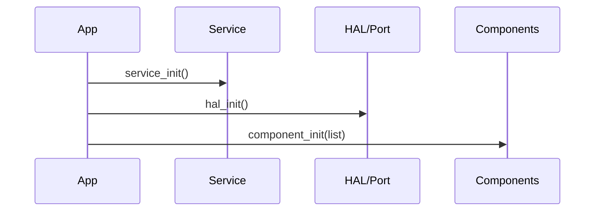

# Service/Component 分层与显式初始化顺序

本页固定“基础服务 vs 组件”的边界，并定义应用层的统一初始化序列。

## 目标

- 让基础能力可复用、可预测，不被上层组件反向依赖。
- 组件是否启用由应用显式控制，避免默认“全开”。
- 初始化顺序可验证，可被文档与构建检查约束。

## 分层语义

- **Service（基础服务层）**：core/service、core/util、core/trace、core/alg、io/out。
- **HAL/Port（硬件与平台层）**：io/hal、io/port、platform/*。
- **Component（功能组件层）**：fs/usb/tcpip/ui/audio 等按需启用的系统能力。

## 初始化顺序（必须）



规则：

1) `service_init()`：基础服务先完成，提供日志/容器/调度基座。
2) `hal_init()`：平台与硬件抽象初始化完成。
3) `component_init()`：由应用显式开启需要的组件。

> 组件初始化由应用控制，禁止组件在自身 init 中隐式拉起其它组件。

## 最小示例

```cpp
int charm_boot()
{
    service_init();
    hal_init();

    component_init({
        Component::fs,
        Component::shell,
        Component::audio,
    });
    return 0;
}
```

## 约束与检查

- **依赖约束**：Service 只能被上层使用，禁止反向依赖。
- **初始化约束**：组件只能在 `component_init()` 阶段进入 ready。
- **构建约束**：依赖白名单 + CMake 校验防止非法 import。

## 未来扩展（可选）

- 在 device registry 中记录组件的 init/deinit hook。
- 为 component_init 添加优先级或依赖图，但仍由应用选择启用集合。
