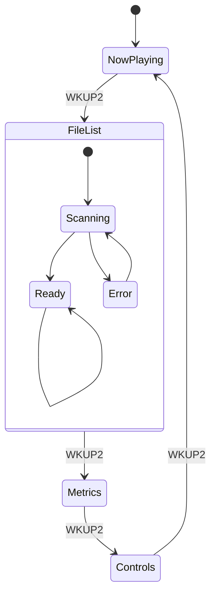

# Player UI Spec (Ink)

## Target
- Panel: ST7305
- Resolution: 168 x 384 (1bpp)
- Orientation: portrait
- Theme: monochrome, high contrast

## Input
- KEY0: primary action (play/pause, select)
- WKUP2: page switch
- Future: rotary encoder (up/down + press)

## Pages
1) Now Playing
2) File List
3) Metrics
4) Controls

## Layout Grid
- Margin: 6 px
- Header height: 20 px
- Footer height: 30 px
- Row height (list): 14 px

## Visual Style
- Typography: single-weight, high-contrast, all-caps for headers, sentence case for content.
- Icon language: simple 1-bit glyphs (triangle play, pause bars, folder, note).
- Emphasis: use inverted blocks for selection and for “Now Playing”.
- Spacing: avoid dense text; reserve at least 4 px between rows.

## Micro-Animations (Ink Friendly)
Ink doesn’t like full-screen motion. Keep it subtle, low-frequency, and partial.
- Page transition: 2-step wipe (top bar first, then body) across two frames.
  - Frame A: update header + footer only.
  - Frame B: update body region.
- List selection: highlight bar blink once (invert on for 150–200 ms, then steady).
- Progress update: change only the bar region every 250–500 ms.
- Playback icon: swap between ▶ and ⏸ with no animation.

## Page: Now Playing
```
+------------------------------------------------+
| Charm Player                                   |
+------------------------------------------------+
| Track  [#########-----]                        |
| Buffer [######--------]                        |
|                                                |
| Now Playing:                                   |
| Title: {track.title}                           |
| Format: {track.format}                         |
|                                                |
| SDMMC1: OK/ERR    I2S1: OK/ERR                  |
+------------------------------------------------+
| WKUP2: Next Page   KEY0: Play/Pause             |
+------------------------------------------------+
```

Elements checklist:
- Title + artist (if known)
- Track time: elapsed / total
- Bitrate or sample rate
- Playback state icon
- Source status (SD/I2S)

## Page: File List
```
+------------------------------------------------+
| File List                                      |
+------------------------------------------------+
| > song01.mp3                                   |
|   song02.mp3                                   |
|   album/                                       |
|   ...                                          |
|                                                |
| Status: Scanning... / Empty / Error            |
+------------------------------------------------+
| WKUP2: Next Page   KEY0: Play/Pause             |
+------------------------------------------------+
```

Elements checklist:
- Current directory path (top right or second header line)
- “Playing now” marker on the active track
- Scroll indicator (tiny bar at right edge)

## Page: Metrics
```
+------------------------------------------------+
| System Metrics                                 |
+------------------------------------------------+
| Uptime: {seconds}s                             |
| Frames: {count}                                |
| Mode: Ink 1bpp                                 |
|                                                |
| SPI5 Mode0                                     |
| ST7305 OK                                      |
+------------------------------------------------+
| WKUP2: Next Page   KEY0: Play/Pause             |
+------------------------------------------------+
```

Elements checklist:
- FPS (UI render)
- Audio buffer fill %
- SD read speed estimate

## Page: Controls
```
+------------------------------------------------+
| Playback                                       |
+------------------------------------------------+
| Volume [########------]                        |
| State: Playing / Paused                        |
| KEY0: Toggle                                   |
| WKUP2: Page                                    |
+------------------------------------------------+
| Audio chain OK     Ink UI running               |
+------------------------------------------------+
```

Elements checklist:
- Repeat / Shuffle state (icons)
- EQ / Gain mode if available

## Navigation Rules
- WKUP2 cycles pages in order.
- KEY0 toggles play/pause (global).
- Future encoder:
  - Rotate: move selection in File List
  - Press: enter dir / play file

## Rendering Notes
- Use filled highlight bar for selected list item.
- Text alignment: left; status rows can be right-aligned if space allows.
- Avoid full-screen clears if flicker appears; consider dirty rects later.

## Optional HTML Mock (for quick visual alignment)
```html
<div style="width:168px;height:384px;border:1px solid #000;font:10px monospace;">
  <div style="border-bottom:1px solid #000;padding:2px 4px;">Charm Player</div>
  <div style="padding:4px;">
    <div>Track  [#########-----]</div>
    <div>Buffer [######--------]</div>
    <div style="margin-top:6px;">Now Playing:</div>
    <div>Title: {track.title}</div>
    <div>Format: 44.1kHz 2ch</div>
    <div style="margin-top:6px;">SDMMC1: OK  I2S1: OK</div>
  </div>
  <div style="border-top:1px solid #000;padding:2px 4px;position:absolute;bottom:0;">
    WKUP2: Next Page  KEY0: Play/Pause
  </div>
</div>
```

## Mermaid State Flow

