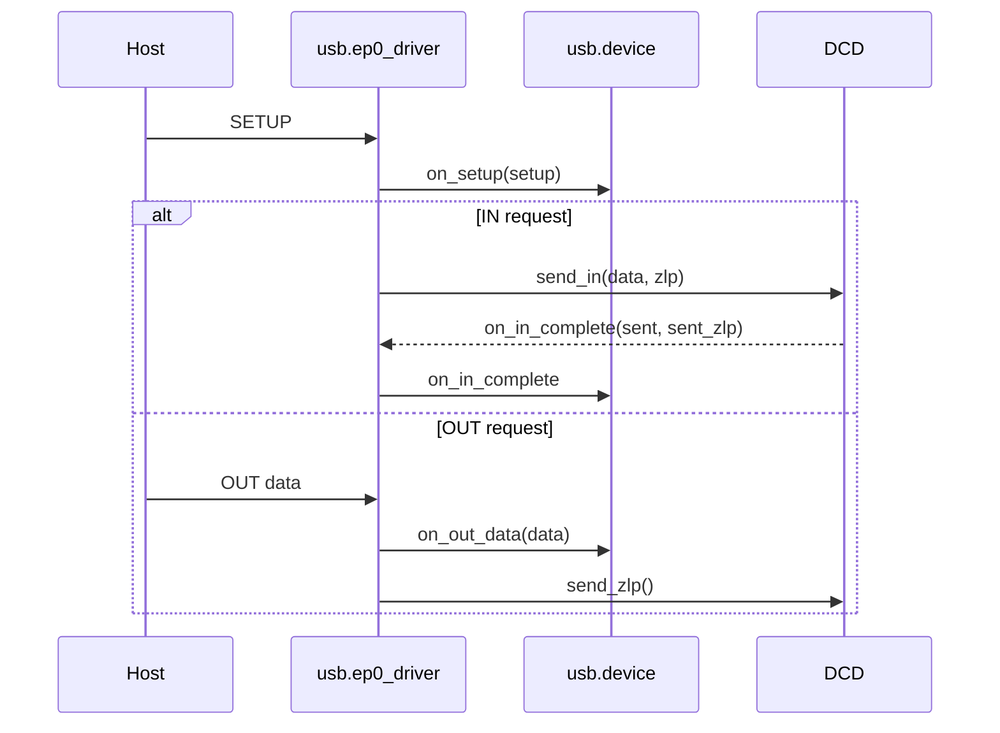

# USB 体系规划（Charm 版本草案）

目标：在不引入过度复杂度的前提下，先完成 **Device 端最小闭环**，再扩展到 MSC/UAC。

## 0) 约束与原则
- 分层清晰：descriptor/common 与 device/class/driver 解耦
- 最小闭环优先：CDC ACM 先落地
- Device 优先：Host 复杂度更高，后置
- Class 面向接口：Class 驱动只关心 control/data，不关心 DCD 实现

## 1) 目录规划（Charm）
```
Modules/io/usb/
  common/        # 描述符/常量/基础类型
  device/        # 设备端 core（EP0/控制请求）
  class/         # CDC/MSC/UAC 类草案
  driver/        # DCD 适配（预留）
```

## 2) 设备端核心对象（当前骨架）
- `usb.device`
  - EP0 状态机（setup/data_in/data_out/status）
  - 标准请求处理（含 ZLP/长度裁剪）
  - class/vendor 钩子与分派
- `usb.ep0_driver`
  - 发送/收包契约：`send_in` / `send_zlp` / `stall`
  - 回调入口：`on_setup` / `on_out_data` / `on_in_complete`

## 3) EP0 驱动契约（最小规范）
硬件层需要提供三类能力：
1. **发送 IN**：`send_in(data, zlp)`  
   - 发送完成后回调 `on_in_complete(sent_bytes, sent_zlp)`
2. **发送 ZLP**：`send_zlp()`  
   - 用于状态阶段或短包补齐
3. **STALL**：`stall()`  
   - 非法请求直接停端点

补充约束：
- `send_in(data, zlp=true)` 不能把 `zlp` 仅当作日志位；若首个数据包非空且需要补齐状态机，DCD 必须在数据包完成后继续发出真正的 EP0 IN ZLP，并在完成回调中以 `sent_zlp=true` 上报。
- EP0 之外的 class endpoints 以 `SET_CONFIGURATION` 提交完成作为激活时机；binding/init 阶段只完成描述符、class 对象与回调绑定，不应提前把 class endpoints 视为已生效。

控制流顺序：
1. `on_setup(setup)`  
2. 若 IN：`send_in(...)`  
3. 若 OUT：主机数据到达后 `on_out_data(...)`  
4. 每个 IN 包完成后：`on_in_complete(...)`

## 4) Class 草案（当前）
- `usb.class_cdc`
  - CDC ACM 描述符 + LineCoding/ControlLineState
  - `serial_state` 通知骨架
- `usb.class_msc`
  - MSC 常量 + ClassOps 骨架
- `usb.class_uac`
  - UAC2 基础常量 + Header 描述符占位

## 5) 当前落地清单（已完成）
1. `usb.common`：描述符结构 + DescriptorBuilder + UTF‑16/ASCII 描述符工具
2. `usb.device`：EP0 状态机 + 标准请求 + vendor/class 分派
3. `usb.ep0_driver`：硬件层接口契约
4. CDC/UAC/MSC：类草案与占位
5. 最小枚举示例：`Examples/usb/usb_cdc_minimal`

## 6) Phase 规划（Device Only）
### Phase 1：CDC ACM
- 目标：替代 UART（日誌/控制台）
- 验收：
  - Windows 识别为虚拟串口
  - 命令触发 shell/EDA 事件

### Phase 2：MSC
- 目标：挂载 FATFS/VFS，形成 U 盘
- 验收：
  - PC 可见卷
  - 文件写入后可被 VFS 读取

### Phase 3：UAC
- 目标：USB 音频设备（sink/source）
- 验收：
  - PC 识别为声卡
  - 与 `audio.sink`/`audio.source` 对接

## 7) 与现有架构对接点
- FS：MSC → `fs_vfs` → `FatFsMount`
- Audio：UAC → `audio.sink` / `audio.source`
- Shell：CDC → `shell_stdio` 或 `usb_stdio`
- Trace：Class 驱动输出 → `trace_core`

## 8) 示例与用法
- 最小 CDC 示例：`Examples/usb/usb_cdc_minimal`
- 枚举路径：DescriptorBuilder → usb.device → usb.ep0_driver → DCD

## 8.1 EP0 请求流（最小）



## 9) 下一步建议（可执行）
1. 补 DCD 适配层（硬件回调契约）
2. 给 CDC 增加最小收发接口样例
3. 补 MSC CBW/CSW 结构与最小状态机
4. UAC 描述符占位补齐（AS 接口/终端）
